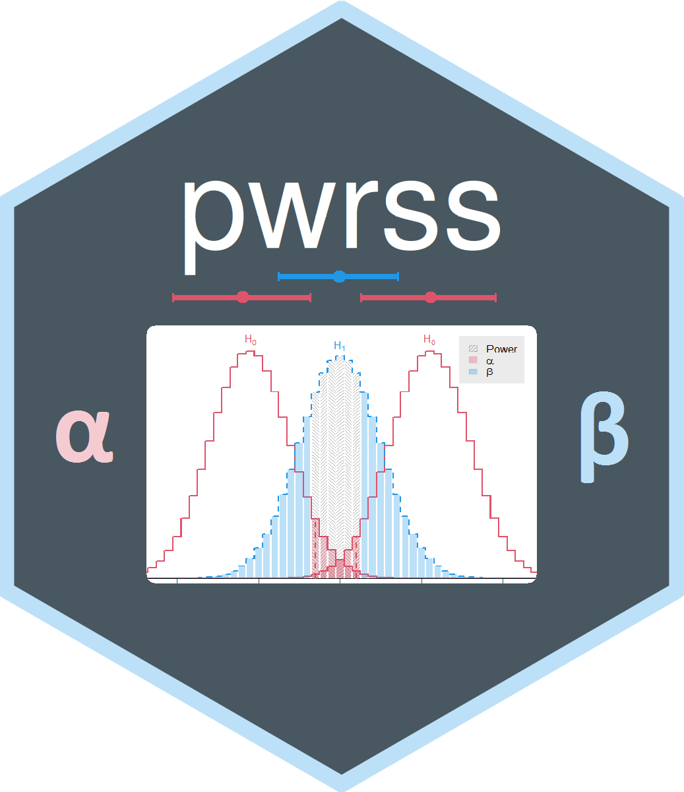

<!-- README.md is generated from README.Rmd. Please edit that file -->

```{r, include = FALSE}
knitr::opts_chunk$set(
  collapse = TRUE,
  comment = "#>",
  fig.path = "man/figures/README-",
  out.width = "100%"
)
```

# pwrss <a href="https://metinbulus.github.io/pwrss/"></a>
<!---
<br clear="all">
--->

<!-- badges: start -->
[](https://cran.r-project.org/package=pwrss)
[](https://www.repostatus.org/#active)
[](https://www.gnu.org/licenses/gpl-3.0.html)
[](https://cran.r-project.org/package=pwrss)
[](https://github.com/metinbulus/pwrss)
[](https://github.com/metinbulus/pwrss/issues)
<!---
[](https://github.com/metinbulus/pwrss/actions/workflows/rhub.yaml)
[](https://github.com/metinbulus/pwrss/actions/workflows/R-CMD-check.yaml)
[](https://github.com/metinbulus/pwrss/actions/workflows/CI.yml)
[](https://github.com/metinbulus/pwrss/actions?query=workflow%3Apkgcheck)
[](https://app.codecov.io/gh/metinbulus/pwrss?branch=main)
--->
[](https://metinbulus.github.io/pwrss/)
<!-- badges: end -->

<!---
[//]: [](https://app.travis-ci.com/metinbulus/pwrss)
--->


```{r, child=c('vignettes/examples.Rmd')}
```

---

[Changelog](https://github.com/metinbulus/pwrss/blob/main/NEWS.md)


## Authors

[Metin Bulus](https://orcid.org/0000-0003-4348-6322)
[Sebastian Jentschke](https://www.uib.no/en/persons/Sebastian.Jentschke)


## License

[GPL 3](https://github.com/metinbulus/pwrss/blob/main/LICENSE)

<!---
## Giving back

If you find this package helpful, please consider donating to the jamovi project (via
the Patreon-link on the left side).
If you can't give money, but would like to support us in another way, you may contribute
to translating [jamovi](https://hosted.weblate.org/engage/jamovi/), the
[jamovi documentation](https://hosted.weblate.org/engage/jamovidocs/), or the textbook
[”learning statistics with jamovi“](https://hosted.weblate.org/engage/jamovi/) into your
language.

Thank you for your support!
--->
