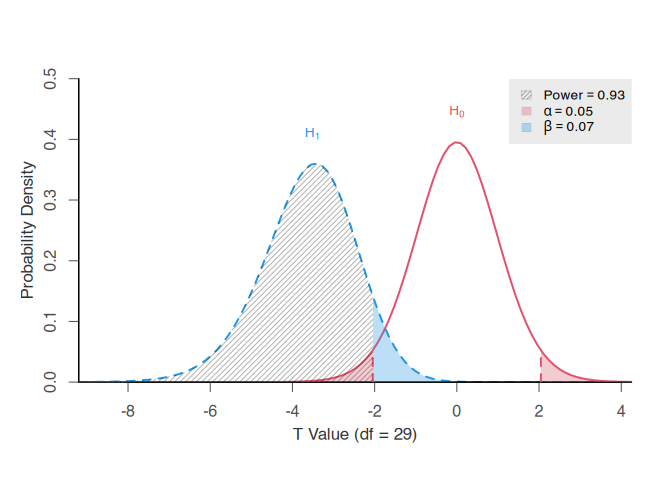
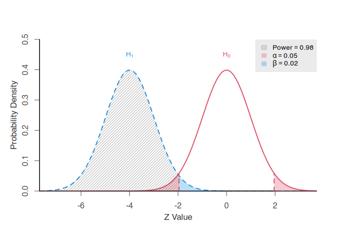
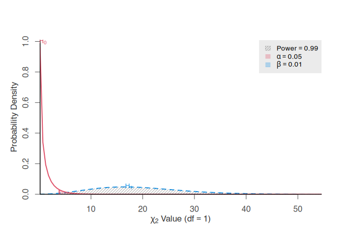

# pwrss <a href="https://metinbulus.github.io/pwrss/"></a>

<br clear="all">

<!-- badges: start -->

[](https://cran.r-project.org/package=pwrss)
[](https://www.repostatus.org/#active)
[](https://www.gnu.org/licenses/gpl-3.0.html)
[](https://cran.r-project.org/package=pwrss)
[](https://github.com/metinbulus/pwrss)
[](https://github.com/metinbulus/pwrss/issues)
[](https://metinbulus.github.io/pwrss/)
<!---
[](https://github.com/metinbulus/pwrss/actions/workflows/rhub.yaml)
[](https://github.com/metinbulus/pwrss/actions/workflows/R-CMD-check.yaml)
[](https://github.com/metinbulus/pwrss/actions/workflows/CI.yml)
[](https://github.com/metinbulus/pwrss/actions?query=workflow%3Apkgcheck)
[](https://app.codecov.io/gh/metinbulus/pwrss?branch=main)
---> <!-- badges: end -->

<!---
[//]: [](https://app.travis-ci.com/metinbulus/pwrss)
--->
<script>
  window.dataLayer = window.dataLayer || [];
  function gtag(){dataLayer.push(arguments);}
  gtag('js', new Date());
&#10;  gtag('config', 'G-047X5R7P7R');
</script>
<style type="text/css">
div.tocify {
  width: 30%;
  max-width: 260px;
  max-height: 100%;
}
&#10;.tocify ul, .tocify li {
  line-height: 20px;
}
&#10;.tocify-subheader .tocify-item {
  font-size: 0.90em;
  padding-left: 35px;
  text-indent: 0;
}
&#10;.tocify-subheader .tocify-subheader .tocify-item {
  font-size: 0.90em;
  padding-left: 70px;
  text-indent: 0;
}
</style>

<div style="background-color:rgb(255, 165, 90); padding: 20px 20px 1px; border-radius:5px;">

<p>
The original tutorial was published on CRAN and can be accessed at:
<a href="https://cran.rstudio.com/web/packages/pwrss/vignettes/examples.html">https://cran.rstudio.com/web/packages/pwrss/vignettes/examples.html</a>
</p>

</div>

<br>

Install and load pwrss R package:

``` r
install.packages("pwrss")
library(pwrss)
```

If you find the package and related material useful please cite as:

<div style="background-color:rgb(245, 245, 245); padding: 20px 20px 1px; border-radius:5px;">

<p>
Bulus, M., & Jentschke, S. (2025). pwrss: Statistical Power and Sample
Size Calculation Tools. R package version 1.0.0.
<https://doi.org/10.32614/CRAN.package.pwrss>
</p>

</div>

**Acknowledgments**

This open-source project has benefited from users who have taken the
time to report typos and identify bugs. I would like to acknowledge
those who have helped improve the accuracy and quality of the project by
reporting these issues. If I have missed anyone who has provided similar
feedback, please let me know.

Error reports from (alphabetic order): <br> Adrian Olszewski (bug
report); Catherine (Kate) Crespi (bug report); dpnichols811 (GitHub
profile) (bug report); Fred Oswald (typo report); Jarrod Hadfield (bug
report); Leszek Gawarecki (typo report); Roland Thijs (typo report)

Please send any bug reports, feedback, or questions to [bulusmetin
\[at\] gmail.com](mailto:bulusmetin@gmail.com)

<br>

# Generic

<hr>

These generic functions compute and return statistical power with the
option to generate Type I and Type II error plots when test statistics
and degrees of freedom are available. Users can input test statistics
manually, valuable for custom designs outside the {pwrss} package’s
scope, or extract them from statistical software output. This
flexibility proves particularly advantageous since test statistics and
degrees of freedom are typically accessible from programs like jamovi,
JASP, SAS, SPSS, or Stata.

Power calculations can be performed by entering the test statistic
through the ncp or mean arguments. Post-hoc power estimates derived this
way provide a sensitivity analysis, revealing the evidential strength of
a study’s sample size relative to the observed effect size. This
approach offers valuable insights for large samples, where effect
estimates demonstrate greater stability. However, for small samples,
where effect size estimates exhibit higher variability, post-hoc power
requires cautious interpretation.

## T-Test

### Post-Hoc

**Example**: The `mtcars` dataset in R that contains information about
32 car models from the 1974 issue of Motor Trend magazine and includes
various performance and design attributes for each vehicle. The
variables of interest:

- `mpg` : Miles per gallon
- `hp` : Gross horsepower
- `wt` : Weight of the car (in 1000 lbs unit)

We aim to estimate the extent to which a one-unit increase in gross
horsepower is associated with miles per gallon, while controlling for
vehicle weight. What is the post-hoc power given the observed test
statistic?

``` r
data(mtcars)

model <- lm(mpg ~ hp + wt, data = mtcars)
summary(model)
#> 
#> Call:
#> lm(formula = mpg ~ hp + wt, data = mtcars)
#> 
#> Residuals:
#>    Min     1Q Median     3Q    Max 
#> -3.941 -1.600 -0.182  1.050  5.854 
#> 
#> Coefficients:
#>             Estimate Std. Error t value Pr(>|t|)    
#> (Intercept) 37.22727    1.59879  23.285  < 2e-16 ***
#> hp          -0.03177    0.00903  -3.519  0.00145 ** 
#> wt          -3.87783    0.63273  -6.129 1.12e-06 ***
#> ---
#> Signif. codes:  0 '***' 0.001 '**' 0.01 '*' 0.05 '.' 0.1 ' ' 1
#> 
#> Residual standard error: 2.593 on 29 degrees of freedom
#> Multiple R-squared:  0.8268, Adjusted R-squared:  0.8148 
#> F-statistic: 69.21 on 2 and 29 DF,  p-value: 9.109e-12

power.t.test(ncp = -3.519, # t-value for hp variable
             df = 29, # residual degrees of freedom
             alpha = 0.05, # type 1 error rate
             alternative = "two.sided",
             plot = TRUE)
```



    #> +--------------------------------------------------+
    #> |                POWER CALCULATION                 |
    #> +--------------------------------------------------+
    #> 
    #> Generic T-Test
    #> 
    #> ---------------------------------------------------
    #> Hypotheses
    #> ---------------------------------------------------
    #>   H0 (Null Claim) : ncp = null.ncp 
    #>   H1 (Alt. Claim) : ncp != null.ncp 
    #> 
    #> ---------------------------------------------------
    #> Results
    #> ---------------------------------------------------
    #>   Type 1 Error (alpha)   = 0.050
    #>   Type 2 Error (beta)    = 0.075
    #>   Statistical Power      = 0.925  <<

**Report**: The post-hoc power analysis showed that a sample of 32 cars
had a 0.925 chance of detecting the observed relationship between
horsepower and miles per gallon, if such a relationship exists. The
analysis was conducted using an $\alpha$ level of 0.05.

### User-Defined Design

Power calculation is not readily available for non-equivalent pre-test
vs. post-test control-group-designs but the formula is already known.
The approximate standard error is

$$SE = \sqrt{\frac{1 - R^2}{p(1 - p)n(1 - R^2_{TX})}}$$

with $df = n - g - 2$ where

- $R^2$ : Explanatory power of covariates
- $R^2_{TX}$ : Squared point-biserial correlation between treatment
  indicator and pre-test
- $p$ : Group allocation rate
- $n$ : Total sample size
- $g$ : Number of covariates

For details please see
(<a href="https://dergipark.org.tr/tr/download/article-file/1783497"
target="_blank">Bulus</a>, 2021, p. 52;
<a href="https://doi.org/10.1177%2F0193841X0102500101"
target="_blank">Oakes and Feldman</a>, 2001, p. 15).

**Example**: A team of educational psychologists implements a
mindfulness-based stress-reduction program in 6th-grade classrooms at
one middle school, while 6th-grade classrooms at another school continue
with their usual homeroom activities (the conventional approach). They
want to determine whether the new program yields greater improvements in
emotional regulation by comparing students in the intervention school
with those in the control school. All students complete a standardized
emotional-regulation inventory at both the start and the end of the
semester.

A superiority test will be conducted to assess whether improvements in
the intervention school exceed those in the control school by a
meaningful margin. The researcher considers a medium effect relevant and
sufficient support for potential scale-up (`d = 0.50`) and defines the
superiority margin as 0.10 - that is, the mindfulness program will be
considered superior to the conventional program if the `d - null.d` is
at least 0.10.

Assume there are two classrooms in each school, each classroom has 30
students, the pre-test accounts for 50% of the variance in post-test
scores, and the squared point-biserial correlation between group
membership and emotional regulation scores is 0.10. What is the power to
detect superiority under these criteria?

``` r
# define parameters
d <- 0.50 # effect size under alternative
null.d <- 0 # effect size under null
margin <- 0.10 # smallest meaningful diff between d and null.d

p <- 0.50 # proportion of subjects in the intervention school
n <- 120 # total sample size
g <- 1 # number of covariates
r.squared <- 0.50 # explanatory power of covariates
rtx.squared <- 0.10 # squared point-biserial cor between trt dummy and outcome

# calculate the standard error
std.error <- sqrt((1 - r.squared) / (p * (1 - p) * n * (1 - rtx.squared)))

# calculate non-centrality parameters
ncp <- (d - null.d) / std.error
null.ncp <- margin / std.error

# calculate power
power.t.test(ncp = ncp,
             null.ncp = null.ncp,
             df = n - g - 2,
             alpha = 0.05,
             alternative = "one.sided",
             plot = FALSE)
#> +--------------------------------------------------+
#> |                POWER CALCULATION                 |
#> +--------------------------------------------------+
#> 
#> Generic T-Test
#> 
#> ---------------------------------------------------
#> Hypotheses
#> ---------------------------------------------------
#>   H0 (Null Claim) : ncp <= null.ncp 
#>   H1 (Alt. Claim) : ncp > null.ncp 
#> 
#> ---------------------------------------------------
#> Results
#> ---------------------------------------------------
#>   Type 1 Error (alpha)   = 0.050
#>   Type 2 Error (beta)    = 0.104
#>   Statistical Power      = 0.896  <<
```

**Report**: A power analysis was conducted to assess whether a sample of
120 students would be sufficient to detect the effect of a mindfulness
intervention on emotional regulation. The analysis targeted a moderate
effect size (d = 0.50) with a superiority margin of 0.10, using a
one-tailed test at $\alpha$ = 0.05. This design yielded an estimated
power of 0.90, indicating adequate sensitivity to detect the
intervention effect.

## Z-Test

### Post-Hoc

**Example**: The `warpbreaks` dataset in R contains data from an
experiment on the number of warp breaks per loom in a fixed length of
yarn. It includes information on the type of wool and tension level used
during weaving. The dataset is often used to illustrate count data
modeling. The variables of interest:

- `breaks`: Number of warp breaks
- `wool`: Type of wool (factor with levels A and B)
- `tension`: Tension applied to the yarn (factor with levels Low,
  Medium, High)

We aim to estimate the extent to which the type of wool and the level of
tension are associated with the number of warp breaks using a Poisson
regression model. What is the post-hoc power given the observed test
statistic for Wool B?

``` r
data(warpbreaks)

model <- glm(breaks ~ wool + tension, data = warpbreaks,
             family = poisson(link = "log"))
summary(model)
#> 
#> Call:
#> glm(formula = breaks ~ wool + tension, family = poisson(link = "log"), 
#>     data = warpbreaks)
#> 
#> Coefficients:
#>             Estimate Std. Error z value Pr(>|z|)    
#> (Intercept)  3.69196    0.04541  81.302  < 2e-16 ***
#> woolB       -0.20599    0.05157  -3.994 6.49e-05 ***
#> tensionM    -0.32132    0.06027  -5.332 9.73e-08 ***
#> tensionH    -0.51849    0.06396  -8.107 5.21e-16 ***
#> ---
#> Signif. codes:  0 '***' 0.001 '**' 0.01 '*' 0.05 '.' 0.1 ' ' 1
#> 
#> (Dispersion parameter for poisson family taken to be 1)
#> 
#>     Null deviance: 297.37  on 53  degrees of freedom
#> Residual deviance: 210.39  on 50  degrees of freedom
#> AIC: 493.06
#> 
#> Number of Fisher Scoring iterations: 4

power.z.test(mean = -3.994, # z-value for wool B
             alpha = 0.05, # type 1 error rate
             alternative = "two.sided",
             plot = TRUE)
```



    #> +--------------------------------------------------+
    #> |                POWER CALCULATION                 |
    #> +--------------------------------------------------+
    #> 
    #> Generic Z-Test
    #> 
    #> ---------------------------------------------------
    #> Hypotheses
    #> ---------------------------------------------------
    #>   H0 (Null Claim) : mean = null.mean 
    #>   H1 (Alt. Claim) : mean != null.mean 
    #> 
    #> ---------------------------------------------------
    #> Results
    #> ---------------------------------------------------
    #>   Type 1 Error (alpha) = 0.050
    #>   Type 2 Error (beta)  = 0.021
    #>   Statistical Power    = 0.979  <<

**Report**: The post-hoc power analysis showed that a sample of 54
trials had a 0.979 chance of detecting the observed relationship between
Wool B and number of warp breaks, if such a relationship exists. The
analysis was conducted using an $\alpha$ level of 0.05.

### User Defined Design

Power calculation is not readily available for Spearman’s $\rho$ rank
correlation but the formula is already known. The approximate standard
error for the Fisher’s Z-transformed correlation coefficient is

$$SE = \sqrt{\frac{1.06}{n - 3}}$$

where $n$ is the sample size. For details please see
(<a href="https://doi.org/10.1093/biomet/44.3-4.470"
target="_blank">Fieller, Hartley, and Pearson</a>, 1957, p. 472).

**Example**: A team of school counselors want to examine whether there
is a relationship between students’ class rank (1st, 2nd, 3rd, etc.) and
their self-reported academic stress levels, measured on a 10-point scale
(1 = no stress, 10 = extreme stress). Since class rank is an ordinal
variable (lower ranks mean higher academic standing) and the stress
scale is subjective and potentially not interval-scaled, the counselor
uses Spearman’s rank-order correlation (Spearman’s $\rho$) to assess
whether higher-ranking students tend to report lower or higher levels of
stress.

Researchers hypothesize that students with higher class ranks (i.e.,
lower rank numbers) report lower stress levels. They plan to recruit 100
students, interested in detecting a Spearman’s $\rho$ as small as 0.30,
and will use a two-tailed test with an $\alpha$ level of 0.05. What is
the power under these criteria?

``` r
# define parameters
rs <- 0.30 # spearman rho rank cor under alternative
null.rs <- 0 # spearman rho rank cor under null
n <- 100 # sample size

# apply Fisher's Z transformation
z.rs <- cor.to.z(rs)$z
#>         z       rho 
#> 0.3095196 0.3000000
z.null.rs <- cor.to.z(null.rs)$z
#>   z rho 
#>   0   0

# calculate the standard error
z.std.error <- sqrt(1.06 / (n - 3))

# calculate the non-centrality parameter
ncp <- (z.rs - z.null.rs) / z.std.error

# calculate power
power.z.test(ncp = ncp,
             alpha = 0.05,
             alternative = "two.sided",
             plot = TRUE)
```


    #> +--------------------------------------------------+
    #> |                POWER CALCULATION                 |
    #> +--------------------------------------------------+
    #> 
    #> Generic Z-Test
    #> 
    #> ---------------------------------------------------
    #> Hypotheses
    #> ---------------------------------------------------
    #>   H0 (Null Claim) : mean = null.mean 
    #>   H1 (Alt. Claim) : mean != null.mean 
    #> 
    #> ---------------------------------------------------
    #> Results
    #> ---------------------------------------------------
    #>   Type 1 Error (alpha) = 0.050
    #>   Type 2 Error (beta)  = 0.158
    #>   Statistical Power    = 0.842  <<

**Report**: A power analysis was conducted to assess whether 100
students are sufficient to detect association between students’ class
rank and their self-reported academic stress levels. The analysis
targeted a moderate Spearman’s $\rho$ of 0.30, a two-tailed test with
$\alpha$ = 0.05. This configuration yielded an estimated power of 0.84,
indicating sufficient sensitivity to detect the hypothesized
association.

## F-Test

### Post-Hoc

**Example**: The `trees` dataset in R contains measurements of the
volume, height, and girth (diameter) of 31 black cherry trees. The
variables of interest:

- `Girth`: Diameter of the tree (in inches)
- `Height`: Height of the tree (in feet)

We aim to estimate the extent to which the tree height is associated
with the tree girth. What is the post-hoc power given the observed test
statistic?

``` r
data(trees)

# model <- aov(Girth ~ Height, data = trees)
model <- lm(Girth ~ Height, data = trees)
summary(model)
#> 
#> Call:
#> lm(formula = Girth ~ Height, data = trees)
#> 
#> Residuals:
#>     Min      1Q  Median      3Q     Max 
#> -4.2386 -1.9205 -0.0714  2.7450  4.5384 
#> 
#> Coefficients:
#>             Estimate Std. Error t value Pr(>|t|)   
#> (Intercept) -6.18839    5.96020  -1.038  0.30772   
#> Height       0.25575    0.07816   3.272  0.00276 **
#> ---
#> Signif. codes:  0 '***' 0.001 '**' 0.01 '*' 0.05 '.' 0.1 ' ' 1
#> 
#> Residual standard error: 2.728 on 29 degrees of freedom
#> Multiple R-squared:  0.2697, Adjusted R-squared:  0.2445 
#> F-statistic: 10.71 on 1 and 29 DF,  p-value: 0.002758

power.f.test(ncp = 10.71, # non-centrality under alternative
             df1 = 1, # numerator degrees of freedom
             df2 = 29, # denominator degrees of freedom
             alpha = 0.05, # type 1 error rate
             plot = FALSE)
#> +--------------------------------------------------+
#> |                POWER CALCULATION                 |
#> +--------------------------------------------------+
#> 
#> Generic F-Test
#> 
#> ---------------------------------------------------
#> Hypotheses
#> ---------------------------------------------------
#>   H0 (Null Claim) : ncp = null.ncp 
#>   H1 (Alt. Claim) : ncp > null.ncp 
#> 
#> ---------------------------------------------------
#> Results
#> ---------------------------------------------------
#>   Type 1 Error (alpha)   = 0.050
#>   Type 2 Error (beta)    = 0.115
#>   Statistical Power      = 0.885  <<
```

**Report**: The post-hoc power analysis showed that a sample of 31 trees
had a 0.885 chance of detecting the observed relationship between tree
height and girth, if such a relationship exists in the population. The
analysis was conducted using an $\alpha$ level of 0.05.

## Chi-square Test

### Post-Hoc 1

**Example**: The `HairEyeColor` dataset in R contains data from a survey
of 592 students, recording the joint distribution of hair color, eye
color, and gender. It is stored as a three-dimensional contingency
table, with counts representing the number of individuals in each
category. The variables of interest:

- `Hair`: Hair color (e.g., Black, Brown, Blond, Red)
- `Eye`: Eye color (e.g., Brown, Blue, Hazel, Green)

We aim to examine the association between hair color and eye color. What
is the post-hoc power given the observed test statistic from a
chi-squared test of independence?

``` r
data(HairEyeColor)

table <- margin.table(HairEyeColor, c(1, 2))
print(table)
#>        Eye
#> Hair    Brown Blue Hazel Green
#>   Black    68   20    15     5
#>   Brown   119   84    54    29
#>   Red      26   17    14    14
#>   Blond     7   94    10    16

chisq.test(table)
#> 
#>  Pearson's Chi-squared test
#> 
#> data:  table
#> X-squared = 138.29, df = 9, p-value < 2.2e-16

power.chisq.test(ncp = 138.29, # X-squared
                 df = 9, # degrees of freedom
                 alpha = 0.05, # type 1 error rate
                 plot = FALSE)
#> +--------------------------------------------------+
#> |                POWER CALCULATION                 |
#> +--------------------------------------------------+
#> 
#> Generic Chi-square Test
#> 
#> ---------------------------------------------------
#> Hypotheses
#> ---------------------------------------------------
#>   H0 (Null Claim)   : ncp = null.ncp 
#>   H1 (Alt. Claim)   : ncp > null.ncp 
#> 
#> ---------------------------------------------------
#> Results
#> ---------------------------------------------------
#>   Type 1 Error (alpha)   = 0.050
#>   Type 2 Error (beta)    = 0.000
#>   Statistical Power      = 1  <<
```

**Report**: The post-hoc power analysis showed that a sample of 592
individuals had a 1.00 chance of detecting the observed relationship
between hair and eye color, if such a relationship exists in the
population. The analysis was conducted using an $\alpha$ level of 0.05.

### Post-Hoc 2

**Example**: The `infert` dataset in R contains data from a study on
infertility in women, examining the relationship between reproductive
history and infertility status. It includes demographic and clinical
information on 248 women. The variables of interest:

- `case`: Infertility status (1 = infertile, 0 = fertile)
- `age`: Age of woman in years
- `parity`: Number of prior full-term pregnancies
- `induced`: Number of induced abortions
- `spontaneous`: Number of spontaneous abortions

We aim to evaluate whether the number of induced abortions contributes
to the prediction of infertility status, beyond the effects of age,
parity, and spontaneous abortions, using a logistic regression
framework. What is the post-hoc power given the observed deviance
difference between the full and reduced models?

``` r
data(infert)

fit.reduced <- glm(case ~ age + parity + spontaneous,
                   data = infert,
                   family = binomial)

fit.full <- glm(case ~ age + parity + spontaneous + induced,
                data = infert,
                family = binomial)

anova(fit.reduced, fit.full)
#> Analysis of Deviance Table
#> 
#> Model 1: case ~ age + parity + spontaneous
#> Model 2: case ~ age + parity + spontaneous + induced
#>   Resid. Df Resid. Dev Df Deviance  Pr(>Chi)    
#> 1       244     279.41                          
#> 2       243     260.94  1   18.463 1.732e-05 ***
#> ---
#> Signif. codes:  0 '***' 0.001 '**' 0.01 '*' 0.05 '.' 0.1 ' ' 1

power.chisq.test(ncp = 18.463,
                 df = 1,
                 alpha = 0.05,
                 plot = TRUE)
```



    #> +--------------------------------------------------+
    #> |                POWER CALCULATION                 |
    #> +--------------------------------------------------+
    #> 
    #> Generic Chi-square Test
    #> 
    #> ---------------------------------------------------
    #> Hypotheses
    #> ---------------------------------------------------
    #>   H0 (Null Claim)   : ncp = null.ncp 
    #>   H1 (Alt. Claim)   : ncp > null.ncp 
    #> 
    #> ---------------------------------------------------
    #> Results
    #> ---------------------------------------------------
    #>   Type 1 Error (alpha)   = 0.050
    #>   Type 2 Error (beta)    = 0.010
    #>   Statistical Power      = 0.99  <<

**Report**: The post-hoc power analysis indicated that a sample of 248
women provided a 0.99 probability of detecting the unique contribution
of the number of induced abortions to infertility status, while
controlling for other variables, assuming such a relationship exists in
the population. The analysis was conducted using an $\alpha$ level of
0.05.

## Binomial Test

### Post-Hoc

**Example**: The `faithful` dataset contains 272 observations of
eruptions of the Old Faithful geyser in Yellowstone National Park. It
includes:

- `eruptions`: Eruption duration (in minutes)
- `waiting`: Time between eruptions (in minutes)

We aim to test whether eruptions lasting more than 3 minutes occur more
than half the time. What is the post-hoc power given the observed
proportion and sample size?

``` r
data(faithful)

long <- faithful$eruptions > 3
n.success <- sum(long)
n.total <- nrow(faithful)

binom.test(n.success, n.total, p = 0.50)
#> 
#>  Exact binomial test
#> 
#> data:  n.success and n.total
#> number of successes = 175, number of trials = 272, p-value = 2.609e-06
#> alternative hypothesis: true probability of success is not equal to 0.5
#> 95 percent confidence interval:
#>  0.5832982 0.7003038
#> sample estimates:
#> probability of success 
#>              0.6433824

power.binom.test(size = n.total, # number of eruptions
                 prob = n.success / n.total, # prob. of occurrence under alt.
                 null.prob = 0.50, # prob. of occurrence under null
                 alpha = 0.05,
                 alternative = "one.sided",
                 plot = TRUE)
```


    #> +--------------------------------------------------+
    #> |                POWER CALCULATION                 |
    #> +--------------------------------------------------+
    #> 
    #> Generic Binomial Test
    #> 
    #> ---------------------------------------------------
    #> Hypotheses
    #> ---------------------------------------------------
    #>   H0 (Null Claim) : prob <= null.prob 
    #>   H1 (Alt. Claim) : prob > null.prob 
    #> 
    #> ---------------------------------------------------
    #> Results
    #> ---------------------------------------------------
    #>   Type 1 Error (alpha)   = 0.039
    #>   Type 2 Error (beta)    = 0.001
    #>   Statistical Power      = 0.999  <<

**Report**: The post-hoc power analysis indicated that a sample of 272
eruptions provided a 0.999 probability of detecting whether eruptions
lasting more than 3 minutes occur more than 50% of the time, if it
exists in the underlying eruption pattern. The analysis was based on a
one-sided test procedure with $\alpha$ = 0.05.

### User-Defined Designs

**Example 1**: Find number of coin toss to test whether a coin is fair.

``` r
# find the approximate solution
power.z.oneprop(prob = 0.50, # prob. of head under alt.
                null.prob = c(0.495, 0.505), # equivalence margins
                power = 0.80,
                alpha = 0.05, # type 1 error rate
                alternative = "two.one.sided",
                verbose = FALSE)$n
#> [1] 85639

# iterate to find the exact solution
power.binom.test(size = 85632, # number of tosses needed
                 prob = 0.50, # prob. of head under alt.
                 null.prob = c(0.495, 0.505), # equivalence margins
                 alpha = 0.05, # type 1 error rate
                 alternative = "two.one.sided",
                 plot = FALSE)
#> +--------------------------------------------------+
#> |                POWER CALCULATION                 |
#> +--------------------------------------------------+
#> 
#> Generic Binomial Test
#> 
#> ---------------------------------------------------
#> Hypotheses
#> ---------------------------------------------------
#>   H0 (Null Claim) : prob <= min(null.prob) or 
#>                     prob >= max(null.prob) 
#>   H1 (Alt. Claim) : prob > min(null.prob) and 
#>                     prob < max(null.prob) 
#> 
#> ---------------------------------------------------
#> Results
#> ---------------------------------------------------
#>   Type 1 Error (alpha)   = 0.050
#>   Type 2 Error (beta)    = 0.200
#>   Statistical Power      = 0.8  <<
```

**Report 1**: Power analysis indicated that at least 85,632 coin tosses
are required to determine whether a coin is fair. The analysis assumes a
fair coin has a 0.50 probability of landing heads, with equivalence
margins set at 0.495 and 0.505, using a two one-sided test procedure
with $\alpha$ = 0.05.

**Example 2**: Find optimal number of replications in a Monte Carlo
simulation.

To reliably detect a type 1 error rate of 0.05:

``` r
# find the approximate solution
power.z.oneprop(prob = 0.05, # prob. of head under alt.
                null.prob = c(0.045, 0.055), # equivalence margins
                power = 0.80,
                alpha = 0.05, # type 1 error rate
                alternative = "two.one.sided", verbose = FALSE)$n
#> [1] 16272

# iterate to find the exact solution
power.binom.test(size = 16424, # number of replications needed
                 prob = 0.05, # prob. of falsely rejecting null
                 null.prob = c(0.045, 0.055), # equivalence margins
                 alpha = 0.05,
                 alternative = "two.one.sided",
                 plot = FALSE)
#> +--------------------------------------------------+
#> |                POWER CALCULATION                 |
#> +--------------------------------------------------+
#> 
#> Generic Binomial Test
#> 
#> ---------------------------------------------------
#> Hypotheses
#> ---------------------------------------------------
#>   H0 (Null Claim) : prob <= min(null.prob) or 
#>                     prob >= max(null.prob) 
#>   H1 (Alt. Claim) : prob > min(null.prob) and 
#>                     prob < max(null.prob) 
#> 
#> ---------------------------------------------------
#> Results
#> ---------------------------------------------------
#>   Type 1 Error (alpha)   = 0.049
#>   Type 2 Error (beta)    = 0.198
#>   Statistical Power      = 0.802  <<
```

To reliably detect a power rate of 0.80:

``` r
# find the approximate solution
power.z.oneprop(prob = 0.80, # prob. of correctly rejecting null
                null.prob = c(0.795, 0.805), # equivalence margins
                power = 0.80,
                alpha = 0.05, # type 1 error rate
                alternative = "two.one.sided", verbose = FALSE)$n
#> [1] 54809

# iterate to find the exact solution
power.binom.test(size = 55011, # number of replications needed
                 prob = 0.80, # prob. of correctly rejecting null
                 null.prob = c(0.795, 0.805), # equivalence margins
                 alpha = 0.05,
                 alternative = "two.one.sided",
                 plot = FALSE)
#> +--------------------------------------------------+
#> |                POWER CALCULATION                 |
#> +--------------------------------------------------+
#> 
#> Generic Binomial Test
#> 
#> ---------------------------------------------------
#> Hypotheses
#> ---------------------------------------------------
#>   H0 (Null Claim) : prob <= min(null.prob) or 
#>                     prob >= max(null.prob) 
#>   H1 (Alt. Claim) : prob > min(null.prob) and 
#>                     prob < max(null.prob) 
#> 
#> ---------------------------------------------------
#> Results
#> ---------------------------------------------------
#>   Type 1 Error (alpha)   = 0.050
#>   Type 2 Error (beta)    = 0.199
#>   Statistical Power      = 0.801  <<
```

**Report 2**: Power analysis indicated that at least 16,424 replications
are required to estimate the Type 1 error rate at $\alpha$ = 0.05. This
analysis used a two one-sided test procedure with equivalence margins
set at 0.045 and 0.055. In contrast, at least 55,011 replications are
needed to estimate statistical power at 0.80, assuming equivalence
margins of 0.795 and 0.805, also using the two one-sided test procedure
with $\alpha$ = 0.05.

## Error Plots

`plot()` function (S3 method) is a wrapper around the generic functions
above. It creates a visual representation of both null and alternative
distributions, with shaded areas indicating Type 1 error (false
positive) and Type 2 error (false negative) regions.

Assign results of any `pwrss` function to an R object and pass it to the
`plot()` function.

``` r
power.t.student(d = 0.20, power = 0.80) |>
  plot()
```


NOTE: In earlier versions of the {pwrss} package, the `plot()` function
generated multiple panel plots for ANCOVA designs and mediation models.
This feature is no longer supported, as the updated functions now return
one effect at a time.

<br> <br>

# Means (T-Test)

<hr>

## Independent Samples T-Test

An independent samples t-test is used to compare the mean outcomes of
two groups that are statistically independent - meaning the outcome
value of an individual in one group is not related to the outcome value
of an individual in the other group. These groups may represent
treatment and control conditions, gender groups (e.g., females and
males), or any other pre-existing or experimentally assigned categories.

### Parametric

**Example**: Suppose we aim to evaluate the extent to which a
psychological intervention reduces post-earthquake psychosomatic
symptoms. We consider a standardized mean difference as small as Cohen’s
d = -0.20 between the treatment and control groups to be meaningful and
relevant. What is the minimum required sample size per group, accounting
for a 0.05 dropout rate in the treatment group?

``` r
power.t.student(d = -0.20,
                power = 0.80,
                alpha = 0.05,
                alternative = "one.sided",
                design = "independent")
#> +--------------------------------------------------+
#> |             SAMPLE SIZE CALCULATION              |
#> +--------------------------------------------------+
#> 
#> Student's T-Test (Independent Samples)
#> 
#> ---------------------------------------------------
#> Hypotheses
#> ---------------------------------------------------
#>   H0 (Null Claim) : d - null.d >= 0 
#>   H1 (Alt. Claim) : d - null.d < 0 
#> 
#> ---------------------------------------------------
#> Results
#> ---------------------------------------------------
#>   Sample Size            = 310 and 310  <<
#>   Type 1 Error (alpha)   = 0.050
#>   Type 2 Error (beta)    = 0.200
#>   Statistical Power      = 0.8

# account for attrition
inflate.sample(n = 310, rate = 0) # control
#> 310
inflate.sample(n = 310, rate = 0.05) # treatment
#> 327
```

**Report**: We conducted a power analysis to determine the required
sample size for comparing treatment and control groups on psychosomatic
symptoms. The analysis assumed a small effect size (Cohen’s d = 0.20),
0.80 statistical power, and a 0.05 significance level (one-tailed).
Results indicated that 310 participants per group are needed (620
total). To account for an anticipated 0.05 attrition in the treatment
group, an additional 17 participants are required, bringing the total
sample size to 637.

### Robust Parametric

Unlike experimental designs, group variances and population proportions
may differ for some pre-existing groups (e.g. male and female teachers).
Assume the smallest effect size of interest is Cohen’s d = 0.20. The
expected variance ratio (female to male) is 1.5, and the prevalence
ratio (female to male) in the population is 2. What is the minimum
required sample size per group under these conditions?

``` r
power.t.welch(d = 0.20,
              power = 0.80,
              n.ratio = 2,
              var.ratio = 1.5,
              alpha = 0.05,
              alternative = "two.sided")
#> +--------------------------------------------------+
#> |             SAMPLE SIZE CALCULATION              |
#> +--------------------------------------------------+
#> 
#> Welch's T-Test (Independent Samples)
#> 
#> ---------------------------------------------------
#> Hypotheses
#> ---------------------------------------------------
#>   H0 (Null Claim) : d - null.d = 0 
#>   H1 (Alt. Claim) : d - null.d != 0 
#> 
#> ---------------------------------------------------
#> Results
#> ---------------------------------------------------
#>   Sample Size            = 517 and 259  <<
#>   Type 1 Error (alpha)   = 0.050
#>   Type 2 Error (beta)    = 0.199
#>   Statistical Power      = 0.801
```

**Report**: We conducted a power analysis to determine the required
sample size for comparing females and males. The analysis assumed a
small effect (Cohen’s d = 0.20), 0.80 power, and 0.05 significance level
(two-tailed). The analysis additionally incorporated realistic
population characteristics: unequal variances (variance ratio = 1.5,
females relative to males) and unequal group prevalence (2:1
female-to-male ratio). Results indicated that 517 females and 259 males
are required (776 total).

### Non-Parametric

The outcome variable may be treated as continuous, but does not follow a
normal distribution - for example, Likert-type scales with 5 to 7
categories, ranked data, or other bounded ordinal measures. Assume the
smallest effect size of interest between the treatment and control
groups is Cohen’s d = 0.20. What is the minimum required sample size per
group, accounting for a 0.05 dropout rate in the treatment group?

``` r
power.np.wilcoxon(d = 0.20,
                  power = 0.80,
                  n.ratio = 1,
                  alpha = 0.05,
                  alternative = "two.sided",
                  design = "independent",
                  distribution = "normal")
#> +--------------------------------------------------+
#> |             SAMPLE SIZE CALCULATION              |
#> +--------------------------------------------------+
#> 
#> Wilcoxon Rank-Sum Test (Independent Samples) 
#> (Wilcoxon-Mann-Whitney or Mann-Whitney U Test)
#> 
#>   Method       : Guenther
#>   Distribution : Normal
#> 
#> ---------------------------------------------------
#> Hypotheses
#> ---------------------------------------------------
#>   H0 (Null Claim) : d - null.d = 0 
#>   H1 (Alt. Claim) : d - null.d != 0 
#> 
#> ---------------------------------------------------
#> Results
#> ---------------------------------------------------
#>   Sample Size            = 412 and 412  <<
#>   Type 1 Error (alpha)   = 0.050
#>   Type 2 Error (beta)    = 0.200
#>   Statistical Power      = 0.8

inflate.sample(n = 412, rate = 0.05) # treatment
#> 434
```

**Report**: We conducted a power analysis to determine the required
sample size for comparing treatment and control groups on a Likert-type
outcome measure, assuming that the observed categories reflect an
underlying continuous latent construct that follows a normal
distribution. The analysis assumed a small effect size (Cohen’s d =
0.20), 0.80 statistical power, and a 0.05 significance level
(two-tailed). Results indicated that 412 participants per group are
needed (824 total). To account for an anticipated 0.05 attrition in the
treatment group, an additional 22 participants are required, bringing
the total sample size to 846.

### Non-Inferiority

A non-inferiority trial, which may evaluate the effectiveness of a new
program, drug, or product, tests whether the mean outcome in the
treatment group is not unacceptably worse than that in the
conventional-treatment or placebo group, based on a pre-specified
non-inferiority margin. For instance, a `d - null.d` difference as small
as `margin = -0.05` may still support a conclusion of non-inferiority.
What is the minimum required sample size to detect an effect size of d =
0.20 under this criterion?

<div style="background-color:rgb(188, 224, 247); padding: 20px 20px 1px; border-radius:5px;">

When higher values of an outcome is better the margin usually takes
NEGATIVE values; whereas when lower values of the outcome is better
margin usually takes POSITIVE values.

</div>

<br>

``` r
# parametric (an example report is provided below)
power.t.student(d = 0.20,
                margin = -0.05,
                power = 0.80,
                alpha = 0.05,
                alternative = "one.sided",
                design = "independent")
#> +--------------------------------------------------+
#> |             SAMPLE SIZE CALCULATION              |
#> +--------------------------------------------------+
#> 
#> Student's T-Test (Independent Samples)
#> 
#> ---------------------------------------------------
#> Hypotheses
#> ---------------------------------------------------
#>   H0 (Null Claim) : d - null.d <= margin 
#>   H1 (Alt. Claim) : d - null.d > margin 
#> 
#> ---------------------------------------------------
#> Results
#> ---------------------------------------------------
#>   Sample Size            = 199 and 199  <<
#>   Type 1 Error (alpha)   = 0.050
#>   Type 2 Error (beta)    = 0.199
#>   Statistical Power      = 0.801

# consider 0.05 attrition rate
inflate.sample(n = 398, rate = 0.05)
#> 419

# robust parametric
power.t.welch(d = 0.20,
              margin = -0.05,
              n.ratio = 2,
              var.ratio = 2,
              power = 0.80,
              alpha = 0.05,
              alternative = "one.sided")
#> +--------------------------------------------------+
#> |             SAMPLE SIZE CALCULATION              |
#> +--------------------------------------------------+
#> 
#> Welch's T-Test (Independent Samples)
#> 
#> ---------------------------------------------------
#> Hypotheses
#> ---------------------------------------------------
#>   H0 (Null Claim) : d - null.d <= margin 
#>   H1 (Alt. Claim) : d - null.d > margin 
#> 
#> ---------------------------------------------------
#> Results
#> ---------------------------------------------------
#>   Sample Size            = 238 and 119  <<
#>   Type 1 Error (alpha)   = 0.050
#>   Type 2 Error (beta)    = 0.200
#>   Statistical Power      = 0.8

# non-parametric
power.np.wilcoxon(d = 0.20,
                  margin = -0.05,
                  power = 0.80,
                  alpha = 0.05,
                  alternative = "one.sided",
                  design = "independent")
#> +--------------------------------------------------+
#> |             SAMPLE SIZE CALCULATION              |
#> +--------------------------------------------------+
#> 
#> Wilcoxon Rank-Sum Test (Independent Samples) 
#> (Wilcoxon-Mann-Whitney or Mann-Whitney U Test)
#> 
#>   Method       : Guenther
#>   Distribution : Normal
#> 
#> ---------------------------------------------------
#> Hypotheses
#> ---------------------------------------------------
#>   H0 (Null Claim) : d - null.d <= margin 
#>   H1 (Alt. Claim) : d - null.d > margin 
#> 
#> ---------------------------------------------------
#> Results
#> ---------------------------------------------------
#>   Sample Size            = 208 and 208  <<
#>   Type 1 Error (alpha)   = 0.050
#>   Type 2 Error (beta)    = 0.199
#>   Statistical Power      = 0.801
```

**Report**: We conducted a power analysis to determine the required
sample size for a non-inferiority trial comparing treatment and placebo
groups. The analysis assumed a small treatment effect (d = 0.20), a
non-inferiority margin of d = -0.05, 0.80 power, and a 0.05 significance
level using a one-tailed test appropriate for non-inferiority designs.
Results indicated that 199 participants per group (398 total) are needed
to demonstrate that the treatment is not meaningfully inferior to the
placebo. Accounting for an anticipated 0.05 attrition rate, we will
recruit an additional 21 participants, yielding a target sample size of
419 participants.

### Superiority

A superiority trial evaluates whether a new program, drug, or product
leads to a meaningfully better mean outcome in the treatment group
compared to a conventional treatment or placebo group, based on a
pre-specified superiority margin. For example, a `d - null.d` difference
as small as `margin = 0.05` may be considered sufficient to claim
superiority. What is the minimum required sample size to detect an
effect size of d = 0.20 under this criterion?

<div style="background-color:rgb(188, 224, 247); padding: 20px 20px 1px; border-radius:5px;">

When higher values of an outcome is better margin usually takes POSITIVE
values; whereas when lower values of the outcome is better margin
usually takes NEGATIVE values.

</div>

<br>

``` r
# parametric (an example report is provided below)
power.t.student(d = 0.20,
                margin = 0.05,
                power = 0.80,
                alpha = 0.05,
                alternative = "one.sided",
                design = "independent")
#> +--------------------------------------------------+
#> |             SAMPLE SIZE CALCULATION              |
#> +--------------------------------------------------+
#> 
#> Student's T-Test (Independent Samples)
#> 
#> ---------------------------------------------------
#> Hypotheses
#> ---------------------------------------------------
#>   H0 (Null Claim) : d - null.d <= margin 
#>   H1 (Alt. Claim) : d - null.d > margin 
#> 
#> ---------------------------------------------------
#> Results
#> ---------------------------------------------------
#>   Sample Size            = 552 and 552  <<
#>   Type 1 Error (alpha)   = 0.050
#>   Type 2 Error (beta)    = 0.199
#>   Statistical Power      = 0.801

# consider 0.05 attrition rate
inflate.sample(n = 1104, rate = 0.05)
#> 1163

# robust parametric
power.t.welch(d = 0.20,
              margin = 0.05,
              n.ratio = 2,
              var.ratio = 2,
              power = 0.80,
              alpha = 0.05,
              alternative = "one.sided")
#> +--------------------------------------------------+
#> |             SAMPLE SIZE CALCULATION              |
#> +--------------------------------------------------+
#> 
#> Welch's T-Test (Independent Samples)
#> 
#> ---------------------------------------------------
#> Hypotheses
#> ---------------------------------------------------
#>   H0 (Null Claim) : d - null.d <= margin 
#>   H1 (Alt. Claim) : d - null.d > margin 
#> 
#> ---------------------------------------------------
#> Results
#> ---------------------------------------------------
#>   Sample Size            = 662 and 331  <<
#>   Type 1 Error (alpha)   = 0.050
#>   Type 2 Error (beta)    = 0.200
#>   Statistical Power      = 0.8

# non-parametric
power.np.wilcoxon(d = 0.20,
                  margin = 0.05,
                  power = 0.80,
                  alpha = 0.05,
                  alternative = "one.sided",
                  design = "independent")
#> +--------------------------------------------------+
#> |             SAMPLE SIZE CALCULATION              |
#> +--------------------------------------------------+
#> 
#> Wilcoxon Rank-Sum Test (Independent Samples) 
#> (Wilcoxon-Mann-Whitney or Mann-Whitney U Test)
#> 
#>   Method       : Guenther
#>   Distribution : Normal
#> 
#> ---------------------------------------------------
#> Hypotheses
#> ---------------------------------------------------
#>   H0 (Null Claim) : d - null.d <= margin 
#>   H1 (Alt. Claim) : d - null.d > margin 
#> 
#> ---------------------------------------------------
#> Results
#> ---------------------------------------------------
#>   Sample Size            = 578 and 578  <<
#>   Type 1 Error (alpha)   = 0.050
#>   Type 2 Error (beta)    = 0.199
#>   Statistical Power      = 0.801
```

**Report**: We conducted a power analysis to determine the required
sample size for a superiority trial comparing treatment and placebo
groups. The analysis assumed a small treatment effect (d = 0.20), a
superiority margin of d = 0.05, 0.80 power, and a 0.05 significance
level using a one-tailed test appropriate for superiority designs.
Results indicated that 552 participants per group (1104 total) are
needed to demonstrate that the treatment is meaningfully superior to the
placebo. Accounting for an anticipated 0.05 attrition rate in both
groups, we will recruit an additional 59 participants, yielding a target
sample size of 1163 participants.

### Equivalence

An equivalence trial evaluates whether a new program, drug, or product
performs similarly to a conventional treatment or placebo, within a
pre-specified equivalence margin. For example, a difference of
`d - null.d` falling within the range `margin = c(-0.10, 0.10)` may be
considered sufficient to claim equivalence. What is the minimum required
sample size to detect an effect size of d = 0.20 under this criterion?

``` r
# parametric (an example report is provided below)
power.t.student(d = 0,
                margin = c(-0.10, 0.10),
                power = 0.80,
                alpha = 0.05,
                alternative = "two.one.sided",
                design = "independent")
#> +--------------------------------------------------+
#> |             SAMPLE SIZE CALCULATION              |
#> +--------------------------------------------------+
#> 
#> Student's T-Test (Independent Samples)
#> 
#> ---------------------------------------------------
#> Hypotheses
#> ---------------------------------------------------
#>   H0 (Null Claim) : d - null.d <= min(margin) or 
#>                     d - null.d >= max(margin) 
#>   H1 (Alt. Claim) : d - null.d > min(margin) and 
#>                     d - null.d < max(margin) 
#> 
#> ---------------------------------------------------
#> Results
#> ---------------------------------------------------
#>   Sample Size            = 1714 and 1714  <<
#>   Type 1 Error (alpha)   = 0.050
#>   Type 2 Error (beta)    = 0.200
#>   Statistical Power      = 0.8

# consider 0.05 attrition rate
inflate.sample(n = 3428, rate = 0.05)
#> 3609

# robust parametric
power.t.welch(d = 0,
              margin = c(-0.10, 0.10),
              n.ratio = 2,
              var.ratio = 2,
              power = 0.80,
              alpha = 0.05,
              alternative = "two.one.sided")
#> +--------------------------------------------------+
#> |             SAMPLE SIZE CALCULATION              |
#> +--------------------------------------------------+
#> 
#> Welch's T-Test (Independent Samples)
#> 
#> ---------------------------------------------------
#> Hypotheses
#> ---------------------------------------------------
#>   H0 (Null Claim) : d - null.d <= min(margin) or 
#>                     d - null.d >= max(margin) 
#>   H1 (Alt. Claim) : d - null.d > min(margin) and 
#>                     d - null.d < max(margin) 
#> 
#> ---------------------------------------------------
#> Results
#> ---------------------------------------------------
#>   Sample Size            = 2056 and 1028  <<
#>   Type 1 Error (alpha)   = 0.050
#>   Type 2 Error (beta)    = 0.200
#>   Statistical Power      = 0.8

# non-parametric
power.np.wilcoxon(d = 0,
                  margin = c(-0.10, 0.10),
                  power = 0.80,
                  alpha = 0.05,
                  alternative = "two.one.sided",
                  design = "independent")
#> +--------------------------------------------------+
#> |             SAMPLE SIZE CALCULATION              |
#> +--------------------------------------------------+
#> 
#> Wilcoxon Rank-Sum Test (Independent Samples) 
#> (Wilcoxon-Mann-Whitney or Mann-Whitney U Test)
#> 
#>   Method       : Guenther
#>   Distribution : Normal
#> 
#> ---------------------------------------------------
#> Hypotheses
#> ---------------------------------------------------
#>   H0 (Null Claim) : d - null.d <= min(margin) or 
#>                     d - null.d >= max(margin) 
#>   H1 (Alt. Claim) : d - null.d > min(margin) and 
#>                     d - null.d < max(margin) 
#> 
#> ---------------------------------------------------
#> Results
#> ---------------------------------------------------
#>   Sample Size            = 1795 and 1795  <<
#>   Type 1 Error (alpha)   = 0.050
#>   Type 2 Error (beta)    = 0.200
#>   Statistical Power      = 0.8
```

**Report**: We conducted a power analysis to determine the required
sample size for an equivalence trial comparing a new treatment to a
conventional one. The analysis assumed no difference (d = 0), an
equivalence margin ranging from d = -0.10 to d = 0.10, 0.80 power, and a
0.05 significance level using a two one-sided test appropriate for
equivalence designs. Results indicated that 1714 participants per group
(3428 total) are needed to demonstrate that the new treatment is similar
to the conventional one. Accounting for an anticipated 0.05 attrition
rate in both groups, we will recruit an additional 181 participants,
yielding a target sample size of 3609 participants.

### Minimum Effect

Minimum effect testing is useful when the goal is to assess whether a
new program, drug, or product performs meaningfully better or worse than
a conventional treatment-beyond a pre-defined threshold of practical
significance (equivalence margins). For instance, a difference of
`d - null.d` falling outside the range `margin = c(-0.05, 0.05)` may be
sufficient to conclude that the intervention is either inferior or
superior, exceeding the bounds of minimal practical importance. What is
the minimum required sample size to detect an effect size of Cohen’s d =
0.20 under this criterion?

``` r
# parametric (an example report is provided below)
power.t.student(d = 0.20,
                margin = c(-0.05, 0.05),
                power = 0.80,
                alpha = 0.05,
                alternative = "two.one.sided",
                design = "independent")
#> +--------------------------------------------------+
#> |             SAMPLE SIZE CALCULATION              |
#> +--------------------------------------------------+
#> 
#> Student's T-Test (Independent Samples)
#> 
#> ---------------------------------------------------
#> Hypotheses
#> ---------------------------------------------------
#>   H0 (Null Claim  : d - null.d >= min(margin) and 
#>                     d - null.d <= max(margin) 
#>   H1 (Alt. Claim) : d - null.d < min(margin) or 
#>                     d - null.d > max(margin) 
#> 
#> ---------------------------------------------------
#> Results
#> ---------------------------------------------------
#>   Sample Size            = 700 and 700  <<
#>   Type 1 Error (alpha)   = 0.050
#>   Type 2 Error (beta)    = 0.200
#>   Statistical Power      = 0.8

# consider 0.05 attrition rate
inflate.sample(n = 1400, rate = 0.05)
#> 1474

# robust parametric
power.t.welch(d = 0.20,
              margin = c(-0.05, 0.05),
              n.ratio = 2,
              var.ratio = 2,
              power = 0.80,
              alpha = 0.05,
              alternative = "two.one.sided")
#> +--------------------------------------------------+
#> |             SAMPLE SIZE CALCULATION              |
#> +--------------------------------------------------+
#> 
#> Welch's T-Test (Independent Samples)
#> 
#> ---------------------------------------------------
#> Hypotheses
#> ---------------------------------------------------
#>   H0 (Null Claim  : d - null.d >= min(margin) and 
#>                     d - null.d <= max(margin) 
#>   H1 (Alt. Claim) : d - null.d < min(margin) or 
#>                     d - null.d > max(margin) 
#> 
#> ---------------------------------------------------
#> Results
#> ---------------------------------------------------
#>   Sample Size            = 841 and 421  <<
#>   Type 1 Error (alpha)   = 0.050
#>   Type 2 Error (beta)    = 0.199
#>   Statistical Power      = 0.801

# non-parametric
power.np.wilcoxon(d = 0.20,
                  margin = c(-0.05, 0.05),
                  power = 0.80,
                  alpha = 0.05,
                  alternative = "two.one.sided",
                  design = "independent")
#> +--------------------------------------------------+
#> |             SAMPLE SIZE CALCULATION              |
#> +--------------------------------------------------+
#> 
#> Wilcoxon Rank-Sum Test (Independent Samples) 
#> (Wilcoxon-Mann-Whitney or Mann-Whitney U Test)
#> 
#>   Method       : Guenther
#>   Distribution : Normal
#> 
#> ---------------------------------------------------
#> Hypotheses
#> ---------------------------------------------------
#>   H0 (Null Claim  : d - null.d >= min(margin) and 
#>                     d - null.d <= max(margin) 
#>   H1 (Alt. Claim) : d - null.d < min(margin) or 
#>                     d - null.d > max(margin) 
#> 
#> ---------------------------------------------------
#> Results
#> ---------------------------------------------------
#>   Sample Size            = 733 and 733  <<
#>   Type 1 Error (alpha)   = 0.050
#>   Type 2 Error (beta)    = 0.200
#>   Statistical Power      = 0.8
```

**Report**: We conducted a power analysis to determine the required
sample size for minimum effect testing comparing a new treatment to a
conventional one. The analysis assumed a modest difference (d = 0.20),
an equivalence margin ranging from d = -0.05 to d = 0.05, 0.80 power,
and a 0.05 significance level using a two one-sided test appropriate for
minimum effect testing. Results indicated that 700 participants per
group (1400 total) are needed to reliably detect whether the new
treatment differs from the conventional treatment by more than the
minimally important difference. Accounting for an anticipated 0.05
attrition rate in both groups, we will recruit an additional 74
participants, yielding a target sample size of 1474 participants.

## Paired Samples T-Test

A paired samples t-test is used to compare the mean outcomes of two
related or matched groups, where each observation in one group is paired
with a corresponding observation in the other. This test is appropriate
when the outcome values are not independent, such as when measurements
are taken from the same individuals at two time points (e.g., pre-test
and post-test), or when individuals are matched based on characteristics
(e.g., siblings, matched pairs in experimental designs).

### Parametric

**Example**: A mental health clinic transitions from in-person to
online-only group therapy sessions due to logistical constraints. To
evaluate whether the new format supports a core therapeutic outcome -
emotional regulation - researchers plan to recruit a new group of
clients participating in online therapy and compare their outcomes to a
historical sample of clients who previously completed the same program
in person. Participants will be matched based on baseline symptom
severity, age, gender, and diagnosis. The primary outcome is emotional
regulation, assessed at the end of the program using the Difficulties in
Emotion Regulation Scale (DERS). A two-sided test will be conducted to
determine whether emotional regulation improves or deteriorates in the
online format in comparison to the in-person format. Researchers aim to
detect a small effect (d = 0.20), using a two-sided test with $\alpha$ =
0.05 and 0.80 power. What is the minimum required sample size under this
criterion?

``` r
power.t.student(d = 0.20,
                power = 0.80,
                alpha = 0.05,
                alternative = "two.sided",
                design = "paired")
#> +--------------------------------------------------+
#> |             SAMPLE SIZE CALCULATION              |
#> +--------------------------------------------------+
#> 
#> Student's T-Test (Paired Samples)
#> 
#> ---------------------------------------------------
#> Hypotheses
#> ---------------------------------------------------
#>   H0 (Null Claim) : d - null.d = 0 
#>   H1 (Alt. Claim) : d - null.d != 0 
#> 
#> ---------------------------------------------------
#> Results
#> ---------------------------------------------------
#>   Sample Size            = 199  <<
#>   Type 1 Error (alpha)   = 0.050
#>   Type 2 Error (beta)    = 0.198
#>   Statistical Power      = 0.802

# consider an attrition rate of 0.05
inflate.sample(n = 199, rate = 0.05)
#> 210
```

**Report**: We conducted a power analysis to determine the required
sample size for comparing emotional regulation scores in online versus
in-person therapy sessions. The analysis assumed a modest difference
between groups (d = 0.20), 0.80 power, and a 0.05 significance level
using a two-sided test. Results indicated that 199 participants will
need to be matched to reliably determine whether online therapy is
better or worse than in-person therapy. Accounting for an anticipated
0.05 attrition in the online group, an additional 11 participants need
to be matched, yielding a target sample size of 210 participants.

### Non-parametric

**Example**: Consider the <a href="#paired-t-parametric">earlier
example</a>, but now with a focus on a different outcome: session
satisfaction ratings, measured on a 5-point scale (1 = Not at all, 5 =
Extremely). Researchers aim to determine whether satisfaction ratings
differ between the online and in-person formats. To test this, they plan
to use the Wilcoxon signed-rank test for paired data, targeting a small
effect size (d = 0.20) with a two-sided significance level of $\alpha$ =
0.05. What is the minimum required sample size under these conditions?

``` r
power.np.wilcoxon(d = 0.20,
                  power = 0.80,
                  alpha = 0.05,
                  alternative = "two.sided",
                  design = "paired",
                  distribution = "normal")
#> +--------------------------------------------------+
#> |             SAMPLE SIZE CALCULATION              |
#> +--------------------------------------------------+
#> 
#> Wilcoxon Signed-Rank Test (Paired Samples)
#> 
#>   Method       : Guenther
#>   Distribution : Normal
#> 
#> ---------------------------------------------------
#> Hypotheses
#> ---------------------------------------------------
#>   H0 (Null Claim) : d - null.d = 0 
#>   H1 (Alt. Claim) : d - null.d != 0 
#> 
#> ---------------------------------------------------
#> Results
#> ---------------------------------------------------
#>   Sample Size            = 208  <<
#>   Type 1 Error (alpha)   = 0.050
#>   Type 2 Error (beta)    = 0.199
#>   Statistical Power      = 0.801

# consider an attrition rate of 0.05
inflate.sample(n = 208, rate = 0.05)
#> 219
```

**Report**: We conducted a power analysis to determine the required
sample size for comparing session satisfaction ratings in online versus
in-person therapy sessions using Wilcoxon signed-rank test. The analysis
assumed a modest difference between groups (d = 0.20), 0.80 power, a
0.05 significance level using a two-sided test, and normal distribution.
Results indicated that 208 participants will need to be matched to
reliably determine whether online therapy is better or worse than
in-person therapy in terms of session satisfaction ratings. Accounting
for an anticipated 0.05 attrition in the online group, an additional 11
participants need to be matched, yielding a target sample size of 219
participants.

### Non-inferiority

Consider the <a href="#paired-t-parametric">earlier example</a>, but now
with a focus on a different outcome: perceived group cohesion. To
evaluate whether the new format preserves the perceived group cohesion,
researchers plan to conduct a non-inferiority test to assess whether
perceived group cohesion ratings in the online group is not meaningfully
worse than that of the matched in-person group. The researcher expects
no change (`d = 0`). The `d - null.d` difference can be as small as
`margin = -0.10` but the online format will still be considered as
non-inferior. What is the minimum required sample size under this
criterion?

<div style="background-color:rgb(188, 224, 247); padding: 20px 20px 1px; border-radius:5px;">

When higher values of an outcome is better the margin usually takes
NEGATIVE values; whereas when lower values of the outcome is better
margin usually takes POSITIVE values.

</div>

<br>

``` r
# parametric (an example report is provided below)
power.t.student(d = 0,
                margin = -0.10,
                power = 0.80,
                alpha = 0.05,
                alternative = "one.sided",
                design = "paired")
#> +--------------------------------------------------+
#> |             SAMPLE SIZE CALCULATION              |
#> +--------------------------------------------------+
#> 
#> Student's T-Test (Paired Samples)
#> 
#> ---------------------------------------------------
#> Hypotheses
#> ---------------------------------------------------
#>   H0 (Null Claim) : d - null.d <= margin 
#>   H1 (Alt. Claim) : d - null.d > margin 
#> 
#> ---------------------------------------------------
#> Results
#> ---------------------------------------------------
#>   Sample Size            = 619  <<
#>   Type 1 Error (alpha)   = 0.050
#>   Type 2 Error (beta)    = 0.200
#>   Statistical Power      = 0.8

# consider 0.05 attrition rate
inflate.sample(n = 619, rate = 0.05)
#> 652

# non-parametric
power.np.wilcoxon(d = 0,
                  margin = -0.10,
                  power = 0.80,
                  alpha = 0.05,
                  alternative = "one.sided",
                  design = "paired")
#> +--------------------------------------------------+
#> |             SAMPLE SIZE CALCULATION              |
#> +--------------------------------------------------+
#> 
#> Wilcoxon Signed-Rank Test (Paired Samples)
#> 
#>   Method       : Guenther
#>   Distribution : Normal
#> 
#> ---------------------------------------------------
#> Hypotheses
#> ---------------------------------------------------
#>   H0 (Null Claim) : d - null.d <= margin 
#>   H1 (Alt. Claim) : d - null.d > margin 
#> 
#> ---------------------------------------------------
#> Results
#> ---------------------------------------------------
#>   Sample Size            = 648  <<
#>   Type 1 Error (alpha)   = 0.050
#>   Type 2 Error (beta)    = 0.200
#>   Statistical Power      = 0.8
```

**Report**: We conducted a power analysis to determine the required
sample size for a non-inferiority test comparing perceived group
cohesion ratings in online versus in-person therapy sessions. The
analysis assumed no true difference between groups (d = 0), a
non-inferiority margin of -0.10, 0.80 power, and a 0.05 significance
level using a one-sided test appropriate for non-inferiority designs.
Results indicated that 619 participants will need to be matched to
reliably determine whether online therapy is not meaningfully worse than
in-person therapy by more than the pre-specified margin. Accounting for
an anticipated 0.05 attrition in the online group, an additional 33
participants are required, yielding a target sample size of 652
participants.

### Superiority

Consider the <a href="#paired-t-parametric">earlier example</a>, but now
with a focus on a different outcome: psychological safety. While
maintaining core therapeutic outcomes is important, the online format
may offer additional advantages. One such outcome is psychological
safety, which is defined as the comfort in expressing thoughts,
emotions, and personal experiences during group sessions without fear of
judgment or rejection. To evaluate whether the online format enhances
this dimension, researchers plan to recruit a new group of clients
beginning online therapy and match them to a historical sample of
previous clients who completed the same program in person. Matching is
done based on baseline symptom severity, age, gender, and diagnosis.

A superiority test is conducted to assess whether psychological safety
ratings are meaningfully higher in the online group compared to the
matched in-person group. The researcher is interested in a modest change
(`d = 0.20`), and `d - null.d` difference can be as small as
`margin = 0.10` but the online format will still be considered as
superior. What is the minimum required sample size under this criterion?

<div style="background-color:rgb(188, 224, 247); padding: 20px 20px 1px; border-radius:5px;">

When higher values of an outcome is better margin usually takes POSITIVE
values; whereas when lower values of the outcome is better margin
usually takes NEGATIVE values.

</div>

<br>

``` r
# parametric (an example report is provided below)
power.t.student(d = 0.20,
                margin = 0.10,
                power = 0.80,
                alpha = 0.05,
                alternative = "one.sided",
                design = "paired")
#> +--------------------------------------------------+
#> |             SAMPLE SIZE CALCULATION              |
#> +--------------------------------------------------+
#> 
#> Student's T-Test (Paired Samples)
#> 
#> ---------------------------------------------------
#> Hypotheses
#> ---------------------------------------------------
#>   H0 (Null Claim) : d - null.d <= margin 
#>   H1 (Alt. Claim) : d - null.d > margin 
#> 
#> ---------------------------------------------------
#> Results
#> ---------------------------------------------------
#>   Sample Size            = 627  <<
#>   Type 1 Error (alpha)   = 0.050
#>   Type 2 Error (beta)    = 0.200
#>   Statistical Power      = 0.8

# consider 0.05 attrition rate
inflate.sample(n = 627, rate = 0.05)
#> 660

# non-parametric
power.np.wilcoxon(d = 0.20,
                  margin = 0.10,
                  power = 0.80,
                  alpha = 0.05,
                  alternative = "one.sided",
                  design = "paired")
#> +--------------------------------------------------+
#> |             SAMPLE SIZE CALCULATION              |
#> +--------------------------------------------------+
#> 
#> Wilcoxon Signed-Rank Test (Paired Samples)
#> 
#>   Method       : Guenther
#>   Distribution : Normal
#> 
#> ---------------------------------------------------
#> Hypotheses
#> ---------------------------------------------------
#>   H0 (Null Claim) : d - null.d <= margin 
#>   H1 (Alt. Claim) : d - null.d > margin 
#> 
#> ---------------------------------------------------
#> Results
#> ---------------------------------------------------
#>   Sample Size            = 657  <<
#>   Type 1 Error (alpha)   = 0.050
#>   Type 2 Error (beta)    = 0.200
#>   Statistical Power      = 0.8
```

**Report**: We conducted a power analysis to determine the required
sample size for a superiority test comparing psychological safety
ratings in online versus in-person therapy sessions. The analysis
assumed a modest difference between groups (d = 0.20), a superiority
margin of 0.10, 0.80 power, and a 0.05 significance level using a
one-sided test appropriate for superiority designs. Results indicated
that 627 participants will need to be matched to reliably determine
whether online therapy is not meaningfully better than in-person therapy
by more than the pre-specified margin. Accounting for an anticipated
0.05 attrition in the online group, an additional 33 participants are
required, yielding a target sample size of 660 participants.

### Equivalence

**Example**: Consider the <a href="#paired-t-parametric">earlier
example</a>, but now with a focus on a different outcome: emotional
intensity. While the new format is expected to retain key therapeutic
benefits, certain outcomes must remain stable for the intervention to be
considered acceptable. One such outcome is emotional intensity during
sessions, defined as the typical depth and strength of emotions
experienced and expressed by participants in group discussions. Too
little emotional intensity may signal disengagement or superficial
participation, while too much may overwhelm participants or disrupt
group cohesion. Therefore, maintaining a similar level of emotional
intensity in the online format is essential. To evaluate this,
researchers plan to recruit a new group of clients beginning online
therapy and match them to a historical sample of previous clients who
completed the same program in person. Matching is done based on baseline
symptom severity, age, gender, and diagnosis.

An equivalence test will be conducted to assess whether emotional
intensity scores in the online group are meaningfully similar to those
in the matched in-person group. The researcher is interested in
detecting no difference (d = 0). The `d - null.d` difference within the
range `margin = c(-0.10, 0.10)` is considered sufficient to claim
equivalence. What is the minimum required sample size under this
criterion?

``` r
# parametric (an example report is provided below)
power.t.student(d = 0,
                margin = c(-0.10, 0.10),
                power = 0.80,
                alpha = 0.05,
                alternative = "two.one.sided",
                design = "paired")
#> +--------------------------------------------------+
#> |             SAMPLE SIZE CALCULATION              |
#> +--------------------------------------------------+
#> 
#> Student's T-Test (Paired Samples)
#> 
#> ---------------------------------------------------
#> Hypotheses
#> ---------------------------------------------------
#>   H0 (Null Claim) : d - null.d <= min(margin) or 
#>                     d - null.d >= max(margin) 
#>   H1 (Alt. Claim) : d - null.d > min(margin) and 
#>                     d - null.d < max(margin) 
#> 
#> ---------------------------------------------------
#> Results
#> ---------------------------------------------------
#>   Sample Size            = 858  <<
#>   Type 1 Error (alpha)   = 0.050
#>   Type 2 Error (beta)    = 0.200
#>   Statistical Power      = 0.8

# consider 0.05 attrition rate
inflate.sample(n = 858, rate = 0.05)
#> 904

# non-parametric
power.np.wilcoxon(d = 0,
                  margin = c(-0.10, 0.10),
                  power = 0.80,
                  alpha = 0.05,
                  alternative = "two.one.sided",
                  design = "paired")
#> +--------------------------------------------------+
#> |             SAMPLE SIZE CALCULATION              |
#> +--------------------------------------------------+
#> 
#> Wilcoxon Signed-Rank Test (Paired Samples)
#> 
#>   Method       : Guenther
#>   Distribution : Normal
#> 
#> ---------------------------------------------------
#> Hypotheses
#> ---------------------------------------------------
#>   H0 (Null Claim) : d - null.d <= min(margin) or 
#>                     d - null.d >= max(margin) 
#>   H1 (Alt. Claim) : d - null.d > min(margin) and 
#>                     d - null.d < max(margin) 
#> 
#> ---------------------------------------------------
#> Results
#> ---------------------------------------------------
#>   Sample Size            = 898  <<
#>   Type 1 Error (alpha)   = 0.050
#>   Type 2 Error (beta)    = 0.200
#>   Statistical Power      = 0.8
```

**Report**: We conducted a power analysis to determine the required
sample size for an equivalence test comparing emotional intensity during
online versus in-person group therapy sessions. The analysis assumed no
difference between groups (d = 0), an equivalence margin of -0.10 and
0.10, 0.80 power, and a 0.05 significance level using a two one-sided
test appropriate for equivalence designs. Results indicated that 858
participants will need to be matched to reliably determine whether
emotional intensity in online therapy is meaningfully similar to that in
in-person therapy within the pre-specified equivalence margin.
Accounting for an anticipated 0.05 attrition in the online group, an
additional 46 participants are required, yielding a target sample size
of 904 participants.

### Minimum Effect

Consider the <a href="#paired-t-parametric">earlier example</a>, with
the same outcome: emotional regulation. Different from the earlier
example, the null hypothesis is no longer point zero but stated in terms
of equivalence interval.

An minimal effect test will be conducted to assess whether emotional
regulation scores in the online group are meaningfully different to
those in the matched in-person group. The researcher is interested in
detecting a modest difference (d = 0.20). The `d - null.d` difference
outside of the range `margin = c(-0.10, 0.10)` is considered sufficient
to claim difference. What is the minimum required sample size under this
criterion?

``` r
# parametric (an example report is provided below)
power.t.student(d = -0.20,
                margin = c(-0.10, 0.10),
                power = 0.80,
                alpha = 0.05,
                alternative = "two.one.sided",
                design = "paired")
#> +--------------------------------------------------+
#> |             SAMPLE SIZE CALCULATION              |
#> +--------------------------------------------------+
#> 
#> Student's T-Test (Paired Samples)
#> 
#> ---------------------------------------------------
#> Hypotheses
#> ---------------------------------------------------
#>   H0 (Null Claim  : d - null.d >= min(margin) and 
#>                     d - null.d <= max(margin) 
#>   H1 (Alt. Claim) : d - null.d < min(margin) or 
#>                     d - null.d > max(margin) 
#> 
#> ---------------------------------------------------
#> Results
#> ---------------------------------------------------
#>   Sample Size            = 797  <<
#>   Type 1 Error (alpha)   = 0.050
#>   Type 2 Error (beta)    = 0.200
#>   Statistical Power      = 0.8

# consider 0.05 attrition rate
inflate.sample(n = 797, rate = 0.05)
#> 839

# non-parametric
power.np.wilcoxon(d = -0.20,
                  margin = c(-0.05, 0.05),
                  power = 0.80,
                  alpha = 0.05,
                  alternative = "two.one.sided",
                  design = "paired")
#> +--------------------------------------------------+
#> |             SAMPLE SIZE CALCULATION              |
#> +--------------------------------------------------+
#> 
#> Wilcoxon Signed-Rank Test (Paired Samples)
#> 
#>   Method       : Guenther
#>   Distribution : Normal
#> 
#> ---------------------------------------------------
#> Hypotheses
#> ---------------------------------------------------
#>   H0 (Null Claim  : d - null.d >= min(margin) and 
#>                     d - null.d <= max(margin) 
#>   H1 (Alt. Claim) : d - null.d < min(margin) or 
#>                     d - null.d > max(margin) 
#> 
#> ---------------------------------------------------
#> Results
#> ---------------------------------------------------
#>   Sample Size            = 370  <<
#>   Type 1 Error (alpha)   = 0.050
#>   Type 2 Error (beta)    = 0.200
#>   Statistical Power      = 0.8
```

**Report**: We conducted a power analysis to determine the required
sample size for a minimal effect test comparing emotional regulation
during online versus in-person group therapy sessions. The analysis
assumed a modest difference between groups (d = 0.20), an equivalence
margin of -0.10 and 0.10, 0.80 power, and a 0.05 significance level
using a two one-sided test appropriate for minimal effect testing.
Results indicated that 797 participants will need to be matched to
reliably determine whether emotional regulation in online therapy is
meaningfully different from in-person therapy. Accounting for an
anticipated 0.05 attrition in the online group, an additional 42
participants are required, yielding a target sample size of 839
participants.

## One-Sample T-Test

A one-sample t-test is used to determine whether the mean of a single
group differs significantly from a known or hypothesized population
value. This test is appropriate when comparing an observed sample mean
to a fixed reference point-such as a national average, theoretical
benchmark, or target score.

### Parametric

**Example**: A school district is interested in determining teacher
stress levels after introducing a new program that involves extensive
teaching activities and evaluation of students. The research division
plan to administer the Perceived Stress Scale (PSS) to teachers, which
produces total scores ranging from 0 to 40. The primary goal is to
determine whether the average stress level among teachers is
meaningfully elevated. A mean score of 22 or higher - two points above
the commonly used clinical threshold of 20 - is considered indicative of
elevated stress that warrants attention. With an estimated standard
deviation of 5, this two-point difference corresponds to a medium effect
size (Cohen’s d = 0.40). Assume a one-tailed test with a significance
level of $\alpha$ = 0.05 and a target power of 0.80. What is the minimum
required sample size under this criterion?

``` r
power.t.student(d = 0.40,
                power = 0.80,
                alpha = 0.05,
                alternative = "two.sided",
                design = "one.sample")
#> +--------------------------------------------------+
#> |             SAMPLE SIZE CALCULATION              |
#> +--------------------------------------------------+
#> 
#> Student's T-Test (One Sample)
#> 
#> ---------------------------------------------------
#> Hypotheses
#> ---------------------------------------------------
#>   H0 (Null Claim) : d - null.d = 0 
#>   H1 (Alt. Claim) : d - null.d != 0 
#> 
#> ---------------------------------------------------
#> Results
#> ---------------------------------------------------
#>   Sample Size            = 52  <<
#>   Type 1 Error (alpha)   = 0.050
#>   Type 2 Error (beta)    = 0.192
#>   Statistical Power      = 0.808
```

**Report**: We conducted a power analysis to determine the required
sample size for assessing whether teachers exhibit elevated stress
levels due to workload. Assuming a two-point difference from the
clinical threshold (Cohen’s d = 0.40), a one-sided test with 0.80 power,
and a 0.05 significance level, the analysis indicated that a minimum of
52 teachers should be surveyed to reliably detect elevated stress.

### Non-Parametric

**Example**: Consider the <a href="#one-sample-t-parametric">earlier
example</a>, but now with a focus on a different outcome that is
measured using a single Likert-type item: job satisfaction. Job
satisfaction is measured using “Overall, I am satisfied with my job.”
and responses range from 1 (strongly disagree) to 5 (strongly agree). A
mean score below the neutral point of 3 indicates dissatisfaction. The
schools district considers a modest difference between average and
neutral point (Cohen’s d = -0.20). Assume a one-tailed test with a
significance level of $\alpha$ = 0.05 and a target power of 0.80. What
is the minimum required sample size under this criterion?

``` r
power.np.wilcoxon(d = -0.20,
                  power = 0.80,
                  alpha = 0.05,
                  alternative = "two.sided",
                  design = "one.sample",
                  distribution = "normal")
#> +--------------------------------------------------+
#> |             SAMPLE SIZE CALCULATION              |
#> +--------------------------------------------------+
#> 
#> Wilcoxon Signed-Rank Test (One Sample)
#> 
#>   Method       : Guenther
#>   Distribution : Normal
#> 
#> ---------------------------------------------------
#> Hypotheses
#> ---------------------------------------------------
#>   H0 (Null Claim) : d - null.d = 0 
#>   H1 (Alt. Claim) : d - null.d != 0 
#> 
#> ---------------------------------------------------
#> Results
#> ---------------------------------------------------
#>   Sample Size            = 208  <<
#>   Type 1 Error (alpha)   = 0.050
#>   Type 2 Error (beta)    = 0.199
#>   Statistical Power      = 0.801
```

**Report**: We conducted a power analysis to determine the required
sample size for assessing whether teachers are satisfied with their job.
Assuming a modest difference from the neutral point (Cohen’s d = -0.20),
a one-sided test with 0.05 significance level and 0.80 power, the
analysis indicated that a minimum of 208 teachers should be surveyed.

### Practically Greater

**Example**: Consider the <a href="#one-sample-t-parametric">earlier
example</a> that focuses on stress as the primary outcome. Now assume
researchers are testing whether the observed difference (`d - null.d`)
exceeds a minimum meaningful effect by specifying `margin = 0.10` -
which correspond to half-point increase in average stress level.
Differences smaller than this margin are not considered practically
significant or a cause for concern. Researchers plan to use a one-sided
test with a significance level of $\alpha$ = 0.05 and a desired power of
0.80. What is the minimum required sample size under this configuration?

``` r
# parametric
power.t.student(d = 0.40,
                margin = 0.10,
                power = 0.80,
                alpha = 0.05,
                alternative = "one.sided",
                design = "one.sample")
#> +--------------------------------------------------+
#> |             SAMPLE SIZE CALCULATION              |
#> +--------------------------------------------------+
#> 
#> Student's T-Test (One Sample)
#> 
#> ---------------------------------------------------
#> Hypotheses
#> ---------------------------------------------------
#>   H0 (Null Claim) : d - null.d <= margin 
#>   H1 (Alt. Claim) : d - null.d > margin 
#> 
#> ---------------------------------------------------
#> Results
#> ---------------------------------------------------
#>   Sample Size            = 72  <<
#>   Type 1 Error (alpha)   = 0.050
#>   Type 2 Error (beta)    = 0.199
#>   Statistical Power      = 0.801

# non-parametric
power.np.wilcoxon(d = 0.40,
                  margin = 0.10,
                  power = 0.80,
                  alpha = 0.05,
                  alternative = "one.sided",
                  design = "one.sample")
#> +--------------------------------------------------+
#> |             SAMPLE SIZE CALCULATION              |
#> +--------------------------------------------------+
#> 
#> Wilcoxon Signed-Rank Test (One Sample)
#> 
#>   Method       : Guenther
#>   Distribution : Normal
#> 
#> ---------------------------------------------------
#> Hypotheses
#> ---------------------------------------------------
#>   H0 (Null Claim) : d - null.d <= margin 
#>   H1 (Alt. Claim) : d - null.d > margin 
#> 
#> ---------------------------------------------------
#> Results
#> ---------------------------------------------------
#>   Sample Size            = 76  <<
#>   Type 1 Error (alpha)   = 0.050
#>   Type 2 Error (beta)    = 0.196
#>   Statistical Power      = 0.804
```

**Report**: We conducted a power analysis to determine the required
sample size for assessing whether stress level of teachers are above the
clinical threshold. Assuming a medium difference from the clinical
threshold (Cohen’s d = 0.40), a one-sided test with 0.05 significance
level and with 0.80 power, the analysis indicated that a minimum of 72
teachers should be surveyed.

### Equivalence

**Example**: A sleep research team is evaluating the safety of a new
melatonin-based supplement designed to support better sleep in adults
without causing excessive drowsiness or oversleeping. To ensure the
supplement does not disrupt healthy sleep patterns, they plan to assess
whether average nightly sleep duration among users falls within the
clinically acceptable range of 6.5 to 8.5 hours, which is considered
optimal for most adults. Using a one-sample equivalence t-test with
equivalence bounds set at $\pm$ 1 hour around the target value of 7.5
hours, the researchers aim to demonstrate that the supplement does not
lead to under- or oversleeping. A two one-sided tests procedure will be
conducted with a significance level of $\alpha$ = 0.05 and 0.80 power.
Assume a standard deviation of 1.2 hours and an expected mean of 7.5
hours. What is the minimum required sample size under this criterion?

``` r
d <- (7.5 - 7.5) / 1.2
margin <- c((6.5 - 7.5) / 1.2, (8.5 - 7.5) / 1.2)

# parametric
power.t.student(d = d,
                margin = margin,
                power = 0.80,
                alpha = 0.05,
                alternative = "two.one.sided",
                design = "one.sample")
#> +--------------------------------------------------+
#> |             SAMPLE SIZE CALCULATION              |
#> +--------------------------------------------------+
#> 
#> Student's T-Test (One Sample)
#> 
#> ---------------------------------------------------
#> Hypotheses
#> ---------------------------------------------------
#>   H0 (Null Claim) : d - null.d <= min(margin) or 
#>                     d - null.d >= max(margin) 
#>   H1 (Alt. Claim) : d - null.d > min(margin) and 
#>                     d - null.d < max(margin) 
#> 
#> ---------------------------------------------------
#> Results
#> ---------------------------------------------------
#>   Sample Size            = 14  <<
#>   Type 1 Error (alpha)   = 0.050
#>   Type 2 Error (beta)    = 0.174
#>   Statistical Power      = 0.826

# non-parametric
power.np.wilcoxon(d = d,
                  margin = margin,
                  power = 0.80,
                  alpha = 0.05,
                  alternative = "two.one.sided",
                  design = "one.sample")
#> +--------------------------------------------------+
#> |             SAMPLE SIZE CALCULATION              |
#> +--------------------------------------------------+
#> 
#> Wilcoxon Signed-Rank Test (One Sample)
#> 
#>   Method       : Guenther
#>   Distribution : Normal
#> 
#> ---------------------------------------------------
#> Hypotheses
#> ---------------------------------------------------
#>   H0 (Null Claim) : d - null.d <= min(margin) or 
#>                     d - null.d >= max(margin) 
#>   H1 (Alt. Claim) : d - null.d > min(margin) and 
#>                     d - null.d < max(margin) 
#> 
#> ---------------------------------------------------
#> Results
#> ---------------------------------------------------
#>   Sample Size            = 14  <<
#>   Type 1 Error (alpha)   = 0.050
#>   Type 2 Error (beta)    = 0.196
#>   Statistical Power      = 0.804
```

**Report**: We conducted a power analysis to determine the required
sample size for assessing whether sleep duration falls within a
predefined acceptable range. Assuming no difference (d = 0) with an
equivalence margin of d = $\pm$ 0.83, a two one-sided test with 0.05
significance level and 0.80 power, the analysis indicated that a minimum
of 14 participants are needed.

### Minimal Effect

**Example**: A research team is testing a new medication developed to
treat generalized anxiety disorder and is monitoring whether it disrupts
normal sleep patterns. While the drug is designed to reduce anxiety,
there is concern it may cause excessive drowsiness or oversleeping. The
clinically acceptable sleep range for healthy adults is defined as 6.5
to 8.5 hours per night, with 7.5 hours as the midpoint. The goal is to
determine whether the mean sleep duration deviates significantly from
7.5 hours. A sleep duration equal or greater than 9 hours is considered
problematic. A one-sample t-test will be used to test whether the
average sleep duration differs from the range of normative values. A two
one-sided test with a significance level of 0.05 and 0.80 power, and
assuming a standard deviation of 1.2 hours. What is the minimum required
sample size under this criterion?

``` r
d <- (9 - 7.5) / 1.2
margin <- c((6.5 - 7.5) / 1.2, (8.5 - 7.5) / 1.2)

# parametric
power.t.student(d = d,
                margin = margin,
                power = 0.80,
                alpha = 0.05,
                alternative = "two.one.sided",
                design = "one.sample")
#> +--------------------------------------------------+
#> |             SAMPLE SIZE CALCULATION              |
#> +--------------------------------------------------+
#> 
#> Student's T-Test (One Sample)
#> 
#> ---------------------------------------------------
#> Hypotheses
#> ---------------------------------------------------
#>   H0 (Null Claim  : d - null.d >= min(margin) and 
#>                     d - null.d <= max(margin) 
#>   H1 (Alt. Claim) : d - null.d < min(margin) or 
#>                     d - null.d > max(margin) 
#> 
#> ---------------------------------------------------
#> Results
#> ---------------------------------------------------
#>   Sample Size            = 74  <<
#>   Type 1 Error (alpha)   = 0.050
#>   Type 2 Error (beta)    = 0.198
#>   Statistical Power      = 0.802

# non-parametric
power.np.wilcoxon(d = d,
                  margin = margin,
                  power = 0.80,
                  alpha = 0.05,
                  alternative = "two.one.sided",
                  design = "one.sample")
#> +--------------------------------------------------+
#> |             SAMPLE SIZE CALCULATION              |
#> +--------------------------------------------------+
#> 
#> Wilcoxon Signed-Rank Test (One Sample)
#> 
#>   Method       : Guenther
#>   Distribution : Normal
#> 
#> ---------------------------------------------------
#> Hypotheses
#> ---------------------------------------------------
#>   H0 (Null Claim  : d - null.d >= min(margin) and 
#>                     d - null.d <= max(margin) 
#>   H1 (Alt. Claim) : d - null.d < min(margin) or 
#>                     d - null.d > max(margin) 
#> 
#> ---------------------------------------------------
#> Results
#> ---------------------------------------------------
#>   Sample Size            = 78  <<
#>   Type 1 Error (alpha)   = 0.050
#>   Type 2 Error (beta)    = 0.196
#>   Statistical Power      = 0.804
```

**Report**: We conducted a power analysis to determine the required
sample size for assessing whether sleep duration falls outside of a
predefined acceptable range. Assuming a large difference (d = 1.25) with
an equivalence margin of d = $\pm$ 0.83, a two one-sided test with 0.05
significance level and 0.80 power, the analysis indicated that a minimum
of 74 participants are needed.

<br> <br>

# Proportions (Z-Test)

<hr>

## One-Sample

A one-sample proportion test compares the proportion of successes in a
sample to a known population proportion or hypothesized value. “Success”
is defined based on the outcome of interest and can represent various
binary events: patient recovery, disease presence, survival, website
click-through, customer retention, exam passage, program completion, or
any other yes / no outcome relevant to the research question.

### Approximate

This approach assumes that the test statistics follow a standard normal
distribution.

**Example**: A regional traffic safety agency plans to conduct an
observational study to estimate seat belt use among daytime drivers.
While state law mandates seat belt use, the agency adopts a 90%
compliance rate as a public safety benchmark, consistent with national
targets promoted by the National Highway Traffic Safety Administration
(NHTSA). A usage rate of 80% or lower would raise concern and
potentially trigger enforcement campaigns. Assuming a one-sided test
with $\alpha = 0.05$ and 0.80 power, how many vehicles should be
observed?

``` r
power.z.oneprop(prob = 0.80, # probability of success under alternative
                null.prob = 0.90, # probability of success under null
                power = 0.80,
                alpha = 0.05,
                alternative = "one.sided")
#> +--------------------------------------------------+
#> |             SAMPLE SIZE CALCULATION              |
#> +--------------------------------------------------+
#> 
#> One Proportion
#> 
#>   Method                 : Normal Approximation
#>   Continuity Correction  : FALSE
#>   Arcsine Transformation : FALSE
#>   Standard Error         : Calculated From Null
#> 
#> ---------------------------------------------------
#> Hypotheses
#> ---------------------------------------------------
#>   H0 (Null Claim)        : prob - null.prob >= 0
#>   H1 (Alt. Claim)        : prob - null.prob < 0
#> 
#> ---------------------------------------------------
#> Results
#> ---------------------------------------------------
#>   Sample Size           = 69  <<
#>   Type 1 Error (alpha)  = 0.050
#>   Type 2 Error (beta)   = 0.200
#>   Statistical Power     = 0.8
```

**Report**: We conducted a power analysis to determine the required
sample size for assessing whether the rate of seat belt use falls below
the predetermined compliance benchmark. A true usage rate of 80% or
lower is considered cause for concern relative to the 90% target.
Assuming a one-sided test with a significance level of 0.05 and 0.80
power, the analysis indicated that a minimum of 69 vehicles should be
observed.

**Arcsine transformation**:

The arcsine transformation stabilizes variance of proportion
differences. It can be useful for proportions towards the extreme.

``` r
power.z.oneprop(prob = 0.80, # probability of success under alternative
                null.prob = 0.90, # probability of success under null
                power = 0.80,
                alpha = 0.05,
                alternative = "one.sided",
                arcsine = TRUE)
#> +--------------------------------------------------+
#> |             SAMPLE SIZE CALCULATION              |
#> +--------------------------------------------------+
#> 
#> One Proportion
#> 
#>   Method                 : Normal Approximation
#>   Continuity Correction  : FALSE
#>   Arcsine Transformation : TRUE
#>   Standard Error         : Calculated From Null
#> 
#> ---------------------------------------------------
#> Hypotheses
#> ---------------------------------------------------
#>   H0 (Null Claim)        : prob - null.prob >= 0
#>   H1 (Alt. Claim)        : prob - null.prob < 0
#> 
#> ---------------------------------------------------
#> Results
#> ---------------------------------------------------
#>   Sample Size           = 54  <<
#>   Type 1 Error (alpha)  = 0.050
#>   Type 2 Error (beta)   = 0.197
#>   Statistical Power     = 0.803
```

**Continuity correction**:

Continuity correction improves the normal approximation for small
samples by accounting for the discrete nature of the outcome, resulting
in more accurate test statistics.

``` r
power.z.oneprop(prob = 0.80, # probability of success under alternative
                null.prob = 0.90, # probability of success under null
                power = 0.80,
                alpha = 0.05,
                alternative = "one.sided",
                correct = TRUE)
#> +--------------------------------------------------+
#> |             SAMPLE SIZE CALCULATION              |
#> +--------------------------------------------------+
#> 
#> One Proportion
#> 
#>   Method                 : Normal Approximation
#>   Continuity Correction  : TRUE
#>   Arcsine Transformation : FALSE
#>   Standard Error         : Calculated From Null
#> 
#> ---------------------------------------------------
#> Hypotheses
#> ---------------------------------------------------
#>   H0 (Null Claim)        : prob - null.prob >= 0
#>   H1 (Alt. Claim)        : prob - null.prob < 0
#> 
#> ---------------------------------------------------
#> Results
#> ---------------------------------------------------
#>   Sample Size           = 79  <<
#>   Type 1 Error (alpha)  = 0.050
#>   Type 2 Error (beta)   = 0.198
#>   Statistical Power     = 0.802
```

**Calculate the standard error using the probability of success under
the alternative hypothesis**:

The default procedure calculates the standard error using probability of
success under the null hypothesis (as in the PASS). This approach
adjusts null distribution standard deviation to obtain more precise
critical values. This can be changed via `std.error` argument. For null
values close to zero or one, it is more appropriate to use the
<a href="#one-prop-exact">exact test</a>.

``` r
power.z.oneprop(prob = 0.80, # probability of success under alternative
                null.prob = 0.90, # probability of success under null
                power = 0.80,
                alpha = 0.05,
                alternative = "one.sided",
                std.error = "alternative")
#> +--------------------------------------------------+
#> |             SAMPLE SIZE CALCULATION              |
#> +--------------------------------------------------+
#> 
#> One Proportion
#> 
#>   Method                 : Normal Approximation
#>   Continuity Correction  : FALSE
#>   Arcsine Transformation : FALSE
#>   Standard Error         : Calculated From Alternative
#> 
#> ---------------------------------------------------
#> Hypotheses
#> ---------------------------------------------------
#>   H0 (Null Claim)        : prob - null.prob >= 0
#>   H1 (Alt. Claim)        : prob - null.prob < 0
#> 
#> ---------------------------------------------------
#> Results
#> ---------------------------------------------------
#>   Sample Size           = 99  <<
#>   Type 1 Error (alpha)  = 0.050
#>   Type 2 Error (beta)   = 0.200
#>   Statistical Power     = 0.8
```

### Exact (Binomial)

**Example**: A pharmaceutical company is evaluating the safety profile
of a new medication developed for generalized anxiety disorder and is
monitoring for the occurrence of skin rash. The company finds a minimum
rate of 2 in 1000 as problematic. The research division plan a one-sided
test with a significance level of 0.05 and 0.80 power. What is the
minimum required sample size under this criterion?

``` r
power.exact.oneprop(prob = 0.002, # probability of success under alternative
                    null.prob = 0, # probability of success under null
                    power = 0.80,
                    alpha = 0.05,
                    alternative = "one.sided")
#> +--------------------------------------------------+
#> |             SAMPLE SIZE CALCULATION              |
#> +--------------------------------------------------+
#> 
#> One Proportion
#> 
#>   Method                 : Exact
#> 
#> ---------------------------------------------------
#> Hypotheses
#> ---------------------------------------------------
#>   H0 (Null Claim)        : prob - null.prob <= 0
#>   H1 (Alt. Claim)        : prob - null.prob > 0
#> 
#> ---------------------------------------------------
#> Results
#> ---------------------------------------------------
#>   Sample Size           = 804  <<
#>   Type 1 Error (alpha)  = 0.050
#>   Type 2 Error (beta)   = 0.200
#>   Statistical Power     = 0.8
```

**Report**: We conducted a power analysis to determine the required
sample size for assessing the rash prevalence. Assuming a rate of 2 in
1000, a one-sided test with 0.05 significance level and 0.80 power, the
analysis indicated that a minimum of 804 participants are needed.

## Independent Samples

An independent samples proportion test compares the proportion of
“successes” between two distinct groups (groups are not related, paired,
or matched) to determine whether a statistically significant difference
exists. Group may exist naturally (females - males, urban - rural, etc.)
or formed by the researcher (new - standard drug, intervention -
control, etc.).

<div style="background-color:rgb(188, 224, 247); padding: 20px 20px 1px; border-radius:5px;">

Cohen’s h is a standard effect size metric for power analyses with
proportions; it is calculated on arcsine-transformed success
probabilities. Although h plays the same role for proportions that
Cohen’s d plays for means, the practical gap between a z-test for
proportions and an independent-samples t-test for continuous data is
usually negligible - sample size estimates rarely vary by more than one
or two units. Consequently, applying the familiar t-test framework
yields power calculations that are acceptably accurate.

</div>

<br>

Here is an example that compares the two approaches:

``` r
# z-test approach
power.z.twoprops(prob1 = 0.60, prob2 = 0.50,
                 power = 0.80, arcsine = TRUE)
#> +--------------------------------------------------+
#> |             SAMPLE SIZE CALCULATION              |
#> +--------------------------------------------------+
#> 
#> Independent Proportions
#> 
#>   Method          : Normal Approximation
#> 
#> ---------------------------------------------------
#> Hypotheses
#> ---------------------------------------------------
#>   H0 (Null Claim) : prob1 - prob2 = 0 
#>   H1 (Alt. Claim) : prob1 - prob2 != 0 
#> 
#> ---------------------------------------------------
#> Results
#> ---------------------------------------------------
#>   Sample Size          = 388 and 388  <<
#>   Type 1 Error (alpha) = 0.050
#>   Type 2 Error (beta)  = 0.199
#>   Statistical Power    = 0.801

# find Cohen's h
probs.to.h(prob1 = 0.60, prob2 = 0.50)
#>         h     prob1     prob2 
#> 0.2013579 0.6000000 0.5000000

# t-test approach
power.t.student(d = 0.2013579, power = 0.80)
#> +--------------------------------------------------+
#> |             SAMPLE SIZE CALCULATION              |
#> +--------------------------------------------------+
#> 
#> Student's T-Test (Independent Samples)
#> 
#> ---------------------------------------------------
#> Hypotheses
#> ---------------------------------------------------
#>   H0 (Null Claim) : d - null.d = 0 
#>   H1 (Alt. Claim) : d - null.d != 0 
#> 
#> ---------------------------------------------------
#> Results
#> ---------------------------------------------------
#>   Sample Size            = 389 and 389  <<
#>   Type 1 Error (alpha)   = 0.050
#>   Type 2 Error (beta)    = 0.199
#>   Statistical Power      = 0.801
```

### Approximate

**Example**: A pharmaceutical company is investigating a new medication
intended to treat generalized anxiety disorder. While its anti-anxiety
efficacy is being evaluated elsewhere, early case reports suggest that
daytime sleepiness - recorded as a binary outcome (present vs. absent) -
may occur more frequently in women than in men. To verify this potential
gender-specific side effect, researchers will enroll equal numbers of
male and female patients, administer the drug for four weeks, and
document whether each participant experiences clinically significant
daytime sleepiness. A five percent difference is considered clinically
meaningful which warrants attention. The research division plan a
one-sided test with a significance level of 0.05 and 0.80 power. What is
the minimum required sample size under this criterion?

<div style="background-color:rgb(188, 224, 247); padding: 20px 20px 1px; border-radius:5px;">

A key difficulty in planning studies of proportion differences is that a
fixed absolute gap translates to different Cohen’s h values depending on
where it falls on the 0 - 1 scale. A change from 50% to 55% (near the
midpoint) yields a very small h and thus demands extremely large
samples, whereas the same 5% increase from 1% to 6% produces a much
larger h and requires far fewer participants. For that reason, it is
essential to anchor the power analysis to a realistic baseline
proportion, ideally drawn from administrative or historical data. For
planning purposes, we will assume that roughly 10% of patients taking
the current standard medication experience daytime sleepiness. We will
use this 10% figure as the reference rate when estimating the sample
size needed to detect any gender-specific increase with the new drug. In
many cases, researchers lack prior information about the event
probabilities. Using 50% as the reference point for one group - against
which an increase or decrease is of interest - is a conservative
approach in power analysis. The actual probability may not be anywhere
near 50% and that is fine.

</div>

<br>

``` r
power.z.twoprops(prob1 = 0.15,
                 prob2 = 0.10,
                 power = 0.80,
                 alpha = 0.05,
                 alternative = "one.sided")
#> +--------------------------------------------------+
#> |             SAMPLE SIZE CALCULATION              |
#> +--------------------------------------------------+
#> 
#> Independent Proportions
#> 
#>   Method          : Normal Approximation
#> 
#> ---------------------------------------------------
#> Hypotheses
#> ---------------------------------------------------
#>   H0 (Null Claim) : prob1 - prob2 <= 0 
#>   H1 (Alt. Claim) : prob1 - prob2 > 0 
#> 
#> ---------------------------------------------------
#> Results
#> ---------------------------------------------------
#>   Sample Size          = 540 and 540  <<
#>   Type 1 Error (alpha) = 0.050
#>   Type 2 Error (beta)  = 0.200
#>   Statistical Power    = 0.8
```

**Report**: We conducted a power analysis to determine the required
sample size for assessing whether gender differences exist in daytime
sleepiness. The analysis assume a rate of 15% for females and 10% for
males, a one-sided test with 0.05 significance level and 0.80 power.
Results indicated that a minimum of 540 participants are needed per
group (1080 total).

**Arcsine transformation**:

``` r
power.z.twoprops(prob1 = 0.15,
                 prob2 = 0.10,
                 power = 0.80,
                 alpha = 0.05,
                 alternative = "one.sided",
                 arcsine = TRUE)
#> +--------------------------------------------------+
#> |             SAMPLE SIZE CALCULATION              |
#> +--------------------------------------------------+
#> 
#> Independent Proportions
#> 
#>   Method          : Normal Approximation
#> 
#> ---------------------------------------------------
#> Hypotheses
#> ---------------------------------------------------
#>   H0 (Null Claim) : prob1 - prob2 <= 0 
#>   H1 (Alt. Claim) : prob1 - prob2 > 0 
#> 
#> ---------------------------------------------------
#> Results
#> ---------------------------------------------------
#>   Sample Size          = 536 and 536  <<
#>   Type 1 Error (alpha) = 0.050
#>   Type 2 Error (beta)  = 0.200
#>   Statistical Power    = 0.8
```

**Continuity correction**:

``` r
power.z.twoprops(prob1 = 0.15,
                 prob2 = 0.10,
                 power = 0.80,
                 alpha = 0.05,
                 alternative = "one.sided",
                 correct = TRUE)
#> +--------------------------------------------------+
#> |             SAMPLE SIZE CALCULATION              |
#> +--------------------------------------------------+
#> 
#> Independent Proportions
#> 
#>   Method          : Normal Approximation
#> 
#> ---------------------------------------------------
#> Hypotheses
#> ---------------------------------------------------
#>   H0 (Null Claim) : prob1 - prob2 <= 0 
#>   H1 (Alt. Claim) : prob1 - prob2 > 0 
#> 
#> ---------------------------------------------------
#> Results
#> ---------------------------------------------------
#>   Sample Size          = 580 and 580  <<
#>   Type 1 Error (alpha) = 0.050
#>   Type 2 Error (beta)  = 0.200
#>   Statistical Power    = 0.8
```

**Calculate the standard error using the unpooled standard deviations**:

``` r
power.z.twoprops(prob1 = 0.15,
                 prob2 = 0.10,
                 power = 0.80,
                 alpha = 0.05,
                 alternative = "one.sided",
                 std.error = "unpooled")
#> +--------------------------------------------------+
#> |             SAMPLE SIZE CALCULATION              |
#> +--------------------------------------------------+
#> 
#> Independent Proportions
#> 
#>   Method          : Normal Approximation
#> 
#> ---------------------------------------------------
#> Hypotheses
#> ---------------------------------------------------
#>   H0 (Null Claim) : prob1 - prob2 <= 0 
#>   H1 (Alt. Claim) : prob1 - prob2 > 0 
#> 
#> ---------------------------------------------------
#> Results
#> ---------------------------------------------------
#>   Sample Size          = 538 and 538  <<
#>   Type 1 Error (alpha) = 0.050
#>   Type 2 Error (beta)  = 0.200
#>   Statistical Power    = 0.8
```

### Exact (Fisher)

**Example**: A metropolitan library system is piloting two new reminder
strategies to boost the timely return of overdue books - a naturally
binary outcome, as a patron either brings the item back within the
amnesty window (yes) or does not (no). Borrowers with an approaching due
date will be randomly assigned to one of two groups. Group A receives an
interactive WhatsApp chatbot that walks them through renewal or return
options, whereas Group B receives a gamified in-app badge that awards
points for prompt returns. The reminder system will be judged worthwhile
if return rate for either of the group exceeds the other by at least 10
percentage points. The decision will help which reminder system to
invest on considering their cost. Because no prior data exist, planners
adopt the “worst-case scenario” approach that maximizes required sample
size: a rise from 50% to 60%. Using a one-sided test with $\alpha$ =
0.05 and 0.80 power, what is the minimum number of patrons needed in
each group?

``` r
power.exact.twoprops(prob1 = 0.60,
                     prob2 = 0.50,
                     power = 0.80,
                     alpha = 0.05,
                     alternative = "one.sided")
#> +--------------------------------------------------+
#> |             SAMPLE SIZE CALCULATION              |
#> +--------------------------------------------------+
#> 
#> Independent Proportions
#> 
#>   Method          : Fisher's Exact
#> 
#> ---------------------------------------------------
#> Hypotheses
#> ---------------------------------------------------
#>   H0 (Null Claim) : prob1 - prob2 <= 0 
#>   H1 (Alt. Claim) : prob1 - prob2 > 0 
#> 
#> ---------------------------------------------------
#> Results
#> ---------------------------------------------------
#>   Sample Size          = 278 and 278  <<
#>   Type 1 Error (alpha) = 0.050
#>   Type 2 Error (beta)  = 0.000
#>   Statistical Power    = 1
```

**Report**: We conducted a power analysis to estimate the required
sample size for evaluating the relative effectiveness of two reminder
systems. Assuming a 10% difference (from 50% to 60%), a one-sided test
with 0.05 significance level and 0.80 power, the analysis indicated that
a minimum of 321 patrons are needed in each group (642 total).

### Non-inferiority

**Example**: A pharmaceutical company is conducting a non-inferiority
trial to evaluate the safety profile of a new medication developed for
generalized anxiety disorder, focusing specifically on the occurrence of
skin rash as a side effect. The current standard treatment has a skin
rash rate of approximately 2 per 1,000 patients (0.2%). The company
wants to ensure that the new medication does not lead to a clinically
unacceptable increase in this side effect. They expect the new drug to
have a skin rash rate of approximately 1 per 1,000 patients (0.1%) and
define a non-inferiority margin of 1 per 1,000 (0.1%), meaning the new
drug’s skin rash rate should not exceed 0.3% to be considered
non-inferior. Assuming a one-sided test with a 0.05 significance level,
0.80 power, and a 0.05 attrition rate for both groups, what is the
minimum required sample size to evaluate non-inferiority under this
criterion?

``` r
power.z.twoprops(prob1 = 0.01,
                 prob2 = 0.02,
                 margin = 0.01,
                 power = 0.80,
                 alpha = 0.05,
                 alternative = "one.sided")
#> +--------------------------------------------------+
#> |             SAMPLE SIZE CALCULATION              |
#> +--------------------------------------------------+
#> 
#> Independent Proportions
#> 
#>   Method          : Normal Approximation
#> 
#> ---------------------------------------------------
#> Hypotheses
#> ---------------------------------------------------
#>   H0 (Null Claim) : prob1 - prob2 >= margin 
#>   H1 (Alt. Claim) : prob1 - prob2 < margin 
#> 
#> ---------------------------------------------------
#> Results
#> ---------------------------------------------------
#>   Sample Size          = 457 and 457  <<
#>   Type 1 Error (alpha) = 0.050
#>   Type 2 Error (beta)  = 0.200
#>   Statistical Power    = 0.8

# consider 5% attrition rate
inflate.sample(n = 914, rate = 0.05)
#> 963
```

**Report**: We conducted a power analysis to estimate the minimum
required sample size to evaluate non-inferiority of a new drug for
treating generalized anxiety disorder compared to standard treatment.
The analysis focused on skin rash as an adverse event, with an assumed
prevalence rate of 1 in 1,000 (0.1%) for the new drug and 2 in 1,000
(0.2%) for the standard treatment. Using a non-inferiority margin of 1
in 1,000 (0.1%) increase, a one-sided test at the 0.05 significance
level, and 0.80 power, the analysis indicated that a minimum of 457
participants are needed in each group (914 total). Considering a 5%
attrition rate a total of 963 participants are needed.

### Superiority Test

**Example**: Consider the <a href="#twoprops-non-inferiority">earlier
example</a> that focuses on non-inferiority of a new drug for treating
generalized anxiety disorder compared to standard treatment. Now assume
researchers aim to evaluate whether the new drug is superior to the
standard treatment in reducing the proportion of patients who resort to
rescue medication. A 5% absolute reduction in rescue medication use is
expected in the new drug group. Since no prior estimates are available,
we assume a worst-case scenario with a 50% usage rate in the standard
treatment group. Using a 1% superiority margin, a one-sided test with a
0.05 significance level, 0.80 power, and a 5% attrition rate for both
groups, what is the minimum required sample size to test for superiority
under these conditions?

``` r
power.z.twoprops(prob1 = 0.45,
                 prob2 = 0.50,
                 margin = -0.01,
                 power = 0.80,
                 alpha = 0.05,
                 alternative = "one.sided")
#> +--------------------------------------------------+
#> |             SAMPLE SIZE CALCULATION              |
#> +--------------------------------------------------+
#> 
#> Independent Proportions
#> 
#>   Method          : Normal Approximation
#> 
#> ---------------------------------------------------
#> Hypotheses
#> ---------------------------------------------------
#>   H0 (Null Claim) : prob1 - prob2 >= margin 
#>   H1 (Alt. Claim) : prob1 - prob2 < margin 
#> 
#> ---------------------------------------------------
#> Results
#> ---------------------------------------------------
#>   Sample Size          = 1926 and 1926  <<
#>   Type 1 Error (alpha) = 0.050
#>   Type 2 Error (beta)  = 0.200
#>   Statistical Power    = 0.8

# consider 5% attrition rate
inflate.sample(n = 3852, rate = 0.05)
#> 4055
```

**Report**: We conducted a power analysis to estimate the minimum
required sample size to evaluate the superiority of a new drug for
treating generalized anxiety disorder compared to the standard
treatment. The analysis focused on the proportion of patients requiring
rescue medication, assuming a prevalence rate of 50% in the standard
treatment group and 45% in the new drug group. Using at least 1%
decrease as the superiority margin, a one-sided test with a 0.05
significance level, and 0.80 power, the analysis indicated that a
minimum of 1,926 participants per group (3,852 total) would be required.
Accounting for a 5% attrition rate, the total sample size increases to
4,055 participants.

### Equivalence

**Example**: A national education ministry implements a new automated
scoring system to evaluate high school students for a merit-based
university scholarship program. The algorithm incorporates multiple
factors including GPA, standardized test scores, extracurricular
activities, and socio-economic indicators using a complex weighting
system. Despite using seemingly objective inputs, there are concerns
that the algorithm’s weighting and interaction effects might
inadvertently favor one gender over another - for example, if the system
overweights certain activities traditionally dominated by one gender, or
if interaction effects between variables create unexpected biases.

Because of these concerns about algorithmic bias in the composite
scoring methodology, the ministry wants the eligibility rates (eligible
vs. not eligible) for the scholarship must remain equivalent across male
and female students. Any disparity greater than $\pm$ 1% in eligibility
rates would be flagged as a potential violation of gender equity policy.

An equivalence trial is conducted to determine whether the new automated
scoring system produces statistically equivalent scholarship eligibility
rates for male and female students. The standard, human-rated system
yields eligibility rates of approximately 10% for both groups. To
evaluate equivalence, the analysis uses a two one-sided test with a 0.05
significance level and 0.80 power. What is the minimum required number
of applications to process per group to test for equivalence under these
conditions?

``` r
power.z.twoprops(prob1 = 0.10,
                 prob2 = 0.10,
                 margin = c(-0.02, 0.02),
                 power = 0.80,
                 alpha = 0.05,
                 alternative = "two.one.sided")
#> +--------------------------------------------------+
#> |             SAMPLE SIZE CALCULATION              |
#> +--------------------------------------------------+
#> 
#> Independent Proportions
#> 
#>   Method          : Normal Approximation
#> 
#> ---------------------------------------------------
#> Hypotheses
#> ---------------------------------------------------
#>   H0 (Null Claim) : prob1 - prob2 <= min(margin) or 
#>                     prob1 - prob2 >= max(margin) 
#>   H1 (Alt. Claim) : prob1 - prob2 > min(margin) and 
#>                     prob1 - prob2 < max(margin) 
#> 
#> ---------------------------------------------------
#> Results
#> ---------------------------------------------------
#>   Sample Size          = 3854 and 3854  <<
#>   Type 1 Error (alpha) = 0.050
#>   Type 2 Error (beta)  = 0.200
#>   Statistical Power    = 0.8
```

**Report**: We conducted a power analysis to estimate the minimum
required sample size to evaluate whether a new automated scoring system
yields scholarship eligibility rates that are statistically equivalent
between male and female students. The analysis assumed a baseline
eligibility rate of 10% for both groups under the standard rater-based
system. Using an equivalence margin of $\pm$ 5%, a two one-sided test
with a 0.05 significance level, and 0.80 power, the analysis indicated
that a minimum of 3,854 applications should be processed per group
(7,708 total).

### Minimum Effect

**Example**: Consider the <a href="#twoprops-equivalence">earlier
example</a> that evaluates whether a new automated scoring system yields
scholarship eligibility rates that are statistically equivalent between
male and female students. The research team establishes that any gender
difference in eligibility rates greater than $\pm$ 3% would constitute a
meaningful disparity requiring algorithmic adjustment. They establish
equivalence bounds of $\pm$ 1% in eligibility rates - a threshold
considered the smallest practically important effect that warrants
monitoring and potential intervention.

A minimal effect test is conducted to check whether the system produces
a gender difference of at least 1% in either direction. Using a two
one-sided test with 0.05 significance level, 0.80 power, what is the
minimum required number of complete applications to process?

``` r
power.z.twoprops(prob1 = 0.13,
                 prob2 = 0.10,
                 margin = c(-0.01, 0.01),
                 power = 0.80,
                 alpha = 0.05,
                 alternative = "two.one.sided")
#> +--------------------------------------------------+
#> |             SAMPLE SIZE CALCULATION              |
#> +--------------------------------------------------+
#> 
#> Independent Proportions
#> 
#>   Method          : Normal Approximation
#> 
#> ---------------------------------------------------
#> Hypotheses
#> ---------------------------------------------------
#>   H0 (Null Claim) : prob1 - prob2 >= min(margin) and 
#>                     prob1 - prob2 <= max(margin) 
#>   H1 (Alt. Claim) : prob1 - prob2 < min(margin) or 
#>                     prob1 - prob2 > max(margin) 
#> 
#> ---------------------------------------------------
#> Results
#> ---------------------------------------------------
#>   Sample Size          = 3992 and 3992  <<
#>   Type 1 Error (alpha) = 0.050
#>   Type 2 Error (beta)  = 0.200
#>   Statistical Power    = 0.8
```

**Report**: We conducted a power analysis to estimate the minimum
required number of complete scholarship applications to evaluate whether
a new automated scoring system results in a gender difference of 3% in
eligibility rates (13% for females and 10% for males). Using equivalence
bounds of $\pm$ 1%, a two one-sided test with a 0.05 significance level,
and 0.80 power, the analysis indicated that a minimum of 3,992
applications should be processed per group (7,984 total).

## Paired Samples

### Approximate

**Example**: Colorectal cancer screening is recommended for adults aged
50-74 as part of routine preventive care. Traditionally, eligible
individuals have been invited to primary care clinics to complete a
fecal immuno-chemical test (FIT), a non-invasive screening tool for
early detection of colorectal cancer. However, historical administrative
records show that only 40% of invited individuals complete the test
under this in-clinic invitation model.

To improve public health outcomes, a regional health authority is
piloting a new outreach program where FIT kits are mailed directly to
individuals’ homes, removing the need to schedule or attend a clinic
visit. Researchers recruit a new sample of 50- to 74-year-olds to
receive the at-home kits and compare their screening completion rate to
the 40% baseline rate from administrative data. The new group (receiving
mailed FIT kits) will be matched to the historical administrative cohort
(who were invited for in-clinic screening) based on key demographic and
clinical characteristics available in health records,

The binary outcome is screening completion (yes / no). The aim is to
evaluate whether the at-home kit significantly improves uptake, with an
expected 10% increase (from 40% to 50%). A two-sided test, $\alpha$ =
0.05, and 0.80 power is planned to estimate the minimum required sample
size for the newly recruited group.

``` r
power.z.twoprops(prob1 = 0.50,
                 prob2 = 0.40,
                 power = 0.80,
                 alpha = 0.05,
                 alternative = "two.sided",
                 paired = TRUE,
                 rho.paired = 0.50)
#> +--------------------------------------------------+
#> |             SAMPLE SIZE CALCULATION              |
#> +--------------------------------------------------+
#> 
#> Paired Proportions
#> 
#>   Method          : Normal Approximation
#> 
#> ---------------------------------------------------
#> Hypotheses
#> ---------------------------------------------------
#>   H0 (Null Claim) : prob10 - prob01 = 0
#>   H1 (Alt. Claim) : prob10 - prob01 != 0
#> 
#> ---------------------------------------------------
#> Results
#> ---------------------------------------------------
#>   Paired Sample Size   = 200  <<
#>   Type 1 Error (alpha) = 0.050
#>   Type 2 Error (beta)  = 0.196
#>   Statistical Power    = 0.804
```

**Report**: We conducted a power analysis to estimate the minimum
required sample size to evaluate whether a new at-home screening
strategy improves colorectal cancer screening completion among adults
aged 50-74, compared to historical in-clinic invitation data.
Administrative records show that approximately 40% of eligible
individuals completed screening under the standard model. The
intervention aims to improve this rate by at least 10 percentage points,
reaching 50% completion. Using a two-sided test with a 0.05 significance
level, 0.80 power, the analysis indicates that a minimum of 200
participants will need to be matched.

### Exact (McNemar)

Consider the <a href="#twoprops-paired-approx">earlier example</a> that
evaluates a new outreach program to increase colorectal cancer screening
rates via mailing FIT kits directly to individuals’ homes instead of
inviting them the clinic. Instead of relying on the normal approximation
for hypothesis testing, researchers will use the exact McNemar’s test.
All other parameters remain unchanged; however, an additional 13
subjects need to be matched to maintain the desired power.

``` r
power.exact.twoprops(prob1 = 0.50,
                     prob2 = 0.40,
                     power = 0.80,
                     alpha = 0.05,
                     alternative = "two.sided",
                     paired = TRUE,
                     rho.paired = 0.50)
#> +--------------------------------------------------+
#> |             SAMPLE SIZE CALCULATION              |
#> +--------------------------------------------------+
#> 
#> Paired Proportions
#> 
#>   Method          : McNemar's Exact
#> 
#> ---------------------------------------------------
#> Hypotheses
#> ---------------------------------------------------
#>   H0 (Null Claim) : prob10 - prob01 = 0
#>   H1 (Alt. Claim) : prob10 - prob01 != 0
#> 
#> ---------------------------------------------------
#> Results
#> ---------------------------------------------------
#>   Paired Sample Size   = 213  <<
#>   Type 1 Error (alpha) = 0.030
#>   Type 2 Error (beta)  = 0.195
#>   Statistical Power    = 0.805
```

# Correlations (Z-Test)

<hr>

## One-Sample

**Example**: A university counseling center is interested in
understanding the relationship between students’ self-reported sleep
quality and their levels of academic stress. Prior research suggests
only weak associations, but the center believes that the relationship
may be stronger in their population due to increased course loads and
reduced access to support services.

They plan to test whether the Pearson correlation between sleep quality
scores and academic stress scores is significantly greater than 0.10,
which they define as the minimum meaningful effect size. Researchers
define the difference between the expected correlation (0.20) and the
benchmark value (0.10) as the minimum meaningful effect size that
warrants attention. They plan a one-sided test with $\alpha$ = 0.05 and
0.80 power. What is the minimum required sample size under these
criteria?

``` r
power.z.onecor(rho = 0.20,
               null.rho = 0.10,
               power = 0.80,
               alpha = 0.05,
               alternative = "one.sided")
#> +--------------------------------------------------+
#> |             SAMPLE SIZE CALCULATION              |
#> +--------------------------------------------------+
#> 
#> One-Sample Correlation 
#> 
#> ---------------------------------------------------
#> Hypotheses
#> ---------------------------------------------------
#>   H0 (Null Claim) : rho -  null.rho <= 0
#>   H1 (Alt. Claim) : rho -  null.rho > 0
#> 
#> ---------------------------------------------------
#> Results
#> ---------------------------------------------------
#>   Sample Size          = 593  <<
#>   Type 1 Error (alpha) = 0.050
#>   Type 2 Error (beta)  = 0.200
#>   Statistical Power    = 0.8
```

**Report**: We conducted a power analysis to estimate the minimum
required sample size for evaluating whether the correlation between
academic stress and sleep disturbance among university students is
meaningfully greater than a benchmark value. Researchers identified a
correlation of 0.20 as theoretically relevant and set a minimum
meaningful difference of 0.10, using 0.10 as the benchmark. A one-sided
test with a significance level of 0.05 and 0.80 power was planned. The
analysis indicated that a minimum of 593 students would be sufficient.

## Independent Samples

<div style="background-color:rgb(188, 224, 247); padding: 20px 20px 1px; border-radius:5px;">

Cohen’s q is a standard effect size metric for power analyses with
correlations; it is calculated on Fisher’s z-transformed correlations.
Although q plays the same role for correlations that Cohen’s d plays for
means, the practical gap between a z-test for correlations and an
independent-samples t-test is usually negligible - sample size estimates
rarely vary by more than one or two units. Consequently, applying the
familiar t-test framework yields sample size calculations that are
acceptably accurate.

</div>

<br>

Here is an example that compares the two approaches:

``` r
# z-test approach
power.z.twocors(rho1 = 0.20, rho2 = 0.10, power = .80)
#> +--------------------------------------------------+
#> |             SAMPLE SIZE CALCULATION              |
#> +--------------------------------------------------+
#> 
#> Independent Correlations 
#> 
#> ---------------------------------------------------
#> Hypotheses
#> ---------------------------------------------------
#>   H0 (Null Claim) : rho1 - rho2 = 0
#>   H1 (Alt. Claim) : rho1 - rho2 != 0
#> 
#> ---------------------------------------------------
#> Results
#> ---------------------------------------------------
#>   Sample Size          = 1501 and 1501  <<
#>   Type 1 Error (alpha) = 0.050
#>   Type 2 Error (beta)  = 0.200
#>   Statistical Power    = 0.8

# find Cohen's q
cors.to.q(rho1 = 0.20, rho2 = 0.10)
#>         q     delta      rho1      rho2 
#> 0.1023972 0.1000000 0.2000000 0.1000000

# t-test approach
power.t.student(d = 0.1023972, power = 0.80)
#> +--------------------------------------------------+
#> |             SAMPLE SIZE CALCULATION              |
#> +--------------------------------------------------+
#> 
#> Student's T-Test (Independent Samples)
#> 
#> ---------------------------------------------------
#> Hypotheses
#> ---------------------------------------------------
#>   H0 (Null Claim) : d - null.d = 0 
#>   H1 (Alt. Claim) : d - null.d != 0 
#> 
#> ---------------------------------------------------
#> Results
#> ---------------------------------------------------
#>   Sample Size            = 1499 and 1499  <<
#>   Type 1 Error (alpha)   = 0.050
#>   Type 2 Error (beta)    = 0.200
#>   Statistical Power      = 0.8
```

<div style="background-color:rgb(188, 224, 247); padding: 20px 20px 1px; border-radius:5px;">

A key difficulty in planning studies of correlation differences is that
a fixed absolute gap translates to different Cohen’s q values depending
on where it falls on the -1 to 1 scale. A change from 10% to 20% yields
a small q and thus demands a larger samples, whereas the same 10%
increase from 50% to 60% produces a larger q which requires fewer
participants. For that reason, it is essential to anchor the power
analysis to a realistic baseline correlation, ideally drawn from
administrative or historical data. In many cases, researchers lack prior
information about the population correlations. Using 0 correlation as
the reference point for one group - against which an increase or
decrease is of interest - is a conservative approach in power analysis.
The actual correlation may not be anywhere near 0 and that is fine.

</div>

<br>

**Example**: A research team is examining whether the association
between parental support and academic achievement is stronger in low
socio-economic status (SES) schools compared to high-SES schools. If
confirmed, they intend to recommend targeted interventions to enhance
parental involvement specifically in low-SES settings. To determine the
required sample size, the researchers anticipate a small but meaningful
difference between the two correlations. They consider a minimum
meaningful difference of 0.10 - representing the difference between a
correlation of 0 and 0.10 in the worst-case scenario - which corresponds
to a small effect size (Cohen’s q = 0.10). Researchers plan to use a
one-sided test with $\alpha$ = 0.05 and 0.80 power. What is the minimum
required sample size under these criteria?

``` r
power.z.twocors(rho1 = 0.10,
                rho2 = 0,
                power = .80,
                alpha = 0.05,
                alternative = "one.sided")
#> +--------------------------------------------------+
#> |             SAMPLE SIZE CALCULATION              |
#> +--------------------------------------------------+
#> 
#> Independent Correlations 
#> 
#> ---------------------------------------------------
#> Hypotheses
#> ---------------------------------------------------
#>   H0 (Null Claim) : rho1 - rho2 <= 0
#>   H1 (Alt. Claim) : rho1 - rho2 > 0
#> 
#> ---------------------------------------------------
#> Results
#> ---------------------------------------------------
#>   Sample Size          = 1232 and 1232  <<
#>   Type 1 Error (alpha) = 0.050
#>   Type 2 Error (beta)  = 0.200
#>   Statistical Power    = 0.8

# calculate Cohen's h
cors.to.q(rho1 = 0.10, rho2 = 0)
#>         q     delta      rho1      rho2 
#> 0.1003353 0.1000000 0.1000000 0.0000000

# t-test approximation
power.t.student(d = 0.1003353,
                power = .80,
                alpha = 0.05,
                alternative = "one.sided")
#> +--------------------------------------------------+
#> |             SAMPLE SIZE CALCULATION              |
#> +--------------------------------------------------+
#> 
#> Student's T-Test (Independent Samples)
#> 
#> ---------------------------------------------------
#> Hypotheses
#> ---------------------------------------------------
#>   H0 (Null Claim) : d - null.d <= 0 
#>   H1 (Alt. Claim) : d - null.d > 0 
#> 
#> ---------------------------------------------------
#> Results
#> ---------------------------------------------------
#>   Sample Size            = 1229 and 1229  <<
#>   Type 1 Error (alpha)   = 0.050
#>   Type 2 Error (beta)    = 0.200
#>   Statistical Power      = 0.8
```

**Report**: We conducted a power analysis to estimate the minimum
required sample size for evaluating whether the correlation between
parental support and academic achievement is meaningfully stronger in
low socio-economic status (SES) schools compared to high-SES schools. To
reflect the most conservative scenario, we considered a minimum
meaningful increase from a correlation of 0 to 0.10, representing a
small effect size (Cohen’s q = 0.10). The analysis assumed a one-sided
test with a significance level of 0.05 and a statistical power of 0.80.
Results indicated that data should be collected from at least 1,232
students (and their parents) in each SES group, totaling 2,464
participants.

## Paired Samples

### One Common Index

**Example**: A research team investigates whether a school-based
parental engagement program can reduce the impact of socio-economic
status (SES) on academic achievement. Using pre-test and post-test
scores, they compare the correlation between SES and achievement before
and after the intervention. A power analysis is conducted to detect a
small but meaningful change (Cohen’s q = 0.10) in the strength of these
correlations. If the post-intervention correlation is weaker, it
suggests the program effectively mitigates SES-related disparities.

Several meta-analyses have found a moderate positive correlation between
SES and academic achievement (`rho12 = 0.30`). A reduction from 0.30 to
0.20 is meaningful and warrants attention (`rho13 = 0.30`). Also based
on prior meta-analytic findings, it is common to observe a correlation
of 0.70 between pre-test and post-test achievement scores
(`rho23 = 0.30`). Researchers plan to use a one-sided test with $\alpha$
= 0.05 and 0.80 power. What is the minimum required sample size under
these criteria?

``` r
# example data for one common index
# compare cor(V1, V2) to cor(V1, V3)

# subject    V1       V2      V3
# <int>    <dbl>    <dbl>    <dbl>
#   1       1.2      2.3      0.8
#   2      -0.0      1.1      0.7
#   3       1.9     -0.4     -2.3
#   4       0.7      1.3      0.4
#   5       2.1     -0.1      0.8
#   ...     ...      ...      ...
#   1000   -0.5      2.7     -1.7

# V1: socio-economic status (common)
# V2: pre-test
# V3: post-test

power.z.twocors.steiger(rho12 = 0.50,
                        rho13 = 0.40,
                        rho23 = 0.70,
                        power = 0.80,
                        alpha = 0.05,
                        alternative = "one.sided",
                        common.index = TRUE)
#> +--------------------------------------------------+
#> |             SAMPLE SIZE CALCULATION              |
#> +--------------------------------------------------+
#> 
#> Dependent Correlations
#> 
#>   Common Index    : TRUE
#> 
#> ---------------------------------------------------
#> Hypotheses
#> ---------------------------------------------------
#>   H0 (Null Claim) : rho12 - rho13 <= 0
#>   H1 (Alt. Claim) : rho12 - rho13 > 0
#> 
#> ---------------------------------------------------
#> Results
#> ---------------------------------------------------
#>   Sample Size          = 286  <<
#>   Type 1 Error (alpha) = 0.050
#>   Type 2 Error (beta)  = 0.200
#>   Statistical Power    = 0.8

# calculate the effect size
cors.to.q(rho1 = 0.40, rho2 = 0.50)
#>          q      delta       rho1       rho2 
#> -0.1256572 -0.1000000  0.4000000  0.5000000

# adjust the sample for 5% attrition rate
inflate.sample(n = 286, rate = 0.05)
#> 302
```

**Report**: We conducted a power analysis to determine the minimum
sample size required to detect a meaningful reduction in the correlation
between SES and academic achievement following a parental engagement
intervention. Based on prior meta-analyses, the correlation between SES
and academic achievement is assumed to be $\rho_{12}$ = 0.30 at
pre-test, with a post-test correlation of $\rho_{13}$ = 0.20
representing a meaningful reduction (Cohen’s q = 0.126). The correlation
between pre-test and post-test scores is assumed to be $\rho_{23}$ =
-0.70. The analysis uses a one-sided Steiger’s Z test to compare
dependent correlations, with a significance level of 0.05 and a
statistical power of 0.80. Under these assumptions, the minimum required
sample size is 286 students. To account for an anticipated 5% attrition
rate, an additional 16 students should be included, bringing the total
target sample size to 302 students.

### No Common Index

**Example**: A research team investigates whether teaching students
meta-cognitive strategies for reading is transferable to the math
domain. They expect an increase in the correlation between reading and
math scores from pre-test to post-test following an intervention
involving activities related to meta-cognition. Based on meta-analytic
findings, the typical correlation between reading and math is around
0.50. The team considers an increase from `rho12 = 0.50` to
`rho34 = 0.60` as meaningful and relevant, corresponding to Cohen’s q =
0.144.

An increase in both average reading and math scores, along with a
stronger post-test correlation between reading and math, would suggest
that meta-cognitive strategies targeted for reading are transferable to
the math domain. Researchers also assume that the correlation between
pre-test and post-test reading is `rho13 = 0.70`, the correlation
between pre-test and post-test math is `rho24 = 0.70`, the correlation
between pre-test reading and post-test math is `rho14 = 0.40`, and the
correlation between pre-test math and post-test reading is
`rho23 = 0.40`. Researchers plan to use a one-sided test with $\alpha$ =
0.05 and 0.80 power. What is the minimum required sample size under
these criteria?

``` r
# example data for no common index
# compare cor(V1, V2) to cor(V3, V4)

# subject    V1       V2       V3       V4
# <int>    <dbl>    <dbl>    <dbl>    <dbl>
#   1       1.2      2.3      0.8      1.2
#   2      -0.0      1.1      0.7      0.9
#   3       1.9     -0.4     -2.3     -0.1
#   4       0.7      1.3      0.4     -0.3
#   5       2.1     -0.1      0.8      2.7
#   ...     ...      ...      ...      ...
#   1000   -0.5      2.7     -1.7      0.8

# V1: pre-test reading
# V2: pre-test math
# V3: post-test reading
# V4: post-test math

power.z.twocors.steiger(rho12 = 0.50, # cor(V1, V2)
                        rho13 = 0.70,
                        rho23 = 0.40,
                        rho14 = 0.40,
                        rho24 = 0.70,
                        rho34 = 0.60, # cor(V3, V4)
                        power = 0.80,
                        alpha = 0.05,
                        alternative = "one.sided",
                        common.index = FALSE)
#> +--------------------------------------------------+
#> |             SAMPLE SIZE CALCULATION              |
#> +--------------------------------------------------+
#> 
#> Dependent Correlations
#> 
#>   Common Index    : FALSE
#> 
#> ---------------------------------------------------
#> Hypotheses
#> ---------------------------------------------------
#>   H0 (Null Claim) : rho12 - rho34 >= 0
#>   H1 (Alt. Claim) : rho12 - rho34 < 0
#> 
#> ---------------------------------------------------
#> Results
#> ---------------------------------------------------
#>   Sample Size          = 317  <<
#>   Type 1 Error (alpha) = 0.050
#>   Type 2 Error (beta)  = 0.200
#>   Statistical Power    = 0.8

# calculate the effect size
cors.to.q(rho1 = 0.60, rho2 = 0.50)
#>        q    delta     rho1     rho2 
#> 0.143841 0.100000 0.600000 0.500000

# adjust the sample for 5% attrition rate
inflate.sample(n = 317, rate = 0.05)
#> 334
```

**Report**: We conducted a power analysis to determine the minimum
sample size required to detect a meaningful increase in the correlation
between reading and math performance following an intervention involving
meta-cognitive strategy instruction in reading. Based on prior
meta-analyses, the correlation between reading and math scores is
assumed to be $\rho_{12} = 0.50$ at pre-test, with a post-test
correlation of $\rho_{34} = 0.60$ representing a meaningful increase
(Cohen’s $q = 0.144$). The analysis also incorporates the following
assumed correlations: $\rho_{13} = 0.70$ (pre-test reading - post-test
reading), $\rho_{24} = 0.70$ (pre-test math - post-test math),
$\rho_{14} = 0.40$ (pre-test reading - post-test math), and
$\rho_{23} = 0.40$ (pre-test math - post-test reading). The analysis
uses a one-sided Steiger’s Z test to compare dependent correlations,
with a significance level of 0.05 and statistical power of 0.80. Under
these assumptions, the minimum required sample size is 317 students. To
account for an anticipated 5% attrition rate, an additional 17 students
should be included, bringing the total target sample size to 334
students.

<br> <br>

# Regression: Linear (F- and T-Test)

<hr>

## Omnibus F-Test

### $R^2 > 0$

The omnibus F-test in multiple linear regression is used to evaluate
whether the model as a whole explains a statistically significant
portion of variance in the outcome variable. The null hypothesis states
that all regression coefficients (except the intercept) are equal to
zero which means none of the predictors contributes meaningfully to
explaining the outcome variable (or $R^2$ is equal to zero). Alternative
hypothesis states that at least some regression coefficients (except the
intercept) is different from zero (or $R^2$ is greater than zero).

**Example**: Assume that we want to predict a continuous variable $Y$
using $X_{1}$, $X_{2}$, and $X_{2}$ variables (can be a combination of
binary or continuous).

$$Y = \beta_{0} + \beta_{1}X_{1} + \beta_{2}X_{2} + \beta_{3}X_{3} + r, \quad r \sim N(0, \sigma ^ 2)$$

We are interested in a minimum $R^2$ = 0.10. What is the minimum
required sample size?

``` r
power.f.regression(r.squared = 0.10,
                   k.total = 3, # number of total predictors
                   power = 0.80,
                   alpha = 0.05)
#> +--------------------------------------------------+
#> |             SAMPLE SIZE CALCULATION              |
#> +--------------------------------------------------+
#> 
#> Linear Regression (F-Test)
#> 
#> ---------------------------------------------------
#> Hypotheses
#> ---------------------------------------------------
#>   H0 (Null Claim) : R-squared = 0 
#>   H1 (Alt. Claim) : R-squared > 0 
#> 
#> ---------------------------------------------------
#> Results
#> ---------------------------------------------------
#>   Sample Size          = 103  <<
#>   Type 1 Error (alpha) = 0.050
#>   Type 2 Error (beta)  = 0.196
#>   Statistical Power    = 0.804
```

**Report**: We conducted a power analysis to determine the minimum
required sample size to detect a small but meaningful effect in a
multiple linear regression model predicting a continuous outcome
variable $Y$ from three predictors ($X_{1}$, $X_{2}$, and $X_{3}$). We
are interested in an effect as small as $R^2 = 0.10$ using an omnibus
F-test with a significance level of $\alpha = 0.05$ and statistical
power of 0.80. Under these assumptions, the minimum required sample size
is 103 participants.

### $R^2$ \> Margin

**Example**: Consider the <a href="#reg-f-test">earlier example</a>.
Now, instead of testing against a zero null hypothesis (i.e., $R^2$ =
0), we aim to set a practical null hypothesis for $R^2$ at 0.05
(`margin = 0.05`), representing the largest effect size considered
practically null. What is the minimum required sample size under these
conditions?

``` r
power.f.regression(r.squared = 0.10,
                   margin = 0.05,
                   k.total = 3,
                   power = 0.80,
                   alpha = 0.05)
#> +--------------------------------------------------+
#> |             SAMPLE SIZE CALCULATION              |
#> +--------------------------------------------------+
#> 
#> Linear Regression (F-Test)
#> 
#> ---------------------------------------------------
#> Hypotheses
#> ---------------------------------------------------
#>   H0 (Null Claim) : 0 <= R-squared <= margin 
#>   H1 (Alt. Claim) : R-squared > margin 
#> 
#> ---------------------------------------------------
#> Results
#> ---------------------------------------------------
#>   Sample Size          = 612  <<
#>   Type 1 Error (alpha) = 0.050
#>   Type 2 Error (beta)  = 0.200
#>   Statistical Power    = 0.8
```

**Report**: We conducted a power analysis to determine the minimum
required sample size to detect a small but meaningful effect in a
multiple linear regression model predicting a continuous outcome
variable $Y$ from three predictors ($X_{1}$, $X_{2}$, and $X_{3}$). We
are interested in an effect as small as $R^2$ = 0.10 using an omnibus
F-test with a significance level of $\alpha = 0.05$ and statistical
power of 0.80. An $R^2$ \< 0.05 is considered to have negligible
practical significance. Under these assumptions, the minimum required
sample size is 612 participants.

### $\Delta R^2$ \> 0

**Example**: Assume that we want to test the incremental contribution of
two additional predictors ($X_{4}$ and $X_{5}$) to an existing
regression model. That is, we are testing whether adding these two
predictors (k.tested = 2) results in a significant increase in explained
variance. The full model includes five predictors in total (k.total =
5). We are interested in detecting a meaningful increase in explained
variance of $\Delta R^2 = 0.10$. What is the minimum required sample
size under these criteria?

$$
Y = \beta_{0} + \beta_{1}X_{1} + \beta_{2}X_{2} + \beta_{3}X_{3} + \beta_{4}X_{4} + \beta_{5}X_{5} + r, \quad r \sim N(0, \sigma ^ 2)
$$

``` r
power.f.regression(r.squared.change = 0.10,
                   k.total = 5, # number of total predictors
                   k.tested = 2, # number of tested predictors
                   power = 0.80,
                   alpha = 0.05)
#> +--------------------------------------------------+
#> |             SAMPLE SIZE CALCULATION              |
#> +--------------------------------------------------+
#> 
#> Hierarchical Linear Regression (F-Test)
#> 
#> ---------------------------------------------------
#> Hypotheses
#> ---------------------------------------------------
#>   H0 (Null Claim) : Change in R-squared = 0 
#>   H1 (Alt. Claim) : Change in R-squared > 0 
#> 
#> ---------------------------------------------------
#> Results
#> ---------------------------------------------------
#>   Sample Size          = 90  <<
#>   Type 1 Error (alpha) = 0.050
#>   Type 2 Error (beta)  = 0.199
#>   Statistical Power    = 0.801
```

**Report**: We conducted a power analysis to determine the minimum
required sample size to detect a small but meaningful effect in a
multiple linear regression model predicting a continuous outcome
variable $Y$ from five predictors ($X_{1}$ through $X_{5}$). Our primary
interest is in testing the incremental contribution of two predictors
($X_{4}$ and $X_{5}$), beyond the initial model that includes $X_{1}$,
$X_{2}$, and $X_{3}$. Specifically, we aim to detect an increase in
explained variance of $\Delta R^2 = 0.10$ using an F-test with a
significance level of $\alpha = 0.05$ and statistical power of 0.80. The
total number of predictors in the final model is five (`k.total = 5`),
and the number of predictors being tested is two (`k.tested = 2`). Under
these assumptions, the minimum required sample size is 90 participants.

### $\Delta R^2$ \> Margin

**Example**: Consider the <a href="#reg-f-test-rsq-change">earlier
example</a>. Now, instead of testing against a zero null hypothesis
(i.e., $\Delta R^2$ = 0), we aim to set a practical null hypothesis for
$\Delta R^2$ at 0.05 (`margin = 0.05`), representing the largest effect
size considered practically null. What is the minimum required sample
size under these conditions?

``` r
power.f.regression(r.squared.change = 0.10,
                   margin = 0.05,
                   k.total = 5, # number of total predictors
                   k.tested = 2, # number of tested predictors
                   power = 0.80,
                   alpha = 0.05)
#> +--------------------------------------------------+
#> |             SAMPLE SIZE CALCULATION              |
#> +--------------------------------------------------+
#> 
#> Hierarchical Linear Regression (F-Test)
#> 
#> ---------------------------------------------------
#> Hypotheses
#> ---------------------------------------------------
#>   H0 (Null Claim) : 0 <= Change in R-squared <= margin 
#>   H1 (Alt. Claim) : Change in R-squared > margin 
#> 
#> ---------------------------------------------------
#> Results
#> ---------------------------------------------------
#>   Sample Size          = 606  <<
#>   Type 1 Error (alpha) = 0.050
#>   Type 2 Error (beta)  = 0.199
#>   Statistical Power    = 0.801
```

**Report**: We conducted a power analysis to determine the minimum
required sample size to detect a small but meaningful effect in a
multiple linear regression model predicting a continuous outcome
variable $Y$ from five predictors ($X_{1}$ through $X_{5}$). Our
specific interest lies in testing the incremental contribution of two
predictors ($X_{4}$ and $X_{5}$) beyond an initial model containing
three predictors ($X_{1}$, $X_{2}$, and $X_{3}$). We are interested in
detecting an increase in explained variance of $\Delta R^2 = 0.10$ using
an F-test with a significance level of $\alpha = 0.05$ and statistical
power of 0.80. An $\Delta R^2$ less than 0.05 is considered to have
negligible practical significance. Under these assumptions, the minimum
required sample size is 606 participants.

## Single Coefficient (T-Test)

### Standardized Input

In the earlier example, assume that we want to predict a continuous
variable $Y$ using a continuous predictor $X_{1}$ but control for
$X_{2}$, and $X_{2}$ variables (can be a combination of binary or
continuous). We are mainly interested in the effect of $X_{1}$ and
expect a standardized regression coefficient of $\beta_{1} = 0.20$.

$$
Y = \beta_{0} + \beta_{1}X_{1} + \beta_{2}X_{2} + \beta_{3}X_{3} + r, \quad r \sim N(0, \sigma ^ 2)
$$

Again, we are expecting that these three variables explain 30% of the
variance in the outcome ($R^2 = 0.30$). What is the minimum required
sample size? It is sufficient to provide standardized regression
coefficient for `beta` because `sd.predictor = 1` and `sd.outcome = 1`
by default.

``` r
power.t.regression(beta = 0.20,
                   k.total = 3,
                   r.squared = 0.30,
                   power = .80,
                   alpha = 0.05,
                   alternative = "two.sided")
#> +--------------------------------------------------+
#> |             SAMPLE SIZE CALCULATION              |
#> +--------------------------------------------------+
#> 
#> Linear Regression Coefficient (T-Test)
#> 
#> ---------------------------------------------------
#> Hypotheses
#> ---------------------------------------------------
#>   H0 (Null Claim) : beta - null.beta = 0 
#>   H1 (Alt. Claim) : beta - null.beta != 0 
#> 
#> ---------------------------------------------------
#> Results
#> ---------------------------------------------------
#>   Sample Size            = 140  <<
#>   Type 1 Error (alpha)   = 0.050
#>   Type 2 Error           = 0.198
#>   Statistical Power      = 0.802
```

### Unstandardized Input

For unstandardized coefficients specify `sd.outcome` and `sd.predictor`.
Assume we are expecting an unstandardized regression coefficient of
`beta = 0.60`, a standard deviation of `sd.outcome = 12` for the outcome
and a standard deviation of `sd.predictor = 4` for the main predictor.
What is the minimum required sample size?

``` r
power.t.regression(beta = 0.60,
                   sd.outcome = 12,
                   sd.predictor = 4,
                   k.total = 3,
                   r.squared = 0.30,
                   power = .80,
                   alpha = 0.05,
                   alternative = "two.sided")
#> +--------------------------------------------------+
#> |             SAMPLE SIZE CALCULATION              |
#> +--------------------------------------------------+
#> 
#> Linear Regression Coefficient (T-Test)
#> 
#> ---------------------------------------------------
#> Hypotheses
#> ---------------------------------------------------
#>   H0 (Null Claim) : beta - null.beta = 0 
#>   H1 (Alt. Claim) : beta - null.beta != 0 
#> 
#> ---------------------------------------------------
#> Results
#> ---------------------------------------------------
#>   Sample Size            = 140  <<
#>   Type 1 Error (alpha)   = 0.050
#>   Type 2 Error           = 0.198
#>   Statistical Power      = 0.802
```

If the main predictor is binary (e.g. treatment / control), the
standardized regression coefficient is Cohen’s *d*. Standard deviation
of the main predictor is $\sqrt{p(1-p)}$ where *p* is the proportion of
sample in one of the groups. Assume half of the sample is in the first
group $p = 0.50$. What is the minimum required sample size? It is
sufficient to provide Cohen’s *d* for `beta` (standardized difference
between two groups) but specify `sd.predictor = sqrt(p * (1 - p))` where
*p* is the proportion of subjects in one of the groups.

``` r
p <- 0.50
sd.predictor <- sqrt(p * (1 - p))

power.t.regression(beta = 0.20,
                   sd.predictor = sd.predictor,
                   k.total = 3,
                   r.squared = 0.30,
                   power = .80,
                   alpha = 0.05,
                   alternative = "two.sided")
#> +--------------------------------------------------+
#> |             SAMPLE SIZE CALCULATION              |
#> +--------------------------------------------------+
#> 
#> Linear Regression Coefficient (T-Test)
#> 
#> ---------------------------------------------------
#> Hypotheses
#> ---------------------------------------------------
#>   H0 (Null Claim) : beta - null.beta = 0 
#>   H1 (Alt. Claim) : beta - null.beta != 0 
#> 
#> ---------------------------------------------------
#> Results
#> ---------------------------------------------------
#>   Sample Size            = 552  <<
#>   Type 1 Error (alpha)   = 0.050
#>   Type 2 Error           = 0.200
#>   Statistical Power      = 0.8
```

### Non-inferiority

The intervention is expected to be non-inferior to some earlier or other
interventions. Assume that the effect of an earlier or some other
intervention is `beta = 0.10`. The `beta - null.beta` is expected to be
positive and should be at least -0.05 (`margin = -0.05`). What is the
minimum required sample size?

<div style="background-color:rgb(188, 224, 247); padding: 20px 20px 1px; border-radius:5px;">

This is the case when higher values of an outcome is better. When lower
values of an outcome is better the `beta - null.beta` difference is
expected to be NEGATIVE and the `margin` takes POSITIVE values.

</div>

<br>

``` r
p <- 0.50
sd.predictor <- sqrt(p * (1 - p))

power.t.regression(beta = 0.20,
                   null.beta = 0.10,
                   margin = -0.05,
                   sd.predictor = sd.predictor,
                   k.total = 3,
                   r.squared = 0.30,
                   power = .80,
                   alpha = 0.05,
                   alternative = "one.sided")
#> +--------------------------------------------------+
#> |             SAMPLE SIZE CALCULATION              |
#> +--------------------------------------------------+
#> 
#> Linear Regression Coefficient (T-Test)
#> 
#> ---------------------------------------------------
#> Hypotheses
#> ---------------------------------------------------
#>   H0 (Null Claim) : beta - null.beta <= margin 
#>   H1 (Alt. Claim) : beta - null.beta >  margin 
#> 
#> ---------------------------------------------------
#> Results
#> ---------------------------------------------------
#>   Sample Size            = 770  <<
#>   Type 1 Error (alpha)   = 0.050
#>   Type 2 Error           = 0.200
#>   Statistical Power      = 0.8
```

### Superiority

The intervention is expected to be superior to some earlier or other
interventions. Assume that the effect of an earlier or some other
intervention is `beta = 0.10`. The `beta - null.beta` is expected to be
positive and should be at least 0.05 (`margin = 0.05`). What is the
minimum required sample size?

<div style="background-color:rgb(188, 224, 247); padding: 20px 20px 1px; border-radius:5px;">

This is the case when higher values of an outcome is better. When lower
values of an outcome is better `beta - null.beta` difference is expected
to be NEGATIVE and the `margin` takes NEGATIVE values.

</div>

<br>

``` r
p <- 0.50
sd.predictor <- sqrt(p * (1 - p))

power.t.regression(beta = 0.20,
                   null.beta = 0.10,
                   margin = 0.05,
                   sd.predictor = sd.predictor,
                   k.total = 3,
                   r.squared = 0.30,
                   power = .80,
                   alpha = 0.05,
                   alternative = "one.sided")
#> +--------------------------------------------------+
#> |             SAMPLE SIZE CALCULATION              |
#> +--------------------------------------------------+
#> 
#> Linear Regression Coefficient (T-Test)
#> 
#> ---------------------------------------------------
#> Hypotheses
#> ---------------------------------------------------
#>   H0 (Null Claim) : beta - null.beta <= margin 
#>   H1 (Alt. Claim) : beta - null.beta >  margin 
#> 
#> ---------------------------------------------------
#> Results
#> ---------------------------------------------------
#>   Sample Size            = 6934  <<
#>   Type 1 Error (alpha)   = 0.050
#>   Type 2 Error           = 0.200
#>   Statistical Power      = 0.8
```

### Equivalence

The intervention is expected to be equivalent to some earlier or other
interventions. Assume the effect of an earlier or some other
intervention is `beta = 0.20`. The `beta - null.beta` is expected to be
within -0.05 and 0.05 (`margin = c(-0.05, 0.05)`). What is the minimum
required sample size?

``` r
p <- 0.50
sd.predictor <- sqrt(p * (1 - p))

power.t.regression(beta = 0.20,
                   null.beta = 0.20,
                   margin = c(-0.05, 0.05),
                   sd.predictor = sd.predictor,
                   k.total = 3,
                   r.squared = 0.30,
                   power = .80,
                   alpha = 0.05,
                   alternative = "two.one.sided")
#> +--------------------------------------------------+
#> |             SAMPLE SIZE CALCULATION              |
#> +--------------------------------------------------+
#> 
#> Linear Regression Coefficient (T-Test)
#> 
#> ---------------------------------------------------
#> Hypotheses
#> ---------------------------------------------------
#>   H0 (Null Claim) : beta - null.beta <= min(margin) or 
#>                     beta - null.beta >= max(margin) 
#>   H1 (Alt. Claim) : beta - null.beta > min(margin) and 
#>                     beta - null.beta < max(margin)
#> 
#> ---------------------------------------------------
#> Results
#> ---------------------------------------------------
#>   Sample Size            = 9593  <<
#>   Type 1 Error (alpha)   = 0.050
#>   Type 2 Error           = 0.200
#>   Statistical Power      = 0.8
```

### Minimum Effect

The intervention effect is expected to be different from the smallest
value that matters to policy and practice. The `beta - null.beta` is
expected to be less than -0.05 or greater than 0.05
(`margin = c(-0.05, 0.05)`). What is the minimum required sample size?

``` r
p <- 0.50
sd.predictor <- sqrt(p * (1 - p))

power.t.regression(beta = 0.20,
                   margin = c(-0.05, 0.05),
                   sd.predictor = sd.predictor,
                   k.total = 3,
                   r.squared = 0.30,
                   power = .80,
                   alpha = 0.05,
                   alternative = "two.one.sided")
#> +--------------------------------------------------+
#> |             SAMPLE SIZE CALCULATION              |
#> +--------------------------------------------------+
#> 
#> Linear Regression Coefficient (T-Test)
#> 
#> ---------------------------------------------------
#> Hypotheses
#> ---------------------------------------------------
#>   H0 (Null Claim) : beta - null.beta >= min(margin) and 
#>                     beta - null.beta <= max(margin) 
#>   H1 (Alt. Claim) : beta - null.beta < min(margin) or 
#>                     beta - null.beta > max(margin) 
#> 
#> ---------------------------------------------------
#> Results
#> ---------------------------------------------------
#>   Sample Size            = 981  <<
#>   Type 1 Error (alpha)   = 0.050
#>   Type 2 Error           = 0.200
#>   Statistical Power      = 0.8
```

<br> <br>

# Regression: Logistic (Wald’s Z-Test)

<hr>

In logistic regression a binary outcome variable (0 / 1: failure /
success, dead / alive, absent / present) is modeled by predicting
probability of being in group 1 ($P_1$) via logit transformation
(natural logarithm of odds). The base probability $P_0$ is the overall
probability of being in group 1 without influence of predictors in the
model (null). Under alternative hypothesis, the probability of being in
group 1 ($P_1$) deviate from $P_0$ depending on the value of the
predictor; whereas under null it is same as the $P_0$. A model with one
main predictor ($X_1$) and two other covariates ($X_2$ and $X_3$) can be
constructed as

$$ln(\frac{P_1}{1 - P_1}) = \beta_{0} + \beta_{1}X_{1} + \beta_{2}X_{2} + \beta_{3}X_{3}$$

where <br> $$\beta_0 = ln(\frac{P_0}{1 - P_0})$$ <br>
$$\beta_1 = ln(\frac{P_1}{1 - P_1} / \frac{P_0}{1 - P_0})$$ <br> Odds
ratio is defined as
$$OR = exp(\beta_1) = \frac{P_1}{1 - P_1} / \frac{P_0}{1 - P_0}$$ <br>

**Example**:

Assume

- A squared multiple correlation of 0.20 between $X_1$ and other
  covariates (`r2.other.x = 0.20` in the code). It can be found in the
  form of adjusted R-square via regressing $X_1$ on $X_2$ and $X_3$.
  Higher values require larger sample sizes. The default is 0 (zero).
- A base probability of $P_0 = 0.15$. This is the rate when predictor
  $X_1 = 0$ or when $\beta_1 = 0$.
- Increasing $X_1$ from 0 to 1 reduces the probability of being in group
  1 from 0.15 to 0.10 ($P_1 = 0.10$).

What is the minimum required sample size? There are three types of
specification to statistical power or sample size calculations; (i)
probability specification, (ii) odds ratio specification, and (iii)
regression coefficient specification (as in standard software output).

## Probability Specification

``` r
power.z.logistic(prob = 0.10,
                 base.prob = 0.15,
                 r.squared.predictor = 0.20,
                 power = 0.80,
                 alpha = 0.05,
                 alternative = "two.sided",
                 distribution = "normal")
#> +--------------------------------------------------+
#> |             SAMPLE SIZE CALCULATION              |
#> +--------------------------------------------------+
#> 
#> Logistic Regression Coefficient (Wald's Z-Test)
#> 
#>   Method          : Demidenko (Variance Corrected)
#>   Predictor Dist. : Normal
#> 
#> ---------------------------------------------------
#> Hypotheses
#> ---------------------------------------------------
#>   H0 (Null Claim) : Odds Ratio = 1
#>   H1 (Alt. Claim) : Odds Ratio != 1
#> 
#> ---------------------------------------------------
#> Results
#> ---------------------------------------------------
#>   Sample Size          = 365  <<
#>   Type 1 Error (alpha) = 0.050
#>   Type 2 Error (beta)  = 0.199
#>   Statistical Power    = 0.801
```

## Odds Ratio Specification

$$OR = \frac{P_1}{1 - P1} / \frac{P_0}{1 - P_0} = \frac{0.10}{1 - 0.10} / \frac{0.15}{1 - 0.15} = 0.6296$$

``` r
power.z.logistic(odds.ratio = 0.6296,
                 base.prob = 0.15,
                 r.squared.predictor = 0.20,
                 power = 0.80,
                 alpha = 0.05,
                 alternative = "two.sided",
                 distribution = "normal")
#> +--------------------------------------------------+
#> |             SAMPLE SIZE CALCULATION              |
#> +--------------------------------------------------+
#> 
#> Logistic Regression Coefficient (Wald's Z-Test)
#> 
#>   Method          : Demidenko (Variance Corrected)
#>   Predictor Dist. : Normal
#> 
#> ---------------------------------------------------
#> Hypotheses
#> ---------------------------------------------------
#>   H0 (Null Claim) : Odds Ratio = 1
#>   H1 (Alt. Claim) : Odds Ratio != 1
#> 
#> ---------------------------------------------------
#> Results
#> ---------------------------------------------------
#>   Sample Size          = 365  <<
#>   Type 1 Error (alpha) = 0.050
#>   Type 2 Error (beta)  = 0.199
#>   Statistical Power    = 0.801
```

## Regression Coefficient

$$\beta_1 = ln(\frac{P_1}{1 - P1} / \frac{P_0}{1 - P_0}) = ln(0.6296) = -0.4626$$

``` r
power.z.logistic(beta1 = -0.4626,
                 base.prob = 0.15,
                 r.squared.predictor = 0.20,
                 power = 0.80,
                 alpha = 0.05,
                 alternative = "two.sided",
                 distribution = "normal")
#> +--------------------------------------------------+
#> |             SAMPLE SIZE CALCULATION              |
#> +--------------------------------------------------+
#> 
#> Logistic Regression Coefficient (Wald's Z-Test)
#> 
#>   Method          : Demidenko (Variance Corrected)
#>   Predictor Dist. : Normal
#> 
#> ---------------------------------------------------
#> Hypotheses
#> ---------------------------------------------------
#>   H0 (Null Claim) : Odds Ratio = 1
#>   H1 (Alt. Claim) : Odds Ratio != 1
#> 
#> ---------------------------------------------------
#> Results
#> ---------------------------------------------------
#>   Sample Size          = 365  <<
#>   Type 1 Error (alpha) = 0.050
#>   Type 2 Error (beta)  = 0.199
#>   Statistical Power    = 0.801
```

## Change Distribution

**Change the distribution parameters of predictor X**:

The mean and standard deviation of a normally distributed main predictor
is 0 and 1 by default. They can be modified. In the following example
the mean is 20 and the standard deviation is 8.

``` r
distribution <- list(dist = "normal", mean = 20, sd = 8)

power.z.logistic(beta1 = -0.4626,
                 base.prob = 0.15,
                 r.squared.predictor = 0.20,
                 power = 0.80,
                 alpha = 0.05,
                 alternative = "two.sided",
                 distribution = distribution)
#> +--------------------------------------------------+
#> |             SAMPLE SIZE CALCULATION              |
#> +--------------------------------------------------+
#> 
#> Logistic Regression Coefficient (Wald's Z-Test)
#> 
#>   Method          : Demidenko (Variance Corrected)
#>   Predictor Dist. : Normal
#> 
#> ---------------------------------------------------
#> Hypotheses
#> ---------------------------------------------------
#>   H0 (Null Claim) : Odds Ratio = 1
#>   H1 (Alt. Claim) : Odds Ratio != 1
#> 
#> ---------------------------------------------------
#> Results
#> ---------------------------------------------------
#>   Sample Size          = 591  <<
#>   Type 1 Error (alpha) = 0.050
#>   Type 2 Error (beta)  = 0.200
#>   Statistical Power    = 0.8
```

**Change the distribution family of predictor X**:

More distribution types are supported by the function. For example, the
main predictor can be binary (e.g. treatment / control groups). Often
half of the sample is assigned to the treatment group and the other half
to the control (`prob = 0.50` by default).

``` r
power.z.logistic(beta1 = -0.4626,
                 base.prob = 0.15,
                 r.squared.predictor = 0.20,
                 power = 0.80,
                 alpha = 0.05,
                 alternative = "two.sided",
                 distribution = "bernoulli")
#> +--------------------------------------------------+
#> |             SAMPLE SIZE CALCULATION              |
#> +--------------------------------------------------+
#> 
#> Logistic Regression Coefficient (Wald's Z-Test)
#> 
#>   Method          : Demidenko (Variance Corrected)
#>   Predictor Dist. : Bernoulli
#> 
#> ---------------------------------------------------
#> Hypotheses
#> ---------------------------------------------------
#>   H0 (Null Claim) : Odds Ratio = 1
#>   H1 (Alt. Claim) : Odds Ratio != 1
#> 
#> ---------------------------------------------------
#> Results
#> ---------------------------------------------------
#>   Sample Size          = 1723  <<
#>   Type 1 Error (alpha) = 0.050
#>   Type 2 Error (beta)  = 0.200
#>   Statistical Power    = 0.8
```

**Change the treatment group allocation rate of the binary predictor X**
(`prob = 0.40`):

The per-subject cost in a treatment group is sometimes substantially
higher than the per-subject cost in control group. At other times, it is
difficult to recruit subjects for a treatment whereas there are plenty
of subjects to be considered for the control group (e.g. a long
wait-list). In such cases there is some leeway to pick an unbalanced
sample (but not too much unbalanced). Assume the treatment group
allocation rate is 40%. What is the minimum required sample size?

``` r
distribution <- list(dist = "bernoulli", prob = 0.40)

power.z.logistic(beta1 = -0.4626,
                 base.prob = 0.15,
                 r.squared.predictor = 0.20,
                 power = 0.80,
                 alpha = 0.05,
                 alternative = "two.sided",
                 distribution = distribution)
#> +--------------------------------------------------+
#> |             SAMPLE SIZE CALCULATION              |
#> +--------------------------------------------------+
#> 
#> Logistic Regression Coefficient (Wald's Z-Test)
#> 
#>   Method          : Demidenko (Variance Corrected)
#>   Predictor Dist. : Bernoulli
#> 
#> ---------------------------------------------------
#> Hypotheses
#> ---------------------------------------------------
#>   H0 (Null Claim) : Odds Ratio = 1
#>   H1 (Alt. Claim) : Odds Ratio != 1
#> 
#> ---------------------------------------------------
#> Results
#> ---------------------------------------------------
#>   Sample Size          = 1826  <<
#>   Type 1 Error (alpha) = 0.050
#>   Type 2 Error (beta)  = 0.200
#>   Statistical Power    = 0.8
```

<br> <br>

# Regression: Poisson (Wald’s Z-Test)

<hr>

In Poisson regression a count outcome variable (e.g. number of hospital
/ store / website visits, number of absence / dead / purchase in a day /
week / month) is modeled by predicting incidence rate ($\lambda$) via
logarithmic transformation (natural logarithm of rates). A model with
one main predictor ($X_1$) and two other covariates ($X_2$ and $X_3$)
can be constructed as

$$
ln(\lambda) = \beta_{0} + \beta_{1}X_{1} + \beta_{2}X_{2} + \beta_{3}X_{3}
$$

where $exp(\beta_0)$ is the base incidence rate. <br>
$$\beta_1 = ln(\frac{\lambda(X_1=1)}{\lambda(X_1=0)})$$ <br> Incidence
rate ratio is defined as
$$exp(\beta_1) = \frac{\lambda(X_1=1)}{\lambda(X_1=0)}$$ <br>

Assume

- The expected base incidence rate is 1.65: $exp(0.50) = 1.65$.
- Increasing $X_1$ from 0 to 1 reduces the mean incidence rate from 1.65
  to 0.905: $exp(-0.10) = 0.905$.

What is the minimum required sample size? There are two types of
specification; (i) rate ratio specification (exponentiated regression
coefficient), and (ii) raw regression coefficient specification (as in
standard software output).

## Regression Coefficient

``` r
power.z.poisson(beta0 = 0.50,
                beta1 = -0.10,
                power = 0.80,
                alpha = 0.05,
                alternative = "two.sided",
                distribution = "normal")
#> +--------------------------------------------------+
#> |             SAMPLE SIZE CALCULATION              |
#> +--------------------------------------------------+
#> 
#> Poisson Regression Coefficient (Wald's Z-Test)
#> 
#>   Method          : Demidenko (Variance Corrected)
#>   Predictor Dist. : Normal
#> 
#> ---------------------------------------------------
#> Hypotheses
#> ---------------------------------------------------
#>   H0 (Null Claim) : Rate Ratio = 1 
#>   H1 (Alt. Claim) : Rate Ratio != 1 
#> 
#> ---------------------------------------------------
#> Results
#> ---------------------------------------------------
#>   Sample Size          = 474  <<
#>   Type 1 Error (alpha) = 0.050
#>   Type 2 Error (beta)  = 0.200
#>   Statistical Power    = 0.8
```

## Rate Ratio Specification

``` r
power.z.poisson(base.rate = exp(0.50),
                rate.ratio = exp(-0.10),
                power = 0.80,
                alpha = 0.05,
                alternative = "two.sided",
                distribution = "normal")
#> +--------------------------------------------------+
#> |             SAMPLE SIZE CALCULATION              |
#> +--------------------------------------------------+
#> 
#> Poisson Regression Coefficient (Wald's Z-Test)
#> 
#>   Method          : Demidenko (Variance Corrected)
#>   Predictor Dist. : Normal
#> 
#> ---------------------------------------------------
#> Hypotheses
#> ---------------------------------------------------
#>   H0 (Null Claim) : Rate Ratio = 1 
#>   H1 (Alt. Claim) : Rate Ratio != 1 
#> 
#> ---------------------------------------------------
#> Results
#> ---------------------------------------------------
#>   Sample Size          = 474  <<
#>   Type 1 Error (alpha) = 0.050
#>   Type 2 Error (beta)  = 0.200
#>   Statistical Power    = 0.8
```

## Change Distribution

**Change the distribution’s parameters for predictor X**:

``` r
distribution <- list(dist = "normal", mean = 20, sd = 8)

power.z.poisson(base.rate = exp(0.50),
                rate.ratio = exp(-0.10),
                power = 0.80,
                alpha = 0.05,
                alternative = "two.sided",
                distribution = distribution)
#> +--------------------------------------------------+
#> |             SAMPLE SIZE CALCULATION              |
#> +--------------------------------------------------+
#> 
#> Poisson Regression Coefficient (Wald's Z-Test)
#> 
#>   Method          : Demidenko (Variance Corrected)
#>   Predictor Dist. : Normal
#> 
#> ---------------------------------------------------
#> Hypotheses
#> ---------------------------------------------------
#>   H0 (Null Claim) : Rate Ratio = 1 
#>   H1 (Alt. Claim) : Rate Ratio != 1 
#> 
#> ---------------------------------------------------
#> Results
#> ---------------------------------------------------
#>   Sample Size          = 40  <<
#>   Type 1 Error (alpha) = 0.050
#>   Type 2 Error (beta)  = 0.199
#>   Statistical Power    = 0.801
```

The function accommodates other types of distribution. For example, the
main predictor can be binary (e.g. treatment / control groups).

``` r
power.z.poisson(base.rate = exp(0.50),
                rate.ratio = exp(-0.10),
                power = 0.80,
                alpha = 0.05,
                alternative = "two.sided",
                distribution = "bernoulli")
#> +--------------------------------------------------+
#> |             SAMPLE SIZE CALCULATION              |
#> +--------------------------------------------------+
#> 
#> Poisson Regression Coefficient (Wald's Z-Test)
#> 
#>   Method          : Demidenko (Variance Corrected)
#>   Predictor Dist. : Bernoulli
#> 
#> ---------------------------------------------------
#> Hypotheses
#> ---------------------------------------------------
#>   H0 (Null Claim) : Rate Ratio = 1 
#>   H1 (Alt. Claim) : Rate Ratio != 1 
#> 
#> ---------------------------------------------------
#> Results
#> ---------------------------------------------------
#>   Sample Size          = 2003  <<
#>   Type 1 Error (alpha) = 0.050
#>   Type 2 Error (beta)  = 0.200
#>   Statistical Power    = 0.8
```

**Change treatment group allocation rate of the binary predictor X**
(`prob = 0.40`):

``` r
distribution <- list(dist = "bernoulli", prob = 0.40)

power.z.poisson(base.rate = exp(0.50),
                rate.ratio = exp(-0.10),
                power = 0.80,
                alpha = 0.05,
                alternative = "two.sided",
                distribution = distribution)
#> +--------------------------------------------------+
#> |             SAMPLE SIZE CALCULATION              |
#> +--------------------------------------------------+
#> 
#> Poisson Regression Coefficient (Wald's Z-Test)
#> 
#>   Method          : Demidenko (Variance Corrected)
#>   Predictor Dist. : Bernoulli
#> 
#> ---------------------------------------------------
#> Hypotheses
#> ---------------------------------------------------
#>   H0 (Null Claim) : Rate Ratio = 1 
#>   H1 (Alt. Claim) : Rate Ratio != 1 
#> 
#> ---------------------------------------------------
#> Results
#> ---------------------------------------------------
#>   Sample Size          = 2095  <<
#>   Type 1 Error (alpha) = 0.050
#>   Type 2 Error (beta)  = 0.200
#>   Statistical Power    = 0.8
```

<br> <br>

# Regression: Mediation (Z-Test)

<hr>

A simple mediation model can be constructed as in the figure.

<figure>

<figcaption aria-hidden="true">Simple Mediation Model</figcaption>
</figure>

Regression models take the form of

$$
\begin{eqnarray}
M & = & \beta_{0M} + \beta_{a} X + e \\
Y & = & \beta_{0Y} + \beta_{b} M + \beta_{cp} X + \epsilon
\end{eqnarray}
$$

*Y* is the outcome, *M* is the mediator, and *X* is the main predictor.
The indirect effect is the product of $\beta_a$ and $\beta_b$ path
coefficients. $\beta_{cp}$ is the path coefficient for the direct
effect. Path coefficients can be standardized or unstandardized. They
are presumed to be standardized by default because the main predictor,
mediator, and outcome all have standard deviations of
`sd.predictor = 1`, `sd.mediator = 1`, and `sd.outcome = 1` in the
function. Standard deviations should be specified for unstandardized
path coefficients (you can find these values in descriptive tables in
reports / publications).

## Continuous Predictor

Most software applications presume no covariates in the mediator and
outcome models ($R^2_M = 0$ and $R^2_M = 0$). Even with no covariates,
*X* explain some of the variance in *M* ($R^2_M > 0$) and *M* & *X*
explains some of the variance in *Y* ($R^2_Y > 0$). We will almost never
have an R-squared value of 0 (zero). The explained variance in the basic
mediation model (the base R-squared values) can be non-trivial and is
taken into account in the function by default. Thus, results may seem
different from other software outputs.

``` r
# mediation model with base R-squared values
power.z.mediation(beta.a = 0.25,
                  beta.b = 0.25,
                  power = 0.80,
                  alpha = 0.05,
                  method = "sobel")
#> +--------------------------------------------------+
#> |             SAMPLE SIZE CALCULATION              |
#> +--------------------------------------------------+
#> 
#> Indirect Effect in a Mediation Model
#> 
#>   Method            : Sobel
#> 
#> ---------------------------------------------------
#> Hypotheses
#> ---------------------------------------------------
#>   H0 (Null Claim)   : beta[a*b] = 0 
#>   H1 (Alt. Claim)   : beta[a*b] != 0 
#> 
#> ---------------------------------------------------
#> Results
#> ---------------------------------------------------
#>   Sample Size          = 244  <<
#>   Type 1 Error (alpha) = 0.050
#>   Type 2 Error         = 0.199
#>   Statistical Power    = 0.801
```

To match results with other software packages, explicitly specify these
parameters as 0 (zero) (`r.squared.mediator = 0` and
`r.squared.outcome = 0`). There will be some warnings indicating that
the function expects R-squared values greater than the base R-squared
value. Note that in this case `beta.cp` argument will be ignored.

``` r
# base R-squared values are 0 (zero)
# do not specify 'cp'
power.z.mediation(beta.a = 0.25,
                  beta.b = 0.25,
                  r.squared.mediator = 0,
                  r.squared.outcome = 0,
                  power = 0.80,
                  alpha = 0.05,
                  method = "sobel")
#> +--------------------------------------------------+
#> |             SAMPLE SIZE CALCULATION              |
#> +--------------------------------------------------+
#> 
#> Indirect Effect in a Mediation Model
#> 
#>   Method            : Sobel
#> 
#> ---------------------------------------------------
#> Hypotheses
#> ---------------------------------------------------
#>   H0 (Null Claim)   : beta[a*b] = 0 
#>   H1 (Alt. Claim)   : beta[a*b] != 0 
#> 
#> ---------------------------------------------------
#> Results
#> ---------------------------------------------------
#>   Sample Size          = 252  <<
#>   Type 1 Error (alpha) = 0.050
#>   Type 2 Error         = 0.199
#>   Statistical Power    = 0.801
```

## Binary Predictor

The case where the main predictor is binary can be useful in practice. A
researcher might be interested in whether treatment influence the
outcome through some mediators.

``` r
p <- 0.50 # proportion of subjects in one of the groups
sd.predictor <- sqrt(p * (1 - p))

power.z.mediation(beta.a = 0.25,
                  beta.b = 0.25,
                  sd.predictor = sd.predictor,
                  power = 0.80,
                  alpha = 0.05,
                  method = "sobel")
#> +--------------------------------------------------+
#> |             SAMPLE SIZE CALCULATION              |
#> +--------------------------------------------------+
#> 
#> Indirect Effect in a Mediation Model
#> 
#>   Method            : Sobel
#> 
#> ---------------------------------------------------
#> Hypotheses
#> ---------------------------------------------------
#>   H0 (Null Claim)   : beta[a*b] = 0 
#>   H1 (Alt. Claim)   : beta[a*b] != 0 
#> 
#> ---------------------------------------------------
#> Results
#> ---------------------------------------------------
#>   Sample Size          = 615  <<
#>   Type 1 Error (alpha) = 0.050
#>   Type 2 Error         = 0.199
#>   Statistical Power    = 0.801
```

## Joint and Monte Carlo

Joint and Monte Carlo tests are only available when power is requested.

``` r
# binary X
p <- 0.50 # proportion of subjects in one of the groups
sd.predictor <- sqrt(p * (1 - p))

power.z.mediation(beta.a = 0.25,
                  beta.b = 0.25,
                  sd.predictor = sd.predictor,
                  n = 300,
                  alpha = 0.05,
                  method = "joint")
#> +--------------------------------------------------+
#> |                POWER CALCULATION                 |
#> +--------------------------------------------------+
#> 
#> Indirect Effect in a Mediation Model
#> 
#>   Method            : Joint
#> 
#> ---------------------------------------------------
#> Hypotheses
#> ---------------------------------------------------
#>   H0 (Null Claim)   : beta[a*b] = 0 
#>   H1 (Alt. Claim)   : beta[a*b] != 0 
#> 
#> ---------------------------------------------------
#> Results
#> ---------------------------------------------------
#>   Sample Size          = 300
#>   Type 1 Error (alpha) = 0.050
#>   Type 2 Error         = 0.416
#>   Statistical Power    = 0.584  <<

power.z.mediation(beta.a = 0.25,
                  beta.b = 0.25,
                  sd.predictor = sd.predictor,
                  n = 300,
                  alpha = 0.05,
                  method = "monte.carlo")
#> +--------------------------------------------------+
#> |                POWER CALCULATION                 |
#> +--------------------------------------------------+
#> 
#> Indirect Effect in a Mediation Model
#> 
#>   Method            : Monte Carlo
#> 
#> ---------------------------------------------------
#> Hypotheses
#> ---------------------------------------------------
#>   H0 (Null Claim)   : beta[a*b] = 0 
#>   H1 (Alt. Claim)   : beta[a*b] != 0 
#> 
#> ---------------------------------------------------
#> Results
#> ---------------------------------------------------
#>   Sample Size          = 300
#>   Type 1 Error (alpha) = 0.050
#>   Type 2 Error         = 0.421
#>   Statistical Power    = 0.579  <<
```

## Covariate Adjustment

Covariates can be added to the mediator model, outcome model, or both.
Explanatory power of the covariates (R-squared values) for the mediator
and outcome models can be specified via `r.squared.mediator` and
`r.squared.outcome` arguments.

``` r
# continuous X
power.z.mediation(beta.a = 0.25,
                  beta.b = 0.25,
                  r.squared.mediator = 0.50,
                  r.squared.outcome = 0.50,
                  power = 0.80,
                  alpha = 0.05,
                  method = "sobel")
#> +--------------------------------------------------+
#> |             SAMPLE SIZE CALCULATION              |
#> +--------------------------------------------------+
#> 
#> Indirect Effect in a Mediation Model
#> 
#>   Method            : Sobel
#> 
#> ---------------------------------------------------
#> Hypotheses
#> ---------------------------------------------------
#>   H0 (Null Claim)   : beta[a*b] = 0 
#>   H1 (Alt. Claim)   : beta[a*b] != 0 
#> 
#> ---------------------------------------------------
#> Results
#> ---------------------------------------------------
#>   Sample Size          = 189  <<
#>   Type 1 Error (alpha) = 0.050
#>   Type 2 Error         = 0.199
#>   Statistical Power    = 0.801
```

In experimental design subjects are randomly assigned to treatment and
control groups. The allocation usually takes place with a rate of 50%
(or probability of 0.50) meaning that half of the sample is assigned to
treatment and the other half to control. Thus, the mediator model is
less likely to have confounder. It is more common to add covariates to
the outcome model only.

``` r
# binary X
p <- 0.50 # proportion of subjects in one of the groups
sd.predictor <- sqrt(p * (1 - p))

power.z.mediation(beta.a = 0.25,
                  beta.b = 0.25,
                  sd.predictor = sd.predictor,
                  r.squared.outcome = 0.50,
                  power = 0.80,
                  alpha = 0.05,
                  method = "sobel")
#> +--------------------------------------------------+
#> |             SAMPLE SIZE CALCULATION              |
#> +--------------------------------------------------+
#> 
#> Indirect Effect in a Mediation Model
#> 
#>   Method            : Sobel
#> 
#> ---------------------------------------------------
#> Hypotheses
#> ---------------------------------------------------
#>   H0 (Null Claim)   : beta[a*b] = 0 
#>   H1 (Alt. Claim)   : beta[a*b] != 0 
#> 
#> ---------------------------------------------------
#> Results
#> ---------------------------------------------------
#>   Sample Size          = 559  <<
#>   Type 1 Error (alpha) = 0.050
#>   Type 2 Error         = 0.199
#>   Statistical Power    = 0.801
```

<br> <br>

# ANOVA (F-Test)

<hr>

In a one-way ANOVA, a researcher might be interested in comparing the
means of several groups (levels of a factor) with respect to a
continuous variable. In a one-way ANCOVA, they may want to adjust means
for covariates. Furthermore, they may want to inspect interaction
between two or three factors (two-way or three-way ANOVA), or adjust
interaction for covariates (two-way or three-way ANCOVA). The following
examples illustrate how to determine minimum required sample size for
such designs.

## Effect Size as Input

### One-way

A researcher is expecting a difference of Cohen’s *d* = 0.50 between
treatment and control groups (two levels) translating into
$\eta^2 = 0.059$ (`eta.squared = 0.059`). Means are not adjusted for any
covariates. What is the minimum required sample size?

``` r
power.f.ancova(eta.squared = 0.059,
               factor.levels = 2,
               power = 0.80,
               alpha = 0.05)
#> +--------------------------------------------------+
#> |             SAMPLE SIZE CALCULATION              |
#> +--------------------------------------------------+
#> 
#> One-way Analysis of Variance (F-Test)
#> 
#> ---------------------------------------------------
#> Hypotheses
#> ---------------------------------------------------
#>   H0 (Null Claim) : eta.squared = 0 
#>   H1 (Alt. Claim) : eta.squared > 0 
#> 
#> ---------------------------------------------------
#> Results
#> ---------------------------------------------------
#>   Total Sample Size      = 128  <<
#>   Type 1 Error (alpha)   = 0.050
#>   Type 2 Error (beta)    = 0.197
#>   Statistical Power      = 0.803
```

### Two-way

A researcher is expecting a partial $\eta^2 = 0.03$
(`eta.squared = 0.03`) for interaction of treatment / control (Factor A:
two levels) with gender (Factor B: two levels). Thus,
`factor.levels = c(2,2)`. What is the minimum required sample size?

``` r
power.f.ancova(eta.squared = 0.03,
               factor.levels = c(2, 2),
               power = 0.80,
               alpha = 0.05)
#> +--------------------------------------------------+
#> |             SAMPLE SIZE CALCULATION              |
#> +--------------------------------------------------+
#> 
#> Two-way Analysis of Variance (F-Test)
#> 
#> ---------------------------------------------------
#> Hypotheses
#> ---------------------------------------------------
#>   H0 (Null Claim) : eta.squared = 0 
#>   H1 (Alt. Claim) : eta.squared > 0 
#> 
#> ---------------------------------------------------
#> Results
#> ---------------------------------------------------
#>   Total Sample Size      = 256  <<
#>   Type 1 Error (alpha)   = 0.050
#>   Type 2 Error (beta)    = 0.200
#>   Statistical Power      = 0.8
```

### Three-way

A researcher is expecting a partial $\eta^2 = 0.02$
(`eta.squared = 0.02`) for interaction of treatment / control (Factor A:
two levels), gender (Factor B: two levels), and socio-economic status
(Factor C: three levels). Thus, `factor.levels = c(2, 2, 3)`. What is
the minimum required sample size?

``` r
power.f.ancova(eta.squared = 0.02,
               factor.levels = c(2, 2, 3),
               power = 0.80,
               alpha = 0.05)
#> +--------------------------------------------------+
#> |             SAMPLE SIZE CALCULATION              |
#> +--------------------------------------------------+
#> 
#> Three-way Analysis of Variance (F-Test)
#> 
#> ---------------------------------------------------
#> Hypotheses
#> ---------------------------------------------------
#>   H0 (Null Claim) : eta.squared = 0 
#>   H1 (Alt. Claim) : eta.squared > 0 
#> 
#> ---------------------------------------------------
#> Results
#> ---------------------------------------------------
#>   Total Sample Size      = 480  <<
#>   Type 1 Error (alpha)   = 0.050
#>   Type 2 Error (beta)    = 0.196
#>   Statistical Power      = 0.804
```

### Practical Effects

The smallest effect size of interest for policy and practice may differ
from zero. For example, if we want to test whether $\eta^2 = 0.02$ is
meaningfully different from a null value of
$\eta^2_{\text{Null}} = 0.01$, we can specify `null.eta.squared = 0.01`.

``` r
power.f.ancova(eta.squared = 0.02,
               null.eta.squared = 0.01,
               factor.levels = c(2, 2, 3),
               power = 0.80,
               alpha = 0.05)
#> +--------------------------------------------------+
#> |             SAMPLE SIZE CALCULATION              |
#> +--------------------------------------------------+
#> 
#> Three-way Analysis of Variance (F-Test)
#> 
#> ---------------------------------------------------
#> Hypotheses
#> ---------------------------------------------------
#>   H0 (Null Claim) : 0 <= eta.squared <= null.eta.squared 
#>   H1 (Alt. Claim) : eta.squared > null.eta.squared
#> 
#> ---------------------------------------------------
#> Results
#> ---------------------------------------------------
#>   Total Sample Size      = 3516  <<
#>   Type 1 Error (alpha)   = 0.050
#>   Type 2 Error (beta)    = 0.199
#>   Statistical Power      = 0.801
```

## Means and SDs as Input

A researcher is expecting a difference of Cohen’s *d* = 0.50 between
treatment and control groups (two levels) translating into
$\eta^2 = 0.059$, as in the earlier example. Means and standard
deviations are not adjusted for any covariates. What is the minimum
required sample size?

``` r
power.f.ancova.keppel(mu.vector = c(0.50, 0), # vector of means
                      sd.vector = c(1, 1), # vector of standard deviations
                      p.vector = c(0.50, 0.50), # sample allocation rates
                      power = 0.80,
                      alpha = 0.05)
#> +--------------------------------------------------+
#> |             SAMPLE SIZE CALCULATION              |
#> +--------------------------------------------------+
#> 
#> One-way Analysis of Variance (F-Test)
#> 
#> ---------------------------------------------------
#> Hypotheses
#> ---------------------------------------------------
#>   H0 (Null Claim) : eta.squared = 0 
#>   H1 (Alt. Claim) : eta.squared > 0 
#> 
#> ---------------------------------------------------
#> Results
#> ---------------------------------------------------
#>   Total Sample Size      = 128  <<
#>   Type 1 Error (alpha)   = 0.050
#>   Type 2 Error (beta)    = 0.199
#>   Statistical Power      = 0.801
```

NOTE: Keppel procedure allows only one-way ANOVA.

<br> <br>

# ANOVA: Mixed-Effects (F-Test)

<hr>

**The group (between) effect**: A researcher might be interested in
comparing the means of several groups (levels of a factor) with respect
to an outcome variable (continuous) after controlling for the effect of
time. The time effect can be thought as the improvement / grow / loss /
deterioration in the outcome variable that happens naturally or due to
unknown causes.

**The time (within) effect**: A researcher might be interested in
comparing the means of several time points with respect to the outcome
variable after controlling for the group effect. In other words, the
change across time points is not due to the group membership but due to
the improvement / grow / loss / deterioration in the outcome variable
that happens naturally or due to unknown causes.

**The group x time interaction**: A researcher might suspect that means
across groups and means across time points are not independent from each
other. The amount of improvement / grow / loss / deterioration in the
outcome variable depends the group membership.

## Group Effect (Between)

**Example 1: post-test only design with treatment and control groups.**

A researcher is expecting a difference of Cohen’s *d* = 0.50 on the
post-test score between treatment and control groups, translating into
$\eta^2 = 0.059$. The test is administered at a single time point; thus,
the number of repeated measures is 1. What is the minimum required
sample size?

``` r
power.f.mixed.anova(eta.squared = 0.059,
                    factor.levels = c(2, 1), # c("between", "within")
                    power = 0.80,
                    alpha = 0.05,
                    effect = "between")
#> +--------------------------------------------------+
#> |             SAMPLE SIZE CALCULATION              |
#> +--------------------------------------------------+
#> 
#> Analysis of Variance (F-Test)
#> 
#> ---------------------------------------------------
#> Hypotheses
#> ---------------------------------------------------
#>   H0 (Null Claim) : eta.squared = 0 
#>   H1 (Alt. Claim) : eta.squared > 0 
#> 
#> ---------------------------------------------------
#> Results
#> ---------------------------------------------------
#>   Total Sample Size      = 128  <<
#>   Type 1 Error (alpha)   = 0.050
#>   Type 2 Error (beta)    = 0.197
#>   Statistical Power      = 0.803
```

## Time Effect (Within)

**Example 2: Pre-test vs. post-test design with treatment group only.**

A researcher is expecting a difference of Cohen’s *d* = 0.30 between
post-test and pre-test scores, translating into $\eta^2 = 0.022$. The
test is administered before and after the treatment; thus, the number of
repeated measures is 2. There is treatment group but no control group.
The researcher also expects a correlation of 0.50 between pre-test and
post-test scores. What is the minimum required sample size?

``` r
power.f.mixed.anova(eta.squared = 0.022,
                    factor.levels = c(1, 2), # c("between", "within")
                    power = 0.80,
                    alpha = 0.05,
                    rho.within = 0.50,
                    effect = "within")
#> +--------------------------------------------------+
#> |             SAMPLE SIZE CALCULATION              |
#> +--------------------------------------------------+
#> 
#> Repeated Measures Analysis of Variance (F-Test)
#> 
#> ---------------------------------------------------
#> Hypotheses
#> ---------------------------------------------------
#>   H0 (Null Claim) : eta.squared = 0 
#>   H1 (Alt. Claim) : eta.squared > 0 
#> 
#> ---------------------------------------------------
#> Results
#> ---------------------------------------------------
#>   Total Sample Size      = 90  <<
#>   Type 1 Error (alpha)   = 0.050
#>   Type 2 Error (beta)    = 0.196
#>   Statistical Power      = 0.804
```

## Group x Time Interaction

**Example 3: Pre-test vs.post-test control-group design.**

A researcher is expecting a difference of Cohen’s *d* = 0.40 on the
post-test scores between treatment and control groups after controlling
for pre-test, translating into partial $\eta^2 = 0.038$. The test is
administered before and after the treatment; thus, the number of
repeated measures is 2. The researcher also expects a correlation of
0.50 between pre-test and post-test scores. What is the minimum required
sample size?

``` r
power.f.mixed.anova(eta.squared = 0.038,
                    factor.levels = c(2, 2), # c("between", "within")
                    power = 0.80,
                    alpha = 0.05,
                    rho.within = 0.50,
                    effect = "between")
#> +--------------------------------------------------+
#> |             SAMPLE SIZE CALCULATION              |
#> +--------------------------------------------------+
#> 
#> Mixed-Effects Analysis of Variance (F-Test)
#> 
#> ---------------------------------------------------
#> Hypotheses
#> ---------------------------------------------------
#>   H0 (Null Claim) : eta.squared = 0 
#>   H1 (Alt. Claim) : eta.squared > 0 
#> 
#> ---------------------------------------------------
#> Results
#> ---------------------------------------------------
#>   Total Sample Size      = 152  <<
#>   Type 1 Error (alpha)   = 0.050
#>   Type 2 Error (beta)    = 0.197
#>   Statistical Power      = 0.803
```

A researcher is expecting a difference of Cohen’s *d* = 0.30 between
post-test and pre-test scores after controlling for group membership,
translating into partial $\eta^2 = 0.022$. There is both treatment and
control groups. The researcher also expects a correlation of 0.50
between pre-test and post-test scores. What is the minimum required
sample size?

``` r
power.f.mixed.anova(eta.squared = 0.022,
                    factor.levels = c(2, 2), # c("between", "within")
                    power = 0.80,
                    alpha = 0.05,
                    rho.within = 0.50,
                    effect = "within")
#> +--------------------------------------------------+
#> |             SAMPLE SIZE CALCULATION              |
#> +--------------------------------------------------+
#> 
#> Mixed-Effects Analysis of Variance (F-Test)
#> 
#> ---------------------------------------------------
#> Hypotheses
#> ---------------------------------------------------
#>   H0 (Null Claim) : eta.squared = 0 
#>   H1 (Alt. Claim) : eta.squared > 0 
#> 
#> ---------------------------------------------------
#> Results
#> ---------------------------------------------------
#>   Total Sample Size      = 90  <<
#>   Type 1 Error (alpha)   = 0.050
#>   Type 2 Error (beta)    = 0.196
#>   Statistical Power      = 0.804
```

The rationale for inspecting the interaction is that the benefit of the
treatment may depend on the pre-test score (e.g. those with higher
scores on the pre-test improve or deteriorate more). A researcher is
expecting an interaction effect of partial $\eta^2 = 0.01$. The test is
administered before and after the treatment; thus, the number of
repeated measures is 2. There is both treatment and control groups. The
researcher also expects a correlation of 0.50 between pre-test and
post-test scores. What is the minimum required sample size?

``` r
power.f.mixed.anova(eta.squared = 0.01,
                    factor.levels = c(2, 2), # c("between", "within")
                    power = 0.80,
                    alpha = 0.05,
                    rho.within = 0.50,
                    effect = "interaction")
#> +--------------------------------------------------+
#> |             SAMPLE SIZE CALCULATION              |
#> +--------------------------------------------------+
#> 
#> Mixed-Effects Analysis of Variance (F-Test)
#> 
#> ---------------------------------------------------
#> Hypotheses
#> ---------------------------------------------------
#>   H0 (Null Claim) : eta.squared = 0 
#>   H1 (Alt. Claim) : eta.squared > 0 
#> 
#> ---------------------------------------------------
#> Results
#> ---------------------------------------------------
#>   Total Sample Size      = 198  <<
#>   Type 1 Error (alpha)   = 0.050
#>   Type 2 Error (beta)    = 0.196
#>   Statistical Power      = 0.804
```

## Adjusted Eta-squared

It is possible that $\eta^2$ is already adjusted for within-subject
correlation. In this case instead of using unadjusted $\eta^2 = 0.038$
use the adjusted $\eta^2 = 0.05$ but specify `rho.within = NA`.

``` r
power.f.mixed.anova(eta.squared = 0.05,
                    factor.levels = c(2, 2), # c("between", "within")
                    power = 0.80,
                    alpha = 0.05,
                    rho.within = NA,
                    effect = "between")
#> +--------------------------------------------------+
#> |             SAMPLE SIZE CALCULATION              |
#> +--------------------------------------------------+
#> 
#> Mixed-Effects Analysis of Variance (F-Test)
#> 
#> ---------------------------------------------------
#> Hypotheses
#> ---------------------------------------------------
#>   H0 (Null Claim) : eta.squared = 0 
#>   H1 (Alt. Claim) : eta.squared > 0 
#> 
#> ---------------------------------------------------
#> Results
#> ---------------------------------------------------
#>   Total Sample Size      = 152  <<
#>   Type 1 Error (alpha)   = 0.050
#>   Type 2 Error (beta)    = 0.198
#>   Statistical Power      = 0.802
```

## Practical Effects

The smallest effect size of interest for policy and practice may differ
from zero. For example, if we want to test whether $\eta^2 = 0.05$ is
meaningfully different from a null value of
$\eta^2_{\text{Null}} = 0.01$, we can specify `null.eta.squared = 0.01`.

``` r
power.f.mixed.anova(eta.squared = 0.05,
                    null.eta.squared = 0.01,
                    factor.levels = c(2, 2), # c("between", "within")
                    power = 0.80,
                    alpha = 0.05,
                    rho.within = NA,
                    effect = "between")
#> +--------------------------------------------------+
#> |             SAMPLE SIZE CALCULATION              |
#> +--------------------------------------------------+
#> 
#> Mixed-Effects Analysis of Variance (F-Test)
#> 
#> ---------------------------------------------------
#> Hypotheses
#> ---------------------------------------------------
#>   H0 (Null Claim) : 0 <= eta.squared <= null.eta.squared 
#>   H1 (Alt. Claim) : eta.squared > null.eta.squared
#> 
#> ---------------------------------------------------
#> Results
#> ---------------------------------------------------
#>   Total Sample Size      = 380  <<
#>   Type 1 Error (alpha)   = 0.050
#>   Type 2 Error (beta)    = 0.199
#>   Statistical Power      = 0.801
```

<br> <br>

# ANCOVA (F-Test)

<hr>

## Effect Size as Input

### One-way

A researcher is expecting an adjusted difference of Cohen’s *d* = 0.45
between treatment and control groups (`factor.levels = 2`) after
controlling for the pre-test (`k.covariates = 1`) translating into
partial $\eta^2 = 0.048$. What is the minimum required sample size?

``` r
power.f.ancova(eta.squared = 0.048,
               factor.levels = 2,
               k.covariates = 1,
               power = 0.80,
               alpha = 0.05)
#> +--------------------------------------------------+
#> |             SAMPLE SIZE CALCULATION              |
#> +--------------------------------------------------+
#> 
#> One-way Analysis of Covariance (F-Test)
#> 
#> ---------------------------------------------------
#> Hypotheses
#> ---------------------------------------------------
#>   H0 (Null Claim) : eta.squared = 0 
#>   H1 (Alt. Claim) : eta.squared > 0 
#> 
#> ---------------------------------------------------
#> Results
#> ---------------------------------------------------
#>   Total Sample Size      = 158  <<
#>   Type 1 Error (alpha)   = 0.050
#>   Type 2 Error (beta)    = 0.199
#>   Statistical Power      = 0.801
```

<div style="background-color:rgb(188, 224, 247); padding: 20px 20px 1px; border-radius:5px;">

`k.covariates` argument has trivial effect on the results. The
difference between ANOVA and ANCOVA procedure depends on whether the
effect (`eta.squared`) is unadjusted or covariate-adjusted.

</div>

### Two-way

A researcher is expecting a partial $\eta^2 = 0.02$ for interaction of
treatment / control (Factor A) with gender (Factor B) adjusted for the
pre-test (`k.covariates = 1`). What is the minimum required sample size?

``` r
power.f.ancova(eta.squared = 0.02,
               factor.levels = c(2, 2),
               k.covariates = 1,
               power = 0.80,
               alpha = 0.05)
#> +--------------------------------------------------+
#> |             SAMPLE SIZE CALCULATION              |
#> +--------------------------------------------------+
#> 
#> Two-way Analysis of Covariance (F-Test)
#> 
#> ---------------------------------------------------
#> Hypotheses
#> ---------------------------------------------------
#>   H0 (Null Claim) : eta.squared = 0 
#>   H1 (Alt. Claim) : eta.squared > 0 
#> 
#> ---------------------------------------------------
#> Results
#> ---------------------------------------------------
#>   Total Sample Size      = 388  <<
#>   Type 1 Error (alpha)   = 0.050
#>   Type 2 Error (beta)    = 0.199
#>   Statistical Power      = 0.801
```

### Three-way

A researcher is expecting a partial $\eta^2 = 0.01$ for interaction of
treatment / control (Factor A), gender (Factor B), and socio-economic
status (Factor C: three levels) adjusted for the pre-test
(`k.covariates = 1`). What is the minimum required sample size?

``` r
power.f.ancova(eta.squared = 0.01,
               factor.levels = c(2, 2, 3),
               k.covariates = 1,
               power = 0.80,
               alpha = 0.05)
#> +--------------------------------------------------+
#> |             SAMPLE SIZE CALCULATION              |
#> +--------------------------------------------------+
#> 
#> Three-way Analysis of Covariance (F-Test)
#> 
#> ---------------------------------------------------
#> Hypotheses
#> ---------------------------------------------------
#>   H0 (Null Claim) : eta.squared = 0 
#>   H1 (Alt. Claim) : eta.squared > 0 
#> 
#> ---------------------------------------------------
#> Results
#> ---------------------------------------------------
#>   Total Sample Size      = 960  <<
#>   Type 1 Error (alpha)   = 0.050
#>   Type 2 Error (beta)    = 0.199
#>   Statistical Power      = 0.801
```

### Practical Effects

The smallest effect size of interest for policy and practice may differ
from zero. For example, if we want to test whether $\eta^2 = 0.048$ is
meaningfully different from a null value of
$\eta^2_{\text{Null}} = 0.01$, we can specify `null.eta.squared = 0.01`.

``` r
power.f.ancova(eta.squared = 0.048,
               null.eta.squared = 0.01,
               factor.levels = 2,
               k.covariates = 1,
               power = 0.80,
               alpha = 0.05)
#> +--------------------------------------------------+
#> |             SAMPLE SIZE CALCULATION              |
#> +--------------------------------------------------+
#> 
#> One-way Analysis of Covariance (F-Test)
#> 
#> ---------------------------------------------------
#> Hypotheses
#> ---------------------------------------------------
#>   H0 (Null Claim) : 0 <= eta.squared <= null.eta.squared 
#>   H1 (Alt. Claim) : eta.squared > null.eta.squared
#> 
#> ---------------------------------------------------
#> Results
#> ---------------------------------------------------
#>   Total Sample Size      = 410  <<
#>   Type 1 Error (alpha)   = 0.050
#>   Type 2 Error (beta)    = 0.199
#>   Statistical Power      = 0.801
```

## Means and SDs as Input

## Keppel Procedure

A researcher is expecting an adjusted difference of Cohen’s *d* = 0.318
between treatment and control groups after controlling for the pre-test
(`k.covariates = 1`) and explanatory power of the covariates
(`r.squared = 0.50`). This translates into a partial $\eta^2 = 0.048$.
What is the minimum required sample size?

``` r
power.f.ancova.keppel(mu.vector = c(0.318, 0), # vector of adjusted means
                      sd.vector = c(1, 1), # vector of unadjusted standard deviations
                      p.vector = c(0.50, 0.50), # sample allocation rates
                      r.squared = 0.50,
                      k.covariates = 1,
                      power = 0.80,
                      alpha = 0.05)
#> +--------------------------------------------------+
#> |             SAMPLE SIZE CALCULATION              |
#> +--------------------------------------------------+
#> 
#> One-way Analysis of Covariance (F-Test)
#> 
#> ---------------------------------------------------
#> Hypotheses
#> ---------------------------------------------------
#>   H0 (Null Claim) : eta.squared = 0 
#>   H1 (Alt. Claim) : eta.squared > 0 
#> 
#> ---------------------------------------------------
#> Results
#> ---------------------------------------------------
#>   Total Sample Size      = 158  <<
#>   Type 1 Error (alpha)   = 0.050
#>   Type 2 Error (beta)    = 0.198
#>   Statistical Power      = 0.802
```

NOTE: Keppel procedure allows only one-way ANOVA.

## Shieh Procedure

### One-way

A researcher is expecting an adjusted difference of Cohen’s *d* = 0.318
between treatment and control groups after controlling for the pre-test
(`k.covariates = 1`) and explanatory power of the covariates
(`r.squared = 0.50`). This translates into a partial $\eta^2 = 0.048$.
What is the minimum required sample size?

``` r
power.f.ancova.shieh(mu.vector = c(0.318, 0), # vector of adjusted means
                      sd.vector = c(1, 1), # vector of unadjusted standard deviations
                      p.vector = c(0.50, 0.50), # sample allocation rates
                      r.squared = 0.50,
                      k.covariates = 1,
                      power = 0.80,
                      alpha = 0.05)
#> +--------------------------------------------------+
#> |             SAMPLE SIZE CALCULATION              |
#> +--------------------------------------------------+
#> 
#> One-way Analysis of Covariance (F-Test)
#> 
#> ---------------------------------------------------
#> Hypotheses
#> ---------------------------------------------------
#>   H0 (Null Claim) : eta.squared = 0 
#>   H1 (Alt. Claim) : eta.squared > 0 
#> 
#> ---------------------------------------------------
#> Results
#> ---------------------------------------------------
#>   Total Sample Size      = 160  <<
#>   Type 1 Error (alpha)   = 0.050
#>   Type 2 Error (beta)    = 0.195
#>   Statistical Power      = 0.805
```

### Two-way

Assume that cell means for interaction of treatment / control (Factor A)
with gender (Factor B) adjusted for the pre-test (`k.covariates = 1`)
and explanatory power of the covariate (`r.squared = 0.50`) are 0.30,
0.09, 0.05, 0.245, corresponding to cells A1:B1, A1:B2, A2:B1, A2:B2,
respectively, with unit standard deviation for each. This translates
into a partial $\eta^2 = 0.02$. What is the minimum required sample
size?

``` r
power.f.ancova.shieh(mu.vector = c(0.30, 0.09, 0.05, 0.245), # vector of adjusted means
                     sd.vector = c(1, 1, 1, 1), # vector of unadjusted standard deviations
                     p.vector = c(0.25, 0.25, 0.25, 0.25), # sample allocation rates
                     factor.levels = c(2, 2),
                     r.squared = 0.50,
                     k.covariates = 1,
                     power = 0.80,
                     alpha = 0.05)
#> +--------------------------------------------------+
#> |             SAMPLE SIZE CALCULATION              |
#> +--------------------------------------------------+
#> 
#> Two-way Analysis of Covariance (F-Test)
#> 
#> ---------------------------------------------------
#> Hypotheses
#> ---------------------------------------------------
#>   H0 (Null Claim) : eta.squared = 0 
#>   H1 (Alt. Claim) : eta.squared > 0 
#> 
#> ---------------------------------------------------
#> Results
#> ---------------------------------------------------
#>   Total Sample Size      = 388  <<
#>   Type 1 Error (alpha)   = 0.050
#>   Type 2 Error (beta)    = 0.198
#>   Statistical Power      = 0.802
```

# Planned Contrasts (T-Test)

<hr>

## Dummy Coding

``` r
contr.obj <- factorial.contrasts(factor.levels = 3,
                                 coding = "treatment")
#>    A1 A2 A3
#> A1  1  0 -1
#> A2  0  1 -1

# get contrast matrix from the contrast object
contrast.matrix <- contr.obj$contrast.matrix

# calculate sample size given design characteristics
design <- power.f.ancova.shieh(mu.vector = c(0.15, 0.30, 0.20), # marginal means
                               sd.vector = c(1, 1, 1), # unadjusted standard deviations
                               p.vector = c(1 / 3, 1 / 3, 1 / 3), # sample allocation rate
                               contrast.matrix = contrast.matrix,
                               r.squared = 0.50,
                               k.covariates = 1,
                               alpha = 0.05,
                               power = 0.80)
#> +--------------------------------------------------+
#> |             SAMPLE SIZE CALCULATION              |
#> +--------------------------------------------------+
#> 
#> One-way Analysis of Covariance (F-Test)
#> 
#> ---------------------------------------------------
#> Hypotheses
#> ---------------------------------------------------
#>   H0 (Null Claim) : eta.squared = 0 
#>   H1 (Alt. Claim) : eta.squared > 0 
#> 
#> ---------------------------------------------------
#> Results
#> ---------------------------------------------------
#>   Total Sample Size      = 1245  <<
#>   Type 1 Error (alpha)   = 0.050
#>   Type 2 Error (beta)    = 0.199
#>   Statistical Power      = 0.801

# power of planned contrasts, adjusted for alpha level
power.t.contrasts(design, adjust.alpha = "fdr")
#> +--------------------------------------------------+
#> |                POWER CALCULATION                 |
#> +--------------------------------------------------+
#> 
#> Multiple Contrast Analyses (T-Tests)
#> 
#> ---------------------------------------------------
#> Hypotheses
#> ---------------------------------------------------
#>   H0 (Null Claim) : psi = 0 
#>   H1 (Alt. Claim) : psi != 0 
#> 
#> ---------------------------------------------------
#> Results
#> ---------------------------------------------------
#>  contr comparison   psi      d    ncp n.total power
#>      1  A1 <=> A3 -0.05 -0.071 -1.018    1245 0.111
#>      2  A2 <=> A3  0.10  0.141  2.036    1245 0.418
```

## Helmert Coding

``` r
contr.obj <- factorial.contrasts(factor.levels = 3,
                                 coding = "helmert")
#>        A1     A2    A3
#> A1 -0.500  0.500 0.000
#> A2 -0.167 -0.167 0.333

# get contrast matrix from the contrast object
contrast.matrix <- contr.obj$contrast.matrix

# calculate sample size given design characteristics
design <- power.f.ancova.shieh(mu.vector = c(0.15, 0.30, 0.20), # marginal means
                               sd.vector = c(1, 1, 1), # unadjusted standard deviations
                               p.vector = c(1 / 3, 1 / 3, 1 / 3), # allocation, should sum to 1
                               contrast.matrix = contrast.matrix,
                               r.squared = 0.50, # proportion of variance explained by covariates
                               k.covariates = 1, # number of covariates
                               alpha = 0.05,
                               power = 0.80)
#> +--------------------------------------------------+
#> |             SAMPLE SIZE CALCULATION              |
#> +--------------------------------------------------+
#> 
#> One-way Analysis of Covariance (F-Test)
#> 
#> ---------------------------------------------------
#> Hypotheses
#> ---------------------------------------------------
#>   H0 (Null Claim) : eta.squared = 0 
#>   H1 (Alt. Claim) : eta.squared > 0 
#> 
#> ---------------------------------------------------
#> Results
#> ---------------------------------------------------
#>   Total Sample Size      = 1245  <<
#>   Type 1 Error (alpha)   = 0.050
#>   Type 2 Error (beta)    = 0.199
#>   Statistical Power      = 0.801

# power of planned contrasts
power.t.contrasts(design)
#> +--------------------------------------------------+
#> |                POWER CALCULATION                 |
#> +--------------------------------------------------+
#> 
#> Multiple Contrast Analyses (T-Tests)
#> 
#> ---------------------------------------------------
#> Hypotheses
#> ---------------------------------------------------
#>   H0 (Null Claim) : psi = 0 
#>   H1 (Alt. Claim) : psi != 0 
#> 
#> ---------------------------------------------------
#> Results
#> ---------------------------------------------------
#>  contr   comparison    psi      d    ncp n.total power
#>      1    A2 <=> A1  0.075  0.106  3.055    1245 0.863
#>      2 A3 <=> A1 A2 -0.008 -0.012 -0.588    1245 0.090
```

## Polynomial Coding

``` r
contr.obj <- factorial.contrasts(factor.levels = 3,
                                 coding = "poly")
#>         A1     A2    A3
#> A.L -0.707  0.000 0.707
#> A.Q  0.408 -0.816 0.408

# get contrast matrix from the contrast object
contrast.matrix <- contr.obj$contrast.matrix

# calculate sample size given design characteristics
design <- power.f.ancova.shieh(mu.vector = c(0.15, 0.30, 0.20), # marginal means
                               sd.vector = c(1, 1, 1), # unadjusted standard deviations
                               p.vector = c(1 / 3, 1 / 3, 1 / 3), # allocation, should sum to 1
                               contrast.matrix = contrast.matrix,
                               r.squared = 0.50, # proportion of variance explained by covariates
                               k.covariates = 1, # number of covariates
                               alpha = 0.05,
                               power = 0.80)
#> +--------------------------------------------------+
#> |             SAMPLE SIZE CALCULATION              |
#> +--------------------------------------------------+
#> 
#> One-way Analysis of Covariance (F-Test)
#> 
#> ---------------------------------------------------
#> Hypotheses
#> ---------------------------------------------------
#>   H0 (Null Claim) : eta.squared = 0 
#>   H1 (Alt. Claim) : eta.squared > 0 
#> 
#> ---------------------------------------------------
#> Results
#> ---------------------------------------------------
#>   Total Sample Size      = 1245  <<
#>   Type 1 Error (alpha)   = 0.050
#>   Type 2 Error (beta)    = 0.199
#>   Statistical Power      = 0.801

# power of the planned contrasts
power.t.contrasts(design)
#> +--------------------------------------------------+
#> |                POWER CALCULATION                 |
#> +--------------------------------------------------+
#> 
#> Multiple Contrast Analyses (T-Tests)
#> 
#> ---------------------------------------------------
#> Hypotheses
#> ---------------------------------------------------
#>   H0 (Null Claim) : psi = 0 
#>   H1 (Alt. Claim) : psi != 0 
#> 
#> ---------------------------------------------------
#> Results
#> ---------------------------------------------------
#>  contr   comparison    psi      d    ncp n.total power
#>      1    A3 <=> A1  0.035  0.050  1.018    1245 0.174
#>      2 A1 A3 <=> A2 -0.102 -0.144 -2.939    1245 0.836
```

## Custom Contrasts

``` r
# custom contrasts
contrast.matrix <- rbind(
  cbind(A1 = 1, A2 = -0.50, A3 = -0.50),
  cbind(A1 = 0.50, A2 = 0.50, A3 = -1)
)
# labels are not required for custom contrasts,
# but they make it easier to understand power.t.contrasts() output

# calculate sample size given design characteristics
design <- power.f.ancova.shieh(mu.vector = c(0.15, 0.30, 0.20), # marginal means
                               sd.vector = c(1, 1, 1), # unadjusted standard deviations
                               p.vector = c(1 / 3, 1 / 3, 1 / 3), # allocation, should sum to 1
                               contrast.matrix = contrast.matrix,
                               r.squared = 0.50, # proportion of variance explained by covariates
                               k.covariates = 1, # number of covariates
                               alpha = 0.05,
                               power = 0.80)
#> +--------------------------------------------------+
#> |             SAMPLE SIZE CALCULATION              |
#> +--------------------------------------------------+
#> 
#> One-way Analysis of Covariance (F-Test)
#> 
#> ---------------------------------------------------
#> Hypotheses
#> ---------------------------------------------------
#>   H0 (Null Claim) : eta.squared = 0 
#>   H1 (Alt. Claim) : eta.squared > 0 
#> 
#> ---------------------------------------------------
#> Results
#> ---------------------------------------------------
#>   Total Sample Size      = 1245  <<
#>   Type 1 Error (alpha)   = 0.050
#>   Type 2 Error (beta)    = 0.199
#>   Statistical Power      = 0.801

# power of the planned contrasts
power.t.contrasts(design)
#> +--------------------------------------------------+
#> |                POWER CALCULATION                 |
#> +--------------------------------------------------+
#> 
#> Multiple Contrast Analyses (T-Tests)
#> 
#> ---------------------------------------------------
#> Hypotheses
#> ---------------------------------------------------
#>   H0 (Null Claim) : psi = 0 
#>   H1 (Alt. Claim) : psi != 0 
#> 
#> ---------------------------------------------------
#> Results
#> ---------------------------------------------------
#>  contr   comparison    psi      d    ncp n.total power
#>      1 A1 <=> A2 A3 -0.100 -0.141 -2.351    1245 0.652
#>      2 A1 A2 <=> A3  0.025  0.035  0.588    1245 0.090
```

<br> <br>

# Independence (Chi-square Test)

<hr>

## Vector of k Cells

**Effect size: Cohen’s W for goodness-of-fit test (1 x k or k x 1
table).**

How many subjects are needed to claim that girls choose STEM related
majors less than males? Check the original article at
<https://www.aauw.org/issues/education/stem/>

Alternative hypothesis state that 28% of the workforce in STEM field is
women whereas 72% is men (from the article). The null hypothesis assume
50% is women and 50% is men.

``` r
prob.matrix <- c(0.28, 0.72)

probs.to.w(prob.matrix = prob.matrix)
#>    w   df 
#> 0.44 1.00
# Degrees of freedom is k - 1 for Cohen's w.

power.chisq.gof(w = 0.44,
                df = 1,
                alpha = 0.05,
                power = 0.80)
#> +--------------------------------------------------+
#> |             SAMPLE SIZE CALCULATION              |
#> +--------------------------------------------------+
#> 
#> Chi-Square Test for Goodness-of-Fit or Independence
#> 
#> ---------------------------------------------------
#> Hypotheses
#> ---------------------------------------------------
#>   H0 (Null Claim)   : P[i,j] = P0[i,j] for all (i,j) 
#>   H1 (Alt. Claim)   : P[i,j] != P0[i,j] for some (i,j)
#> 
#> ---------------------------------------------------
#> Results
#> ---------------------------------------------------
#>   Total Sample Size      = 41  << 
#>   Type 1 Error (alpha)   = 0.050
#>   Type 2 Error (beta)    = 0.196
#>   Statistical Power      = 0.804
```

## Contingency Table: 2 x 2

**Effect size: Phi Coefficient (or Cramer’s V or Cohen’s W) for
independence test (2 x 2 contingency table).**

How many subjects are needed to claim that girls are under-diagnosed
with ADHD? Check the original article at
<https://time.com/growing-up-with-adhd/>

5.6% of girls and 13.2% of boys are diagnosed with ADHD (from the
article).

``` r
prob.matrix <- rbind(c(0.056, 0.132),
                  c(0.944, 0.868))
colnames(prob.matrix) <- c("Girl", "Boy")
rownames(prob.matrix) <- c("ADHD", "No ADHD")
prob.matrix
#>          Girl   Boy
#> ADHD    0.056 0.132
#> No ADHD 0.944 0.868

probs.to.w(prob.matrix = prob.matrix)
#>         w        df 
#> 0.1302134 1.0000000
# Degrees of freedom is 1 for Phi coefficient.

power.chisq.gof(w = 0.1302134,
                df = 1,
                alpha = 0.05,
                power = 0.80)
#> +--------------------------------------------------+
#> |             SAMPLE SIZE CALCULATION              |
#> +--------------------------------------------------+
#> 
#> Chi-Square Test for Goodness-of-Fit or Independence
#> 
#> ---------------------------------------------------
#> Hypotheses
#> ---------------------------------------------------
#>   H0 (Null Claim)   : P[i,j] = P0[i,j] for all (i,j) 
#>   H1 (Alt. Claim)   : P[i,j] != P0[i,j] for some (i,j)
#> 
#> ---------------------------------------------------
#> Results
#> ---------------------------------------------------
#>   Total Sample Size      = 463  << 
#>   Type 1 Error (alpha)   = 0.050
#>   Type 2 Error (beta)    = 0.200
#>   Statistical Power      = 0.8
```

## Contingency Table: j x k

**Effect size: Cramer’s V (or Cohen’s W) for independence test (j x k
contingency tables).**

How many subjects are needed to detect the relationship between
depression severity and gender? Check the original article at
<https://doi.org/10.1016/j.jad.2019.11.121>

``` r
prob.matrix <- cbind(c(0.6759, 0.1559, 0.1281, 0.0323, 0.0078),
                  c(0.6771, 0.1519, 0.1368, 0.0241, 0.0101))
rownames(prob.matrix) <- c("Normal", "Mild", "Moderate", "Severe", "Extremely Severe")
colnames(prob.matrix) <- c("Female", "Male")
prob.matrix
#>                  Female   Male
#> Normal           0.6759 0.6771
#> Mild             0.1559 0.1519
#> Moderate         0.1281 0.1368
#> Severe           0.0323 0.0241
#> Extremely Severe 0.0078 0.0101

probs.to.w(prob.matrix = prob.matrix)
#>          w         df 
#> 0.03022008 4.00000000
# Degrees of freedom is (nrow - 1) * (ncol - 1) for Cramer's V.

power.chisq.gof(w = 0.03022008,
                df = 4,
                alpha = 0.05,
                power = 0.80)
#> +--------------------------------------------------+
#> |             SAMPLE SIZE CALCULATION              |
#> +--------------------------------------------------+
#> 
#> Chi-Square Test for Goodness-of-Fit or Independence
#> 
#> ---------------------------------------------------
#> Hypotheses
#> ---------------------------------------------------
#>   H0 (Null Claim)   : P[i,j] = P0[i,j] for all (i,j) 
#>   H1 (Alt. Claim)   : P[i,j] != P0[i,j] for some (i,j)
#> 
#> ---------------------------------------------------
#> Results
#> ---------------------------------------------------
#>   Total Sample Size      = 13069  << 
#>   Type 1 Error (alpha)   = 0.050
#>   Type 2 Error (beta)    = 0.200
#>   Statistical Power      = 0.8
```

<br><br>

<div style="background-color:rgb(245, 245, 245); padding: 20px 20px 1px; border-radius:5px;">

Please send any bug reports, feedback or questions to [bulusmetin \[at\]
gmail.com](mailto:bulusmetin@gmail.com).

</div>

------------------------------------------------------------------------

[Changelog](https://github.com/metinbulus/pwrss/blob/main/NEWS.md)

## Authors

[Metin Bulus](https://orcid.org/0000-0003-4348-6322)<br> [Sebastian
Jentschke](https://www.uib.no/en/persons/Sebastian.Jentschke)

## License

This work is licensed under the [GPL
3](https://github.com/metinbulus/pwrss/blob/main/LICENSE).

<!---
[](https://creativecommons.org/licenses/by-nc-sa/4.0/)
&#10;## Giving back
&#10;If you find this package helpful, please consider donating to the jamovi project (via
the Patreon-link on the left side).
If you can't give money, but would like to support us in another way, you may contribute
to translating [jamovi](https://hosted.weblate.org/engage/jamovi/), the
[jamovi documentation](https://hosted.weblate.org/engage/jamovidocs/), or the textbook
[”learning statistics with jamovi“](https://hosted.weblate.org/engage/jamovi/) into your
language.
&#10;Thank you for your support!
--->
